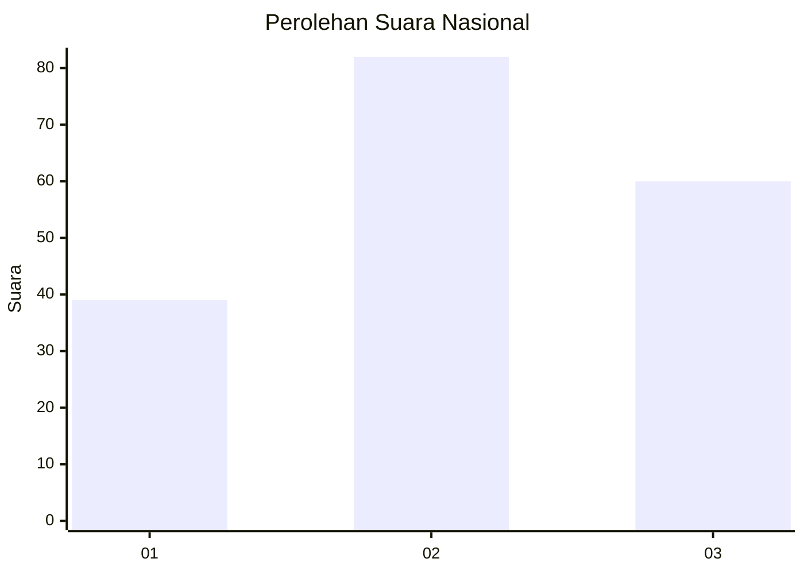
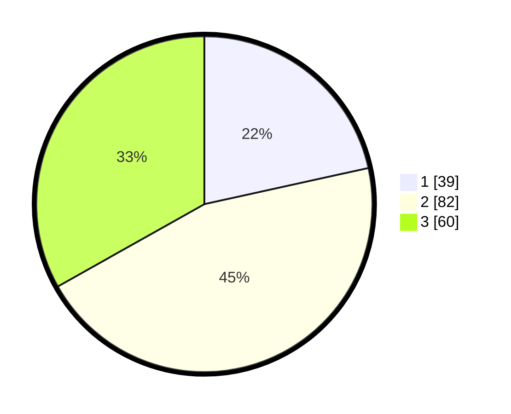

# Hasil

## Grafik

## Tabel

| No.    | Nama Paslon    | Suara | Suara (raw) | Persentase |
|:------ |:-------------- | -----:| -----------:| ----------:|
| 100025 | ANIES MUHAIMIN | 39    | [39][p-1]   | 21,55      |
| 100026 | PRABOWO GIBRAN | 82    | [82][p-2]   | 45,30      |
| 100027 | GANJAR MAHFUD  | 60    | [60][p-3]   | 33,15      |

[p-1]: https://github.com/gigit-pemilu/pemilu-2024/blob/main/pilpres/hitung-suara/sub/31-dki-jakarta/sub/73-jakarta-barat/sub/04-tambora/sub/1007-angke/sub/079-tps/sub/paslon-1.txt
[p-2]: https://github.com/gigit-pemilu/pemilu-2024/blob/main/pilpres/hitung-suara/sub/31-dki-jakarta/sub/73-jakarta-barat/sub/04-tambora/sub/1007-angke/sub/079-tps/sub/paslon-2.txt
[p-3]: https://github.com/gigit-pemilu/pemilu-2024/blob/main/pilpres/hitung-suara/sub/31-dki-jakarta/sub/73-jakarta-barat/sub/04-tambora/sub/1007-angke/sub/079-tps/sub/paslon-3.txt

## Foto C Plano

https://sirekap-obj-formc.kpu.go.id/2212/pemilu/ppwp/31/73/04/10/07/3173041007079-20240215-000911--76c1a1f1-744b-4aff-9f14-c77abbc2568b.jpg

https://sirekap-obj-formc.kpu.go.id/2212/pemilu/ppwp/31/73/04/10/07/3173041007079-20240215-001015--e287f255-e4b0-4397-96f5-88765b2555d5.jpg

https://sirekap-obj-formc.kpu.go.id/2212/pemilu/ppwp/31/73/04/10/07/3173041007079-20240215-001230--04d6d850-0b65-4487-a25d-c8e0f28ecbf7.jpg

## Metadata

| Key        | Value               |
| ---------- | ------------------- |
| Time Stamp | 2024-02-17 16:36:25 |

