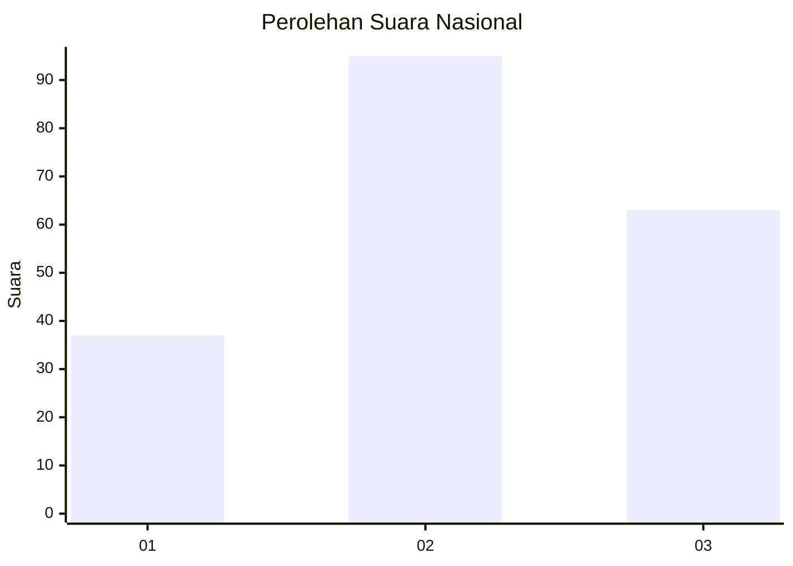
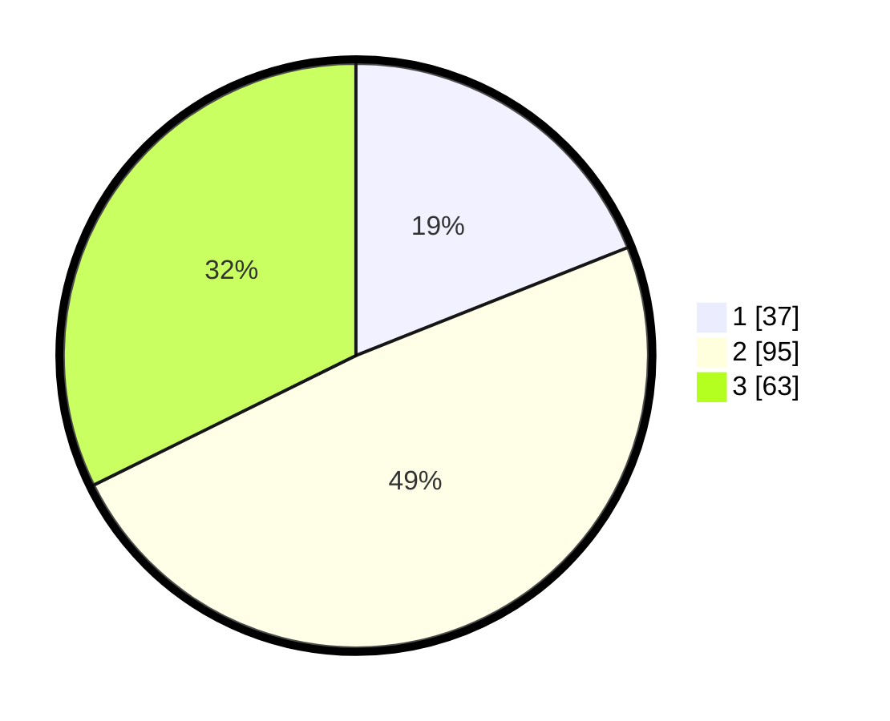

# Hasil

## Grafik

## Tabel

| No.    | Nama Paslon    | Suara | Suara (raw) | Persentase |
|:------ |:-------------- | -----:| -----------:| ----------:|
| 100025 | ANIES MUHAIMIN | 37    | [37][p-1]   | 18,97      |
| 100026 | PRABOWO GIBRAN | 95    | [95][p-2]   | 48,72      |
| 100027 | GANJAR MAHFUD  | 63    | [63][p-3]   | 32,31      |

[p-1]: https://github.com/gigit-pemilu/pemilu-2024/blob/main/pilpres/hitung-suara/sub/31-dki-jakarta/sub/73-jakarta-barat/sub/04-tambora/sub/1007-angke/sub/100-tps/sub/paslon-1.txt
[p-2]: https://github.com/gigit-pemilu/pemilu-2024/blob/main/pilpres/hitung-suara/sub/31-dki-jakarta/sub/73-jakarta-barat/sub/04-tambora/sub/1007-angke/sub/100-tps/sub/paslon-2.txt
[p-3]: https://github.com/gigit-pemilu/pemilu-2024/blob/main/pilpres/hitung-suara/sub/31-dki-jakarta/sub/73-jakarta-barat/sub/04-tambora/sub/1007-angke/sub/100-tps/sub/paslon-3.txt

## Foto C Plano

https://sirekap-obj-formc.kpu.go.id/a615/pemilu/ppwp/31/73/04/10/07/3173041007100-20240214-232041--46d68d10-7ae0-4429-992a-cfb5e6b2a0f6.jpg

https://sirekap-obj-formc.kpu.go.id/a615/pemilu/ppwp/31/73/04/10/07/3173041007100-20240214-231939--0a7693f2-126a-4b45-bb9e-ee6a0eb984bf.jpg

https://sirekap-obj-formc.kpu.go.id/a615/pemilu/ppwp/31/73/04/10/07/3173041007100-20240214-232124--11e5e6dc-95c8-47ee-993f-8b759b91b843.jpg

## Metadata

| Key        | Value               |
| ---------- | ------------------- |
| Time Stamp | 2024-02-21 16:00:00 |

