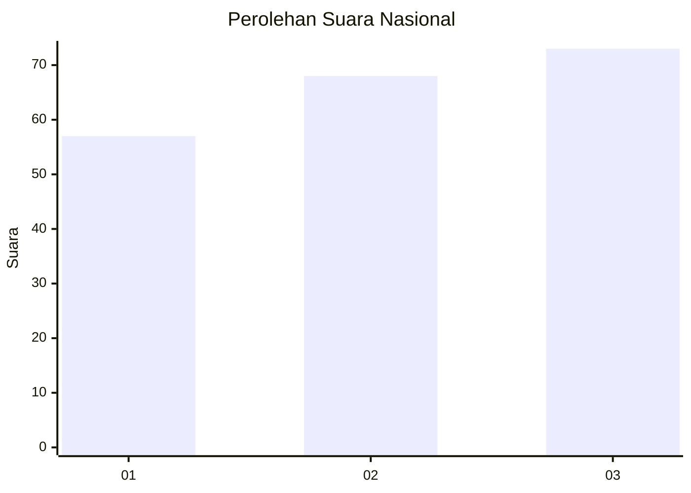
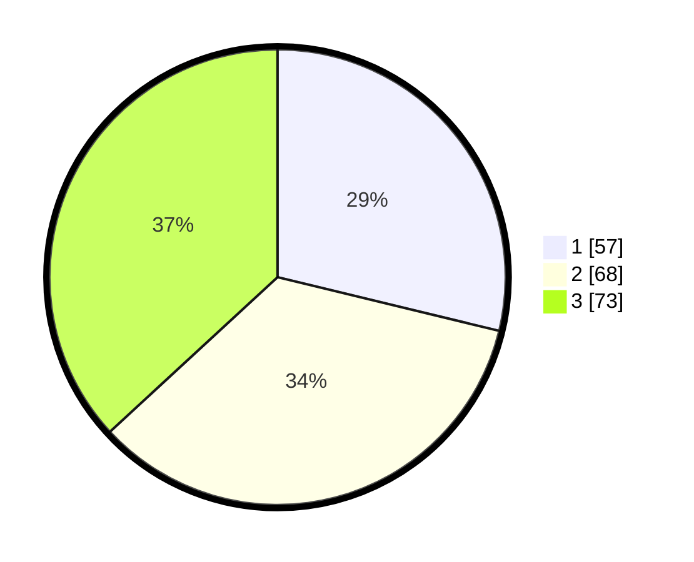

# Hasil

## Grafik

## Tabel

| No.    | Nama Paslon    | Suara | Suara (raw) | Persentase |
|:------ |:-------------- | -----:| -----------:| ----------:|
| 100025 | ANIES MUHAIMIN | 57    | [57][p-1]   | 28,79      |
| 100026 | PRABOWO GIBRAN | 68    | [68][p-2]   | 34,34      |
| 100027 | GANJAR MAHFUD  | 73    | [73][p-3]   | 36,87      |

[p-1]: https://github.com/gigit-pemilu/pemilu-2024/blob/main/pilpres/hitung-suara/sub/31-dki-jakarta/sub/73-jakarta-barat/sub/04-tambora/sub/1008-jembatan-lima/sub/003-tps/sub/paslon-1.txt
[p-2]: https://github.com/gigit-pemilu/pemilu-2024/blob/main/pilpres/hitung-suara/sub/31-dki-jakarta/sub/73-jakarta-barat/sub/04-tambora/sub/1008-jembatan-lima/sub/003-tps/sub/paslon-2.txt
[p-3]: https://github.com/gigit-pemilu/pemilu-2024/blob/main/pilpres/hitung-suara/sub/31-dki-jakarta/sub/73-jakarta-barat/sub/04-tambora/sub/1008-jembatan-lima/sub/003-tps/sub/paslon-3.txt

## Foto C Plano

https://sirekap-obj-formc.kpu.go.id/2127/pemilu/ppwp/31/73/04/10/08/3173041008003-20240215-155352--bbc679b0-b19d-4696-a921-70c7621accba.jpg

https://sirekap-obj-formc.kpu.go.id/2127/pemilu/ppwp/31/73/04/10/08/3173041008003-20240215-155437--d9e4bd06-3822-406a-a196-176734893439.jpg

https://sirekap-obj-formc.kpu.go.id/2127/pemilu/ppwp/31/73/04/10/08/3173041008003-20240215-155452--c230daf7-f69d-4a93-adb0-da40b74ab817.jpg

## Metadata

| Key        | Value               |
| ---------- | ------------------- |
| Time Stamp | 2024-02-21 16:00:00 |

