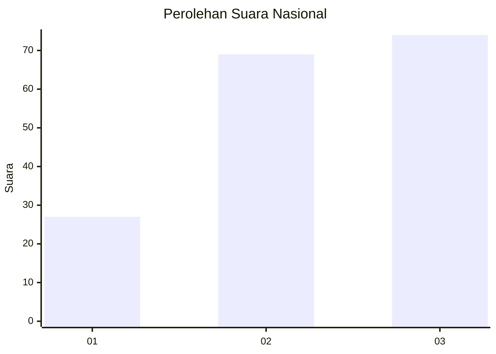
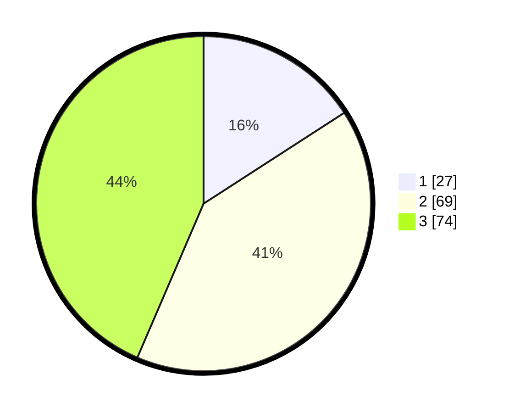

# Hasil

## Grafik

## Tabel

| No.    | Nama Paslon    | Suara | Suara (raw) | Persentase |
|:------ |:-------------- | -----:| -----------:| ----------:|
| 100025 | ANIES MUHAIMIN | 27    | [27][p-1]   | 15,88      |
| 100026 | PRABOWO GIBRAN | 69    | [69][p-2]   | 40,59      |
| 100027 | GANJAR MAHFUD  | 74    | [74][p-3]   | 43,53      |

[p-1]: https://github.com/gigit-pemilu/pemilu-2024/blob/main/pilpres/hitung-suara/sub/31-dki-jakarta/sub/73-jakarta-barat/sub/04-tambora/sub/1008-jembatan-lima/sub/038-tps/sub/paslon-1.txt
[p-2]: https://github.com/gigit-pemilu/pemilu-2024/blob/main/pilpres/hitung-suara/sub/31-dki-jakarta/sub/73-jakarta-barat/sub/04-tambora/sub/1008-jembatan-lima/sub/038-tps/sub/paslon-2.txt
[p-3]: https://github.com/gigit-pemilu/pemilu-2024/blob/main/pilpres/hitung-suara/sub/31-dki-jakarta/sub/73-jakarta-barat/sub/04-tambora/sub/1008-jembatan-lima/sub/038-tps/sub/paslon-3.txt

## Foto C Plano

https://sirekap-obj-formc.kpu.go.id/a668/pemilu/ppwp/31/73/04/10/08/3173041008038-20240214-215008--1644f9fe-9dd4-431e-b7c8-da986f7608a1.jpg

https://sirekap-obj-formc.kpu.go.id/a668/pemilu/ppwp/31/73/04/10/08/3173041008038-20240214-203407--9010c7d7-cd56-43c7-86db-8a184b47a06d.jpg

https://sirekap-obj-formc.kpu.go.id/a668/pemilu/ppwp/31/73/04/10/08/3173041008038-20240214-215456--141e199a-23cf-421d-805d-7e5f94c6f2db.jpg

## Metadata

| Key        | Value               |
| ---------- | ------------------- |
| Time Stamp | 2024-02-24 22:31:28 |

