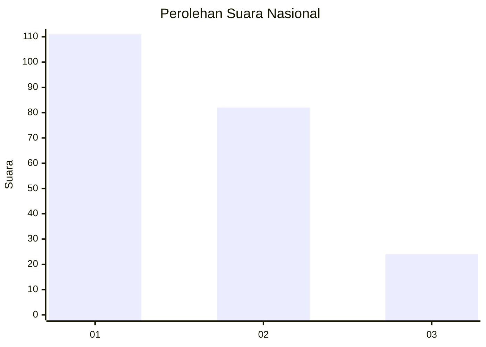
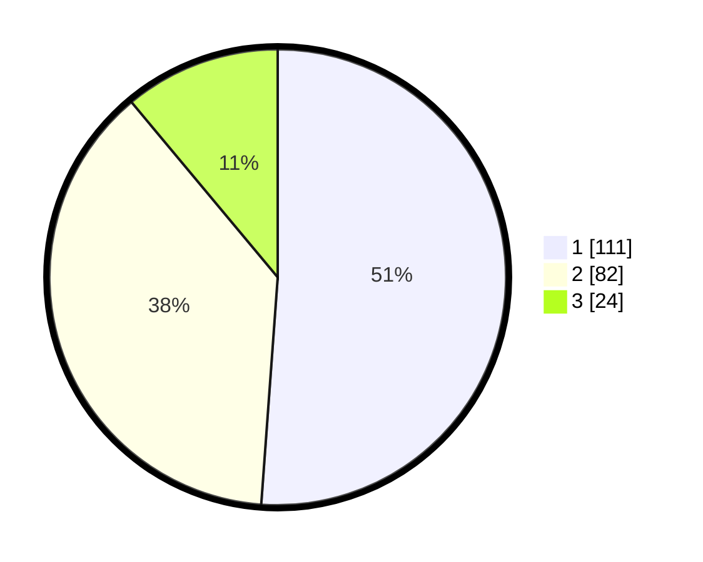

# Hasil

## Grafik

## Tabel

| No.    | Nama Paslon    | Suara | Suara (raw) | Persentase |
|:------ |:-------------- | -----:| -----------:| ----------:|
| 100025 | ANIES MUHAIMIN | 111   | [111][p-1]  | 51,15      |
| 100026 | PRABOWO GIBRAN | 82    | [82][p-2]   | 37,79      |
| 100027 | GANJAR MAHFUD  | 24    | [24][p-3]   | 11,06      |

[p-1]: https://github.com/gigit-pemilu/pemilu-2024/blob/main/pilpres/hitung-suara/sub/31-dki-jakarta/sub/73-jakarta-barat/sub/04-tambora/sub/1008-jembatan-lima/sub/052-tps/sub/paslon-1.txt
[p-2]: https://github.com/gigit-pemilu/pemilu-2024/blob/main/pilpres/hitung-suara/sub/31-dki-jakarta/sub/73-jakarta-barat/sub/04-tambora/sub/1008-jembatan-lima/sub/052-tps/sub/paslon-2.txt
[p-3]: https://github.com/gigit-pemilu/pemilu-2024/blob/main/pilpres/hitung-suara/sub/31-dki-jakarta/sub/73-jakarta-barat/sub/04-tambora/sub/1008-jembatan-lima/sub/052-tps/sub/paslon-3.txt

## Foto C Plano

https://sirekap-obj-formc.kpu.go.id/5624/pemilu/ppwp/31/73/04/10/08/3173041008052-20240214-232837--b592f1f3-b0fb-482e-b7cb-29488fe878a7.jpg

https://sirekap-obj-formc.kpu.go.id/5624/pemilu/ppwp/31/73/04/10/08/3173041008052-20240214-233031--2d8379db-7546-4a83-aabc-a39f56943e4d.jpg

https://sirekap-obj-formc.kpu.go.id/5624/pemilu/ppwp/31/73/04/10/08/3173041008052-20240214-233205--8ccb879f-9fb4-449d-a534-49f4ca06f725.jpg

## Metadata

| Key        | Value               |
| ---------- | ------------------- |
| Time Stamp | 2024-02-15 15:00:29 |

