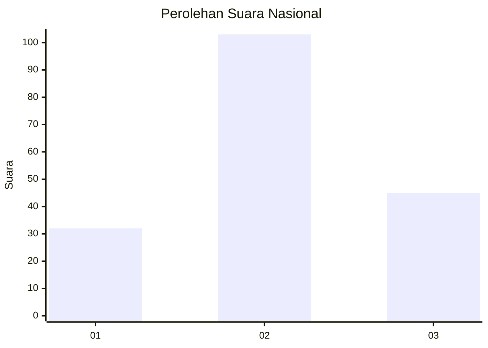
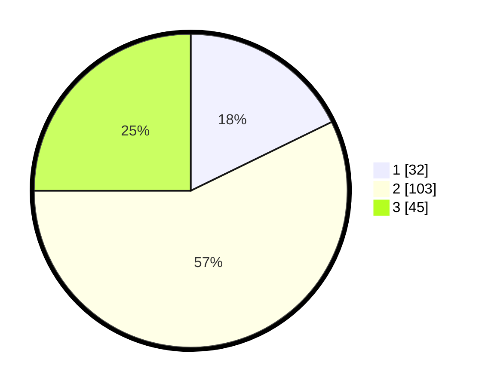

# Hasil

## Grafik

## Tabel

| No.    | Nama Paslon    | Suara | Suara (raw) | Persentase |
|:------ |:-------------- | -----:| -----------:| ----------:|
| 100025 | ANIES MUHAIMIN | 32    | [32][p-1]   | 17,78      |
| 100026 | PRABOWO GIBRAN | 103   | [103][p-2]  | 57,22      |
| 100027 | GANJAR MAHFUD  | 45    | [45][p-3]   | 25,00      |

[p-1]: https://github.com/gigit-pemilu/pemilu-2024/blob/main/pilpres/hitung-suara/sub/31-dki-jakarta/sub/73-jakarta-barat/sub/04-tambora/sub/1009-pekojan/sub/068-tps/sub/paslon-1.txt
[p-2]: https://github.com/gigit-pemilu/pemilu-2024/blob/main/pilpres/hitung-suara/sub/31-dki-jakarta/sub/73-jakarta-barat/sub/04-tambora/sub/1009-pekojan/sub/068-tps/sub/paslon-2.txt
[p-3]: https://github.com/gigit-pemilu/pemilu-2024/blob/main/pilpres/hitung-suara/sub/31-dki-jakarta/sub/73-jakarta-barat/sub/04-tambora/sub/1009-pekojan/sub/068-tps/sub/paslon-3.txt

## Foto C Plano

https://sirekap-obj-formc.kpu.go.id/f999/pemilu/ppwp/31/73/04/10/09/3173041009068-20240214-204423--8dc479f5-06aa-4d6f-b393-ed88ebb26140.jpg

https://sirekap-obj-formc.kpu.go.id/f999/pemilu/ppwp/31/73/04/10/09/3173041009068-20240214-204609--327b374e-b766-4776-a137-37dffb8c5c28.jpg

https://sirekap-obj-formc.kpu.go.id/f999/pemilu/ppwp/31/73/04/10/09/3173041009068-20240214-204709--bc9ca0cd-4df2-462e-82b0-b60c53a6b64d.jpg

## Metadata

| Key        | Value               |
| ---------- | ------------------- |
| Time Stamp | 2024-02-19 20:00:00 |

