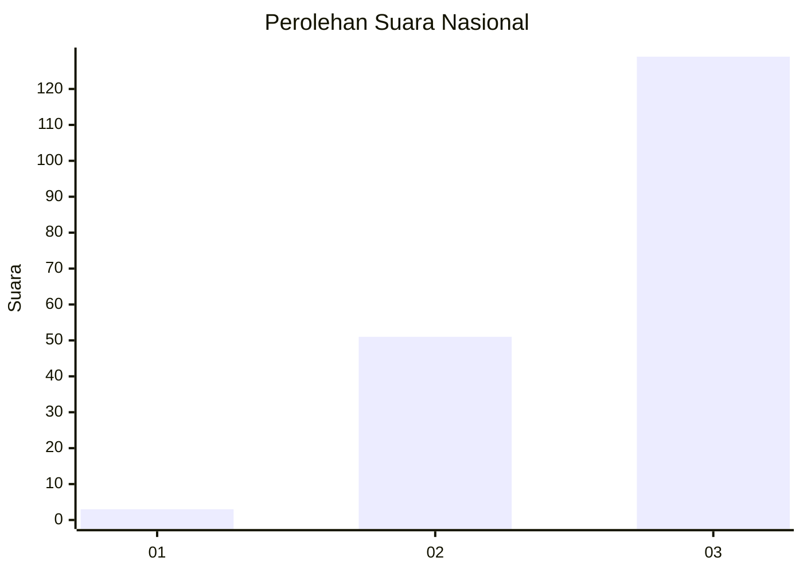
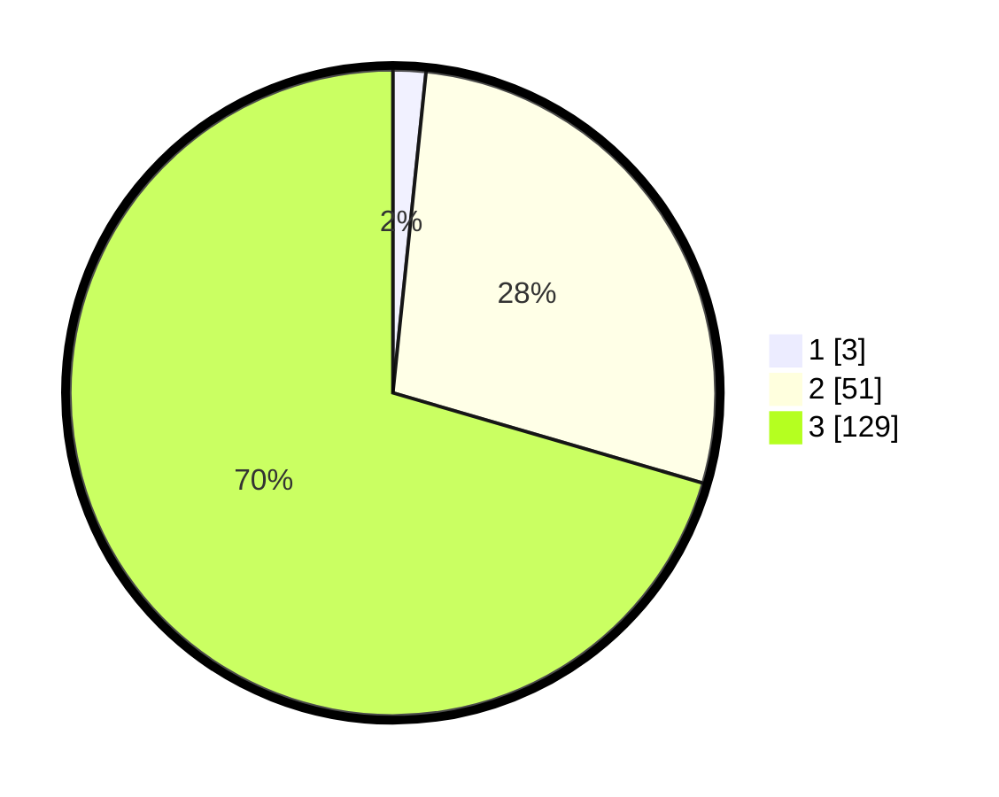

# Hasil

## Grafik

## Tabel

| No.    | Nama Paslon    | Suara | Suara (raw) | Persentase |
|:------ |:-------------- | -----:| -----------:| ----------:|
| 100025 | ANIES MUHAIMIN | 3     | [3][p-1]    | 1,64       |
| 100026 | PRABOWO GIBRAN | 51    | [51][p-2]   | 27,87      |
| 100027 | GANJAR MAHFUD  | 129   | [129][p-3]  | 70,49      |

[p-1]: https://github.com/gigit-pemilu/pemilu-2024/blob/main/pilpres/hitung-suara/sub/31-dki-jakarta/sub/73-jakarta-barat/sub/04-tambora/sub/1011-duri-selatan/sub/008-tps/sub/paslon-1.txt
[p-2]: https://github.com/gigit-pemilu/pemilu-2024/blob/main/pilpres/hitung-suara/sub/31-dki-jakarta/sub/73-jakarta-barat/sub/04-tambora/sub/1011-duri-selatan/sub/008-tps/sub/paslon-2.txt
[p-3]: https://github.com/gigit-pemilu/pemilu-2024/blob/main/pilpres/hitung-suara/sub/31-dki-jakarta/sub/73-jakarta-barat/sub/04-tambora/sub/1011-duri-selatan/sub/008-tps/sub/paslon-3.txt

## Foto C Plano

https://sirekap-obj-formc.kpu.go.id/07a5/pemilu/ppwp/31/73/04/10/11/3173041011008-20240214-195856--39fa3d1c-5573-45ad-8fbe-3dce7af41fdc.jpg

https://sirekap-obj-formc.kpu.go.id/07a5/pemilu/ppwp/31/73/04/10/11/3173041011008-20240214-193658--345c86d2-60bb-4cd1-ae21-61464ff31ba8.jpg

https://sirekap-obj-formc.kpu.go.id/07a5/pemilu/ppwp/31/73/04/10/11/3173041011008-20240214-160056--2501d269-31b8-4381-9bc5-5b47f76c527f.jpg

## Metadata

| Key        | Value               |
| ---------- | ------------------- |
| Time Stamp | 2024-02-19 06:16:00 |

