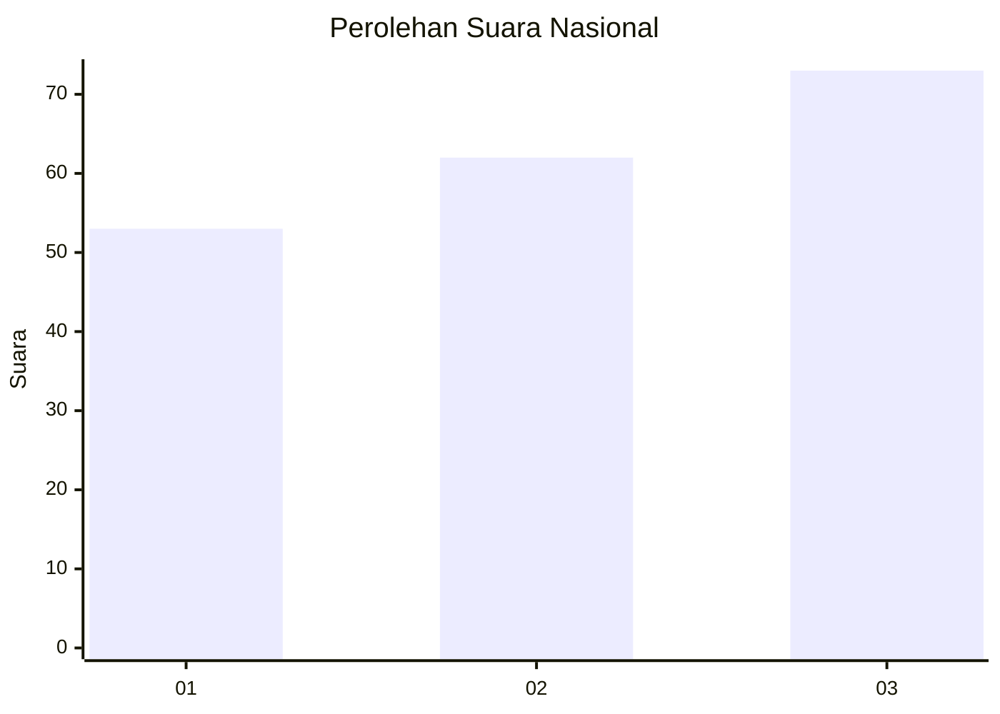
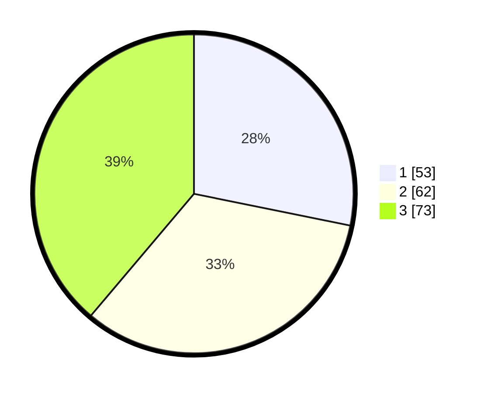

# Hasil

## Grafik

## Tabel

| No.    | Nama Paslon    | Suara | Suara (raw) | Persentase |
|:------ |:-------------- | -----:| -----------:| ----------:|
| 100025 | ANIES MUHAIMIN | 53    | [53][p-1]   | 28,19      |
| 100026 | PRABOWO GIBRAN | 62    | [62][p-2]   | 32,98      |
| 100027 | GANJAR MAHFUD  | 73    | [73][p-3]   | 38,83      |

[p-1]: https://github.com/gigit-pemilu/pemilu-2024/blob/main/pilpres/hitung-suara/sub/31-dki-jakarta/sub/73-jakarta-barat/sub/04-tambora/sub/1011-duri-selatan/sub/014-tps/sub/paslon-1.txt
[p-2]: https://github.com/gigit-pemilu/pemilu-2024/blob/main/pilpres/hitung-suara/sub/31-dki-jakarta/sub/73-jakarta-barat/sub/04-tambora/sub/1011-duri-selatan/sub/014-tps/sub/paslon-2.txt
[p-3]: https://github.com/gigit-pemilu/pemilu-2024/blob/main/pilpres/hitung-suara/sub/31-dki-jakarta/sub/73-jakarta-barat/sub/04-tambora/sub/1011-duri-selatan/sub/014-tps/sub/paslon-3.txt

## Foto C Plano

https://sirekap-obj-formc.kpu.go.id/c91b/pemilu/ppwp/31/73/04/10/11/3173041011014-20240215-003111--0275f014-4269-4f26-900b-04bac8b31a0f.jpg

https://sirekap-obj-formc.kpu.go.id/c91b/pemilu/ppwp/31/73/04/10/11/3173041011014-20240215-003145--353d5ad9-264e-49cb-ad40-933f4864b127.jpg

https://sirekap-obj-formc.kpu.go.id/c91b/pemilu/ppwp/31/73/04/10/11/3173041011014-20240215-003214--22b8aedf-c403-49ca-a1b2-a72c93365865.jpg

## Metadata

| Key        | Value               |
| ---------- | ------------------- |
| Time Stamp | 2024-02-19 21:00:00 |

