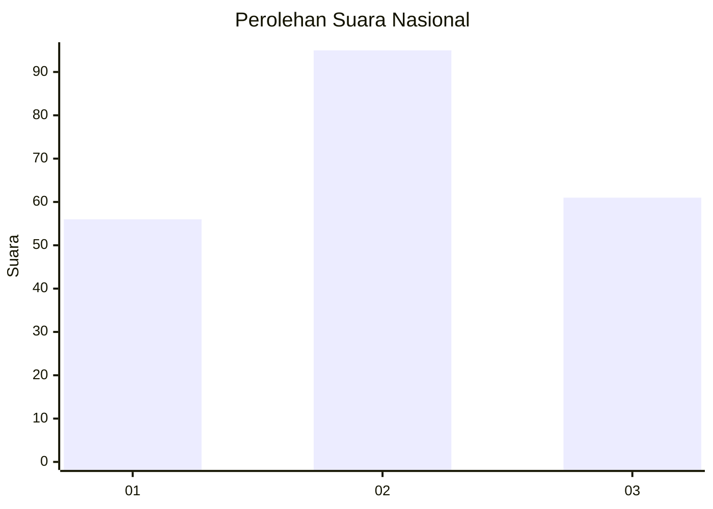
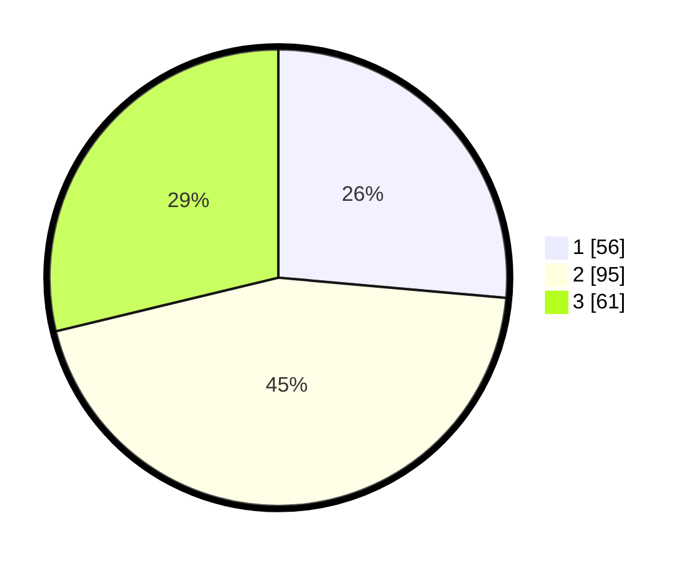

# Hasil

## Grafik

## Tabel

| No.    | Nama Paslon    | Suara | Suara (raw) | Persentase |
|:------ |:-------------- | -----:| -----------:| ----------:|
| 100025 | ANIES MUHAIMIN | 56    | [56][p-1]   | 26,42      |
| 100026 | PRABOWO GIBRAN | 95    | [95][p-2]   | 44,81      |
| 100027 | GANJAR MAHFUD  | 61    | [61][p-3]   | 28,77      |

[p-1]: https://github.com/gigit-pemilu/pemilu-2024/blob/main/pilpres/hitung-suara/sub/31-dki-jakarta/sub/73-jakarta-barat/sub/04-tambora/sub/1011-duri-selatan/sub/026-tps/sub/paslon-1.txt
[p-2]: https://github.com/gigit-pemilu/pemilu-2024/blob/main/pilpres/hitung-suara/sub/31-dki-jakarta/sub/73-jakarta-barat/sub/04-tambora/sub/1011-duri-selatan/sub/026-tps/sub/paslon-2.txt
[p-3]: https://github.com/gigit-pemilu/pemilu-2024/blob/main/pilpres/hitung-suara/sub/31-dki-jakarta/sub/73-jakarta-barat/sub/04-tambora/sub/1011-duri-selatan/sub/026-tps/sub/paslon-3.txt

## Foto C Plano

https://sirekap-obj-formc.kpu.go.id/7274/pemilu/ppwp/31/73/04/10/11/3173041011026-20240214-233351--60740d63-a0d8-47f0-be98-077b6575c442.jpg

https://sirekap-obj-formc.kpu.go.id/7274/pemilu/ppwp/31/73/04/10/11/3173041011026-20240214-233448--70a8e281-1a3e-4e7d-91ea-26d03ac321bc.jpg

https://sirekap-obj-formc.kpu.go.id/7274/pemilu/ppwp/31/73/04/10/11/3173041011026-20240214-233539--aa412e56-90a4-4b2c-b5e4-4f416fba3207.jpg

## Metadata

| Key        | Value               |
| ---------- | ------------------- |
| Time Stamp | 2024-02-21 16:00:00 |

