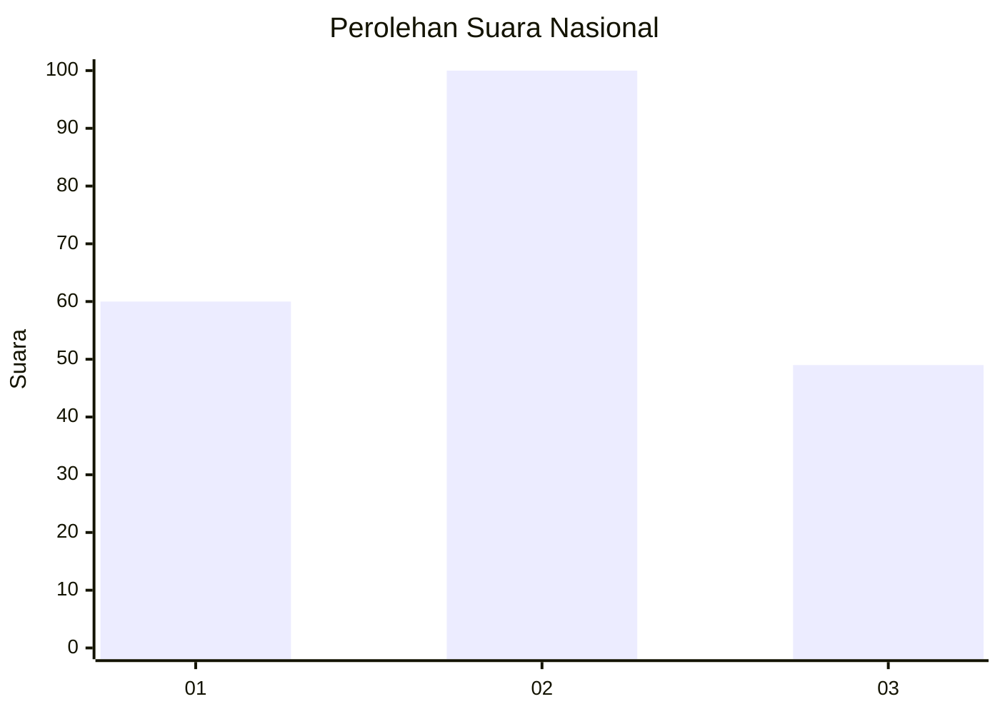
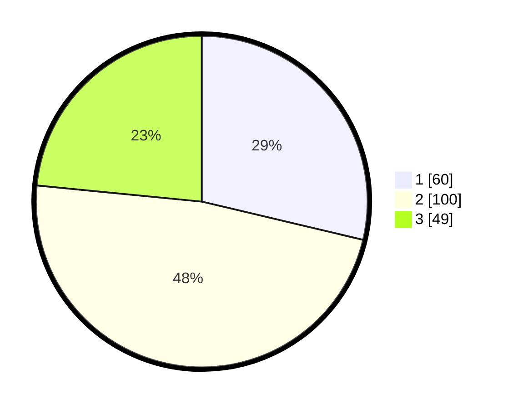

# Hasil

## Grafik

## Tabel

| No.    | Nama Paslon    | Suara | Suara (raw) | Persentase |
|:------ |:-------------- | -----:| -----------:| ----------:|
| 100025 | ANIES MUHAIMIN | 60    | [60][p-1]   | 28,71      |
| 100026 | PRABOWO GIBRAN | 100   | [100][p-2]  | 47,85      |
| 100027 | GANJAR MAHFUD  | 49    | [49][p-3]   | 23,44      |

[p-1]: https://github.com/gigit-pemilu/pemilu-2024/blob/main/pilpres/hitung-suara/sub/31-dki-jakarta/sub/73-jakarta-barat/sub/04-tambora/sub/1011-duri-selatan/sub/033-tps/sub/paslon-1.txt
[p-2]: https://github.com/gigit-pemilu/pemilu-2024/blob/main/pilpres/hitung-suara/sub/31-dki-jakarta/sub/73-jakarta-barat/sub/04-tambora/sub/1011-duri-selatan/sub/033-tps/sub/paslon-2.txt
[p-3]: https://github.com/gigit-pemilu/pemilu-2024/blob/main/pilpres/hitung-suara/sub/31-dki-jakarta/sub/73-jakarta-barat/sub/04-tambora/sub/1011-duri-selatan/sub/033-tps/sub/paslon-3.txt

## Foto C Plano

https://sirekap-obj-formc.kpu.go.id/358b/pemilu/ppwp/31/73/04/10/11/3173041011033-20240214-232600--da40e3d2-2108-48ac-aa5c-7736e2ac0bab.jpg

https://sirekap-obj-formc.kpu.go.id/358b/pemilu/ppwp/31/73/04/10/11/3173041011033-20240214-221844--26900694-6ac4-4723-8009-28ec9c5ce9a0.jpg

https://sirekap-obj-formc.kpu.go.id/358b/pemilu/ppwp/31/73/04/10/11/3173041011033-20240214-221857--3ae63c2c-5133-4fbc-a413-990e3fa442cc.jpg

## Metadata

| Key        | Value               |
| ---------- | ------------------- |
| Time Stamp | 2024-02-19 20:00:00 |

