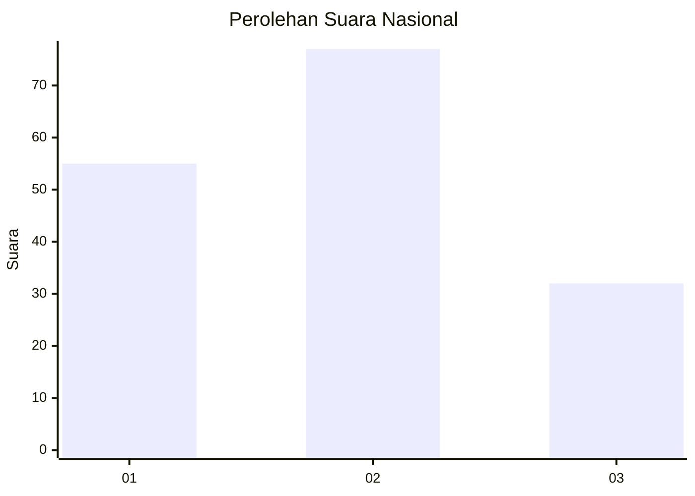
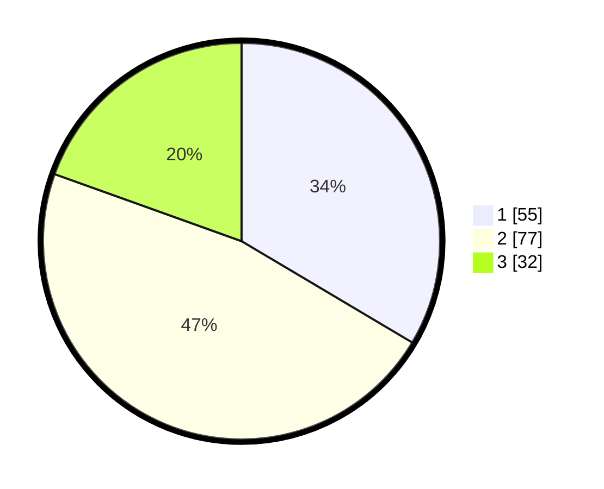

# Hasil

## Grafik

## Tabel

| No.    | Nama Paslon    | Suara | Suara (raw) | Persentase |
|:------ |:-------------- | -----:| -----------:| ----------:|
| 100025 | ANIES MUHAIMIN | 55    | [55][p-1]   | 33,54      |
| 100026 | PRABOWO GIBRAN | 77    | [77][p-2]   | 46,95      |
| 100027 | GANJAR MAHFUD  | 32    | [32][p-3]   | 19,51      |

[p-1]: https://github.com/gigit-pemilu/pemilu-2024/blob/main/pilpres/hitung-suara/sub/31-dki-jakarta/sub/73-jakarta-barat/sub/04-tambora/sub/1011-duri-selatan/sub/034-tps/sub/paslon-1.txt
[p-2]: https://github.com/gigit-pemilu/pemilu-2024/blob/main/pilpres/hitung-suara/sub/31-dki-jakarta/sub/73-jakarta-barat/sub/04-tambora/sub/1011-duri-selatan/sub/034-tps/sub/paslon-2.txt
[p-3]: https://github.com/gigit-pemilu/pemilu-2024/blob/main/pilpres/hitung-suara/sub/31-dki-jakarta/sub/73-jakarta-barat/sub/04-tambora/sub/1011-duri-selatan/sub/034-tps/sub/paslon-3.txt

## Foto C Plano

https://sirekap-obj-formc.kpu.go.id/ba05/pemilu/ppwp/31/73/04/10/11/3173041011034-20240214-232730--3cb71148-185f-4821-bada-b1f0b22aff68.jpg

https://sirekap-obj-formc.kpu.go.id/ba05/pemilu/ppwp/31/73/04/10/11/3173041011034-20240214-211501--a76916d6-4218-4641-84cf-a8ad69cf7b1f.jpg

https://sirekap-obj-formc.kpu.go.id/ba05/pemilu/ppwp/31/73/04/10/11/3173041011034-20240214-233558--77947453-fac8-474e-8d99-838882880905.jpg

## Metadata

| Key        | Value               |
| ---------- | ------------------- |
| Time Stamp | 2024-02-24 22:31:28 |

