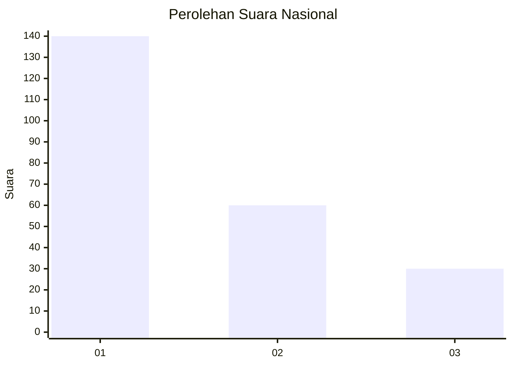

# Hasil

## Grafik

## Tabel

| No.    | Nama Paslon    | Suara | Suara (raw) | Persentase |
|:------ |:-------------- | -----:| -----------:| ----------:|
| 100025 | ANIES MUHAIMIN | 140   | [140][p-1]  | 60,87      |
| 100026 | PRABOWO GIBRAN | 60    | [60][p-2]   | 26,09      |
| 100027 | GANJAR MAHFUD  | 30    | [30][p-3]   | 13,04      |

[p-1]: https://github.com/gigit-pemilu/pemilu-2024/blob/main/pilpres/hitung-suara/sub/31-dki-jakarta/sub/73-jakarta-barat/sub/04-tambora/sub/1011-duri-selatan/sub/038-tps/sub/paslon-1.txt
[p-2]: https://github.com/gigit-pemilu/pemilu-2024/blob/main/pilpres/hitung-suara/sub/31-dki-jakarta/sub/73-jakarta-barat/sub/04-tambora/sub/1011-duri-selatan/sub/038-tps/sub/paslon-2.txt
[p-3]: https://github.com/gigit-pemilu/pemilu-2024/blob/main/pilpres/hitung-suara/sub/31-dki-jakarta/sub/73-jakarta-barat/sub/04-tambora/sub/1011-duri-selatan/sub/038-tps/sub/paslon-3.txt

## Foto C Plano

https://sirekap-obj-formc.kpu.go.id/4b73/pemilu/ppwp/31/73/04/10/11/3173041011038-20240214-190417--9e233901-5b9a-4d61-8394-e7fd470e3c13.jpg

https://sirekap-obj-formc.kpu.go.id/4b73/pemilu/ppwp/31/73/04/10/11/3173041011038-20240214-155729--799f9fe7-7c4c-4115-91f5-ee362fe8e449.jpg

https://sirekap-obj-formc.kpu.go.id/4b73/pemilu/ppwp/31/73/04/10/11/3173041011038-20240214-160058--c7daabea-fecf-48d8-9d4a-fa96fdbb754c.jpg

## Metadata

| Key        | Value               |
| ---------- | ------------------- |
| Time Stamp | 2024-02-19 20:00:00 |

