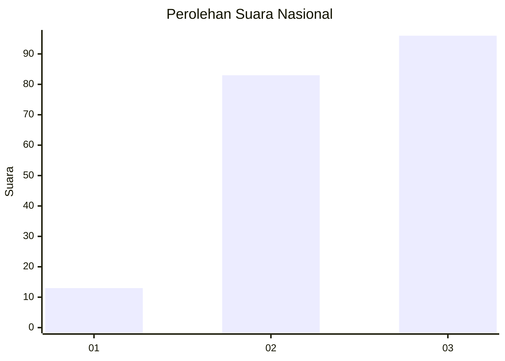
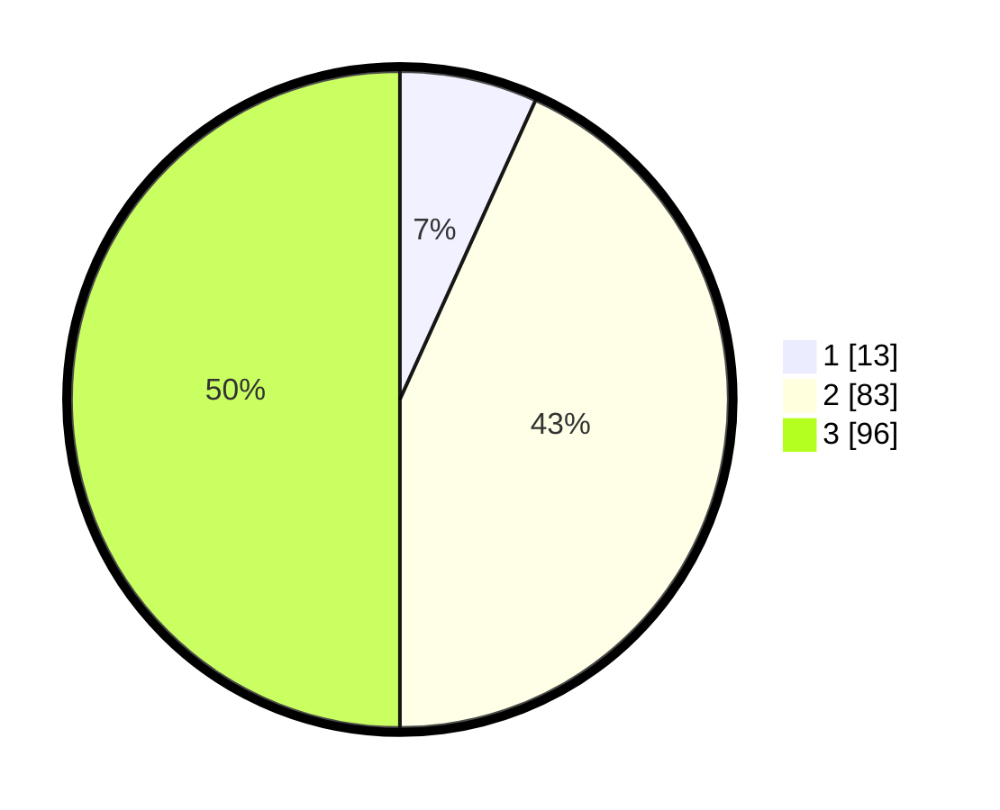

# Hasil

## Grafik

## Tabel

| No.    | Nama Paslon    | Suara | Suara (raw) | Persentase |
|:------ |:-------------- | -----:| -----------:| ----------:|
| 100025 | ANIES MUHAIMIN | 13    | [13][p-1]   | 6,77       |
| 100026 | PRABOWO GIBRAN | 83    | [83][p-2]   | 43,23      |
| 100027 | GANJAR MAHFUD  | 96    | [96][p-3]   | 50,00      |

[p-1]: https://github.com/gigit-pemilu/pemilu-2024/blob/main/pilpres/hitung-suara/sub/31-dki-jakarta/sub/73-jakarta-barat/sub/04-tambora/sub/1011-duri-selatan/sub/048-tps/sub/paslon-1.txt
[p-2]: https://github.com/gigit-pemilu/pemilu-2024/blob/main/pilpres/hitung-suara/sub/31-dki-jakarta/sub/73-jakarta-barat/sub/04-tambora/sub/1011-duri-selatan/sub/048-tps/sub/paslon-2.txt
[p-3]: https://github.com/gigit-pemilu/pemilu-2024/blob/main/pilpres/hitung-suara/sub/31-dki-jakarta/sub/73-jakarta-barat/sub/04-tambora/sub/1011-duri-selatan/sub/048-tps/sub/paslon-3.txt

## Foto C Plano

https://sirekap-obj-formc.kpu.go.id/f93e/pemilu/ppwp/31/73/04/10/11/3173041011048-20240214-222041--31a08b46-8980-4d31-a633-b9383dc6acf4.jpg

https://sirekap-obj-formc.kpu.go.id/f93e/pemilu/ppwp/31/73/04/10/11/3173041011048-20240214-222137--ca4dbf13-883b-491e-8f50-db673de40e5e.jpg

https://sirekap-obj-formc.kpu.go.id/f93e/pemilu/ppwp/31/73/04/10/11/3173041011048-20240214-222239--47e7a268-aa57-4d49-93b9-e29fcd01eeba.jpg

## Metadata

| Key        | Value               |
| ---------- | ------------------- |
| Time Stamp | 2024-02-19 20:00:00 |

