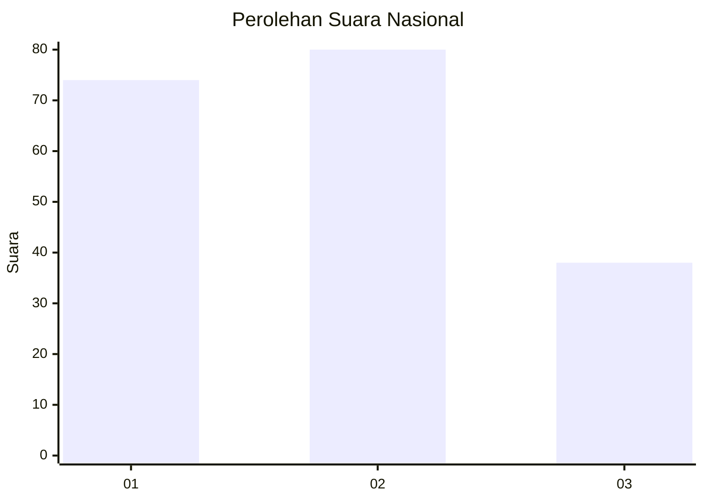
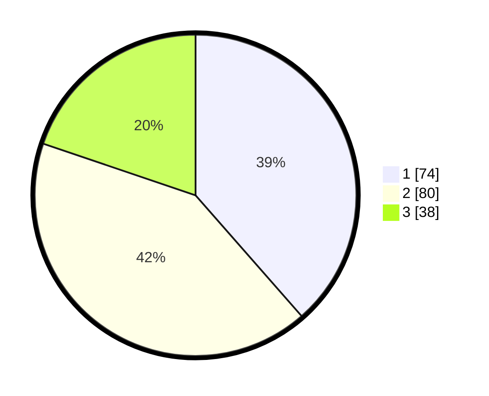

# Hasil

## Grafik

## Tabel

| No.    | Nama Paslon    | Suara | Suara (raw) | Persentase |
|:------ |:-------------- | -----:| -----------:| ----------:|
| 100025 | ANIES MUHAIMIN | 74    | [74][p-1]   | 38,54      |
| 100026 | PRABOWO GIBRAN | 80    | [80][p-2]   | 41,67      |
| 100027 | GANJAR MAHFUD  | 38    | [38][p-3]   | 19,79      |

[p-1]: https://github.com/gigit-pemilu/pemilu-2024/blob/main/pilpres/hitung-suara/sub/31-dki-jakarta/sub/73-jakarta-barat/sub/04-tambora/sub/1011-duri-selatan/sub/050-tps/sub/paslon-1.txt
[p-2]: https://github.com/gigit-pemilu/pemilu-2024/blob/main/pilpres/hitung-suara/sub/31-dki-jakarta/sub/73-jakarta-barat/sub/04-tambora/sub/1011-duri-selatan/sub/050-tps/sub/paslon-2.txt
[p-3]: https://github.com/gigit-pemilu/pemilu-2024/blob/main/pilpres/hitung-suara/sub/31-dki-jakarta/sub/73-jakarta-barat/sub/04-tambora/sub/1011-duri-selatan/sub/050-tps/sub/paslon-3.txt

## Foto C Plano

https://sirekap-obj-formc.kpu.go.id/b619/pemilu/ppwp/31/73/04/10/11/3173041011050-20240215-000529--495e3663-d925-4999-b41d-56ead7743c2d.jpg

https://sirekap-obj-formc.kpu.go.id/b619/pemilu/ppwp/31/73/04/10/11/3173041011050-20240215-000652--c87b4094-f5eb-4337-bd27-c1713d8a0d9c.jpg

https://sirekap-obj-formc.kpu.go.id/b619/pemilu/ppwp/31/73/04/10/11/3173041011050-20240215-000734--9734a9ae-df5c-43f7-95d5-348e20921045.jpg

## Metadata

| Key        | Value               |
| ---------- | ------------------- |
| Time Stamp | 2024-02-19 20:00:00 |

