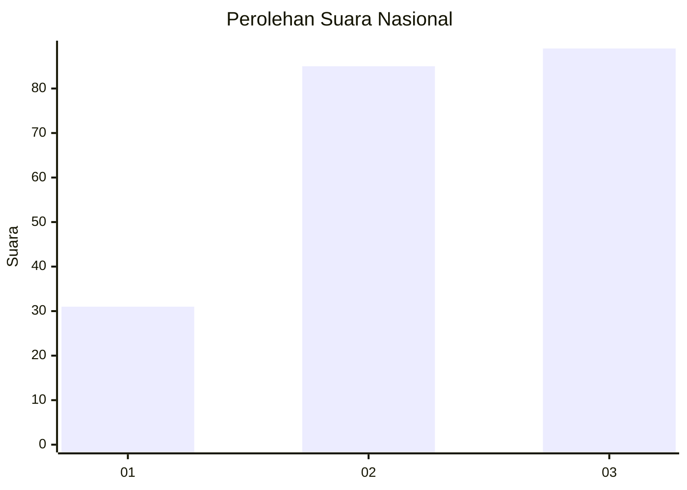
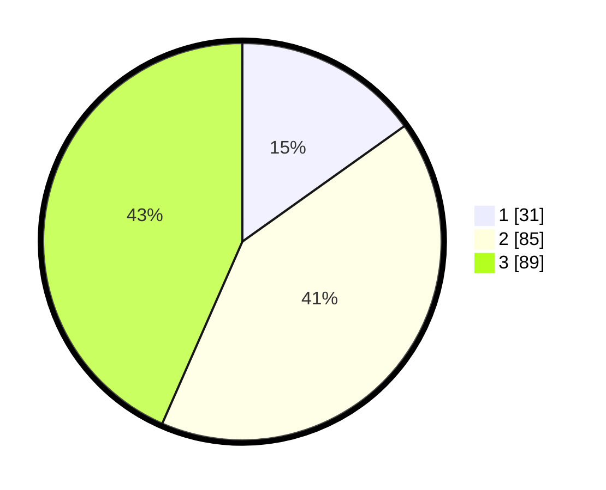

# Hasil

## Grafik

## Tabel

| No.    | Nama Paslon    | Suara | Suara (raw) | Persentase |
|:------ |:-------------- | -----:| -----------:| ----------:|
| 100025 | ANIES MUHAIMIN | 31    | [31][p-1]   | 15,12      |
| 100026 | PRABOWO GIBRAN | 85    | [85][p-2]   | 41,46      |
| 100027 | GANJAR MAHFUD  | 89    | [89][p-3]   | 43,41      |

[p-1]: https://github.com/gigit-pemilu/pemilu-2024/blob/main/pilpres/hitung-suara/sub/31-dki-jakarta/sub/73-jakarta-barat/sub/04-tambora/sub/1011-duri-selatan/sub/052-tps/sub/paslon-1.txt
[p-2]: https://github.com/gigit-pemilu/pemilu-2024/blob/main/pilpres/hitung-suara/sub/31-dki-jakarta/sub/73-jakarta-barat/sub/04-tambora/sub/1011-duri-selatan/sub/052-tps/sub/paslon-2.txt
[p-3]: https://github.com/gigit-pemilu/pemilu-2024/blob/main/pilpres/hitung-suara/sub/31-dki-jakarta/sub/73-jakarta-barat/sub/04-tambora/sub/1011-duri-selatan/sub/052-tps/sub/paslon-3.txt

## Foto C Plano

https://sirekap-obj-formc.kpu.go.id/0e82/pemilu/ppwp/31/73/04/10/11/3173041011052-20240215-012805--fc9bf005-5c00-426d-9111-a7704cb277e0.jpg

https://sirekap-obj-formc.kpu.go.id/0e82/pemilu/ppwp/31/73/04/10/11/3173041011052-20240215-013202--f00bfa84-c87a-4295-9851-aed937bcf85d.jpg

https://sirekap-obj-formc.kpu.go.id/0e82/pemilu/ppwp/31/73/04/10/11/3173041011052-20240215-013337--cee8d044-24b0-4b0f-898d-7b6473e4cea7.jpg

## Metadata

| Key        | Value               |
| ---------- | ------------------- |
| Time Stamp | 2024-02-19 06:16:00 |

