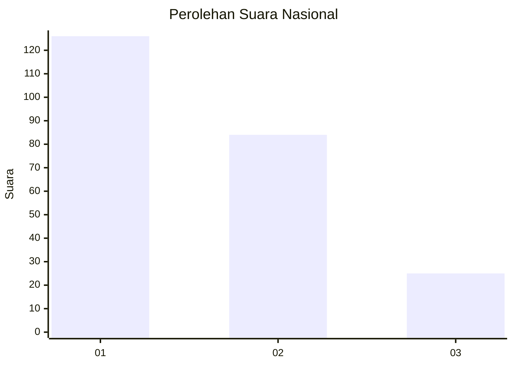
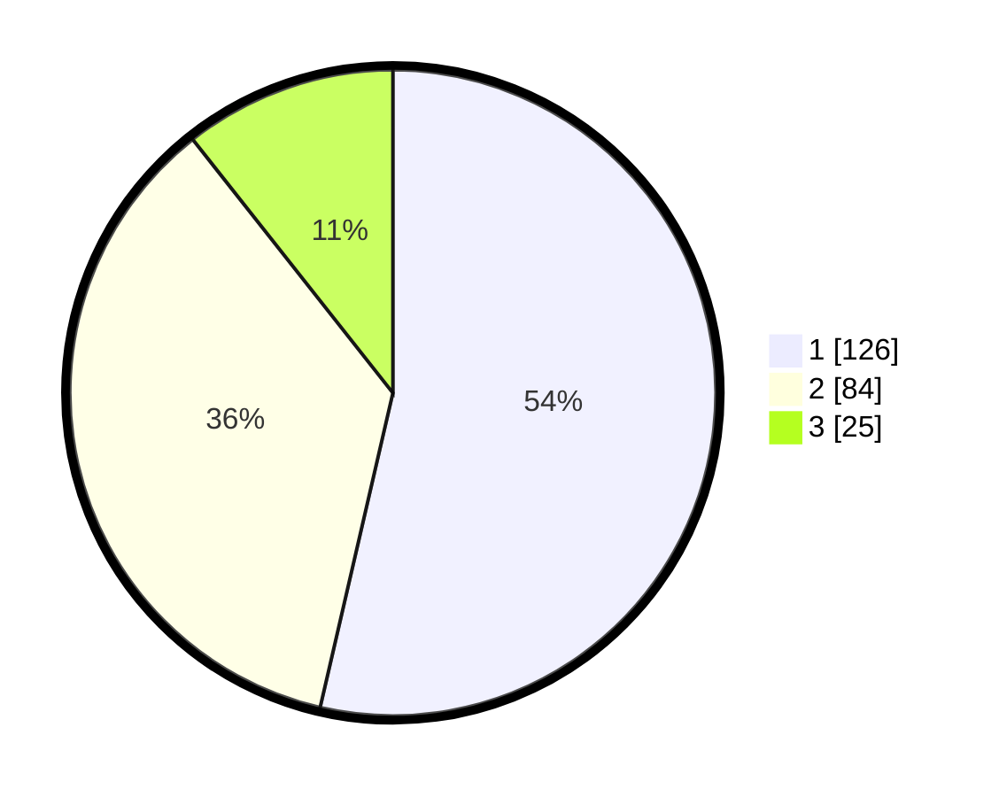

# Hasil

## Grafik

## Tabel

| No.    | Nama Paslon    | Suara | Suara (raw) | Persentase |
|:------ |:-------------- | -----:| -----------:| ----------:|
| 100025 | ANIES MUHAIMIN | 126   | [126][p-1]  | 53,62      |
| 100026 | PRABOWO GIBRAN | 84    | [84][p-2]   | 35,74      |
| 100027 | GANJAR MAHFUD  | 25    | [25][p-3]   | 10,64      |

[p-1]: https://github.com/gigit-pemilu/pemilu-2024/blob/main/pilpres/hitung-suara/sub/31-dki-jakarta/sub/73-jakarta-barat/sub/05-kebon-jeruk/sub/1001-kebon-jeruk/sub/004-tps/sub/paslon-1.txt
[p-2]: https://github.com/gigit-pemilu/pemilu-2024/blob/main/pilpres/hitung-suara/sub/31-dki-jakarta/sub/73-jakarta-barat/sub/05-kebon-jeruk/sub/1001-kebon-jeruk/sub/004-tps/sub/paslon-2.txt
[p-3]: https://github.com/gigit-pemilu/pemilu-2024/blob/main/pilpres/hitung-suara/sub/31-dki-jakarta/sub/73-jakarta-barat/sub/05-kebon-jeruk/sub/1001-kebon-jeruk/sub/004-tps/sub/paslon-3.txt

## Foto C Plano

https://sirekap-obj-formc.kpu.go.id/f006/pemilu/ppwp/31/73/05/10/01/3173051001004-20240215-011007--b40b18bd-0083-4d6a-a100-55f05f2fcbea.jpg

https://sirekap-obj-formc.kpu.go.id/f006/pemilu/ppwp/31/73/05/10/01/3173051001004-20240214-212853--83abb8dc-d19b-407e-91db-9d89bfe6d78a.jpg

https://sirekap-obj-formc.kpu.go.id/f006/pemilu/ppwp/31/73/05/10/01/3173051001004-20240214-212910--79532fda-86b0-4772-821f-bde3c3efaee7.jpg

## Metadata

| Key        | Value               |
| ---------- | ------------------- |
| Time Stamp | 2024-02-17 19:30:00 |

