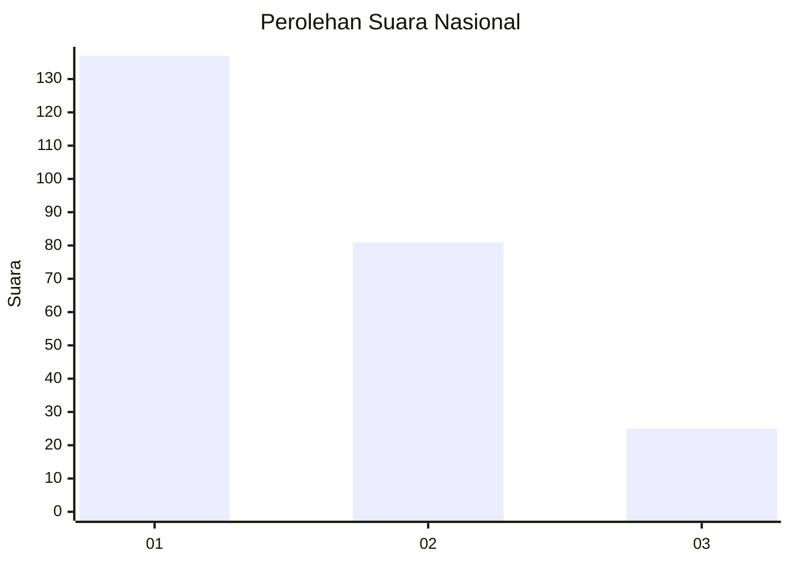
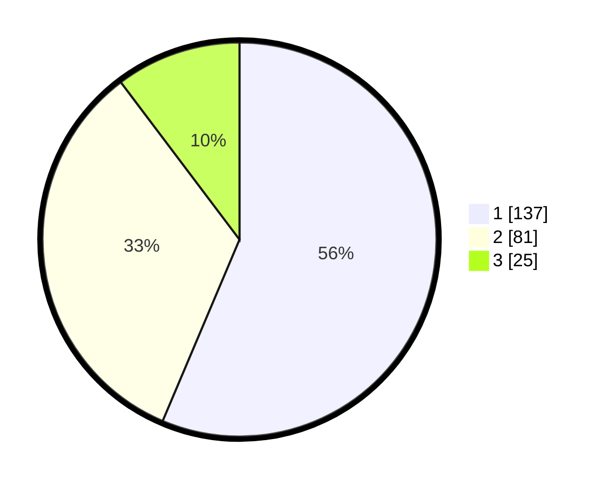

# Hasil

## Grafik

## Tabel

| No.    | Nama Paslon    | Suara | Suara (raw) | Persentase |
|:------ |:-------------- | -----:| -----------:| ----------:|
| 100025 | ANIES MUHAIMIN | 137   | [137][p-1]  | 56,38      |
| 100026 | PRABOWO GIBRAN | 81    | [81][p-2]   | 33,33      |
| 100027 | GANJAR MAHFUD  | 25    | [25][p-3]   | 10,29      |

[p-1]: https://github.com/gigit-pemilu/pemilu-2024/blob/main/pilpres/hitung-suara/sub/31-dki-jakarta/sub/73-jakarta-barat/sub/05-kebon-jeruk/sub/1001-kebon-jeruk/sub/009-tps/sub/paslon-1.txt
[p-2]: https://github.com/gigit-pemilu/pemilu-2024/blob/main/pilpres/hitung-suara/sub/31-dki-jakarta/sub/73-jakarta-barat/sub/05-kebon-jeruk/sub/1001-kebon-jeruk/sub/009-tps/sub/paslon-2.txt
[p-3]: https://github.com/gigit-pemilu/pemilu-2024/blob/main/pilpres/hitung-suara/sub/31-dki-jakarta/sub/73-jakarta-barat/sub/05-kebon-jeruk/sub/1001-kebon-jeruk/sub/009-tps/sub/paslon-3.txt

## Foto C Plano

https://sirekap-obj-formc.kpu.go.id/341c/pemilu/ppwp/31/73/05/10/01/3173051001009-20240215-002715--a5234c71-04a0-438b-9276-28e71004eda7.jpg

https://sirekap-obj-formc.kpu.go.id/341c/pemilu/ppwp/31/73/05/10/01/3173051001009-20240214-211456--c8179105-b04f-4ac7-a7dd-48d02b019e89.jpg

https://sirekap-obj-formc.kpu.go.id/341c/pemilu/ppwp/31/73/05/10/01/3173051001009-20240214-211621--80984463-6b0b-4ebb-accc-88a545137ccb.jpg

## Metadata

| Key        | Value               |
| ---------- | ------------------- |
| Time Stamp | 2024-02-15 00:41:44 |

