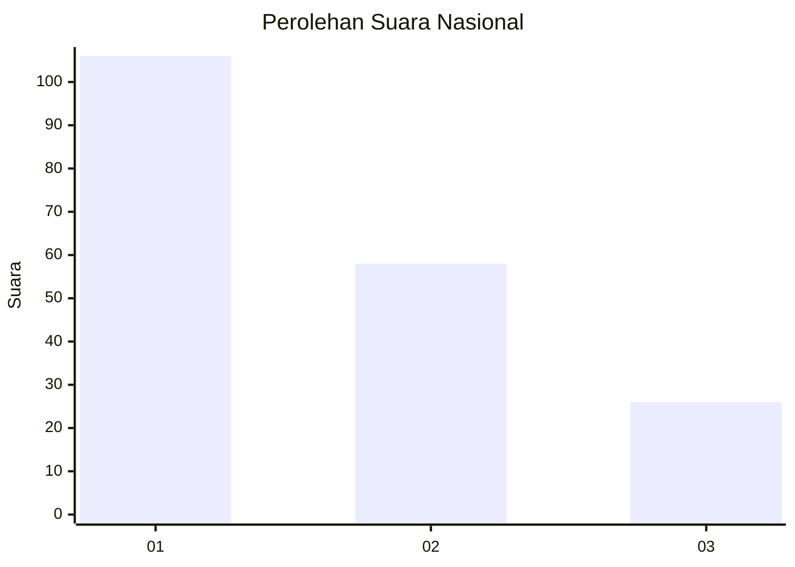
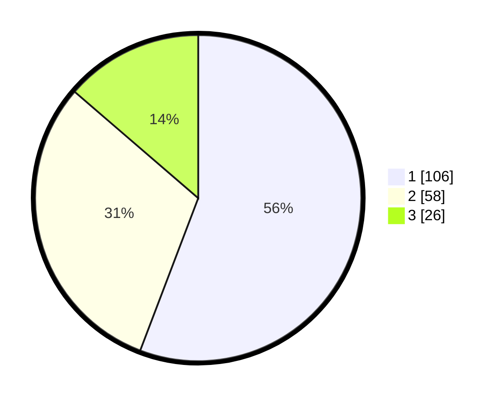

# Hasil

## Grafik

## Tabel

| No.    | Nama Paslon    | Suara | Suara (raw) | Persentase |
|:------ |:-------------- | -----:| -----------:| ----------:|
| 100025 | ANIES MUHAIMIN | 106   | [106][p-1]  | 55,79      |
| 100026 | PRABOWO GIBRAN | 58    | [58][p-2]   | 30,53      |
| 100027 | GANJAR MAHFUD  | 26    | [26][p-3]   | 13,68      |

[p-1]: https://github.com/gigit-pemilu/pemilu-2024/blob/main/pilpres/hitung-suara/sub/31-dki-jakarta/sub/73-jakarta-barat/sub/05-kebon-jeruk/sub/1001-kebon-jeruk/sub/012-tps/sub/paslon-1.txt
[p-2]: https://github.com/gigit-pemilu/pemilu-2024/blob/main/pilpres/hitung-suara/sub/31-dki-jakarta/sub/73-jakarta-barat/sub/05-kebon-jeruk/sub/1001-kebon-jeruk/sub/012-tps/sub/paslon-2.txt
[p-3]: https://github.com/gigit-pemilu/pemilu-2024/blob/main/pilpres/hitung-suara/sub/31-dki-jakarta/sub/73-jakarta-barat/sub/05-kebon-jeruk/sub/1001-kebon-jeruk/sub/012-tps/sub/paslon-3.txt

## Foto C Plano

https://sirekap-obj-formc.kpu.go.id/1aa4/pemilu/ppwp/31/73/05/10/01/3173051001012-20240215-000811--c9b8b52e-bb16-4e19-9963-76ac0b1833ad.jpg

https://sirekap-obj-formc.kpu.go.id/1aa4/pemilu/ppwp/31/73/05/10/01/3173051001012-20240214-234940--78b19c72-4428-4e41-a609-4212ad19e0a1.jpg

https://sirekap-obj-formc.kpu.go.id/1aa4/pemilu/ppwp/31/73/05/10/01/3173051001012-20240214-235042--8910d9ff-2b9c-4e90-bead-a86a521843d5.jpg

## Metadata

| Key        | Value               |
| ---------- | ------------------- |
| Time Stamp | 2024-02-19 13:00:00 |

