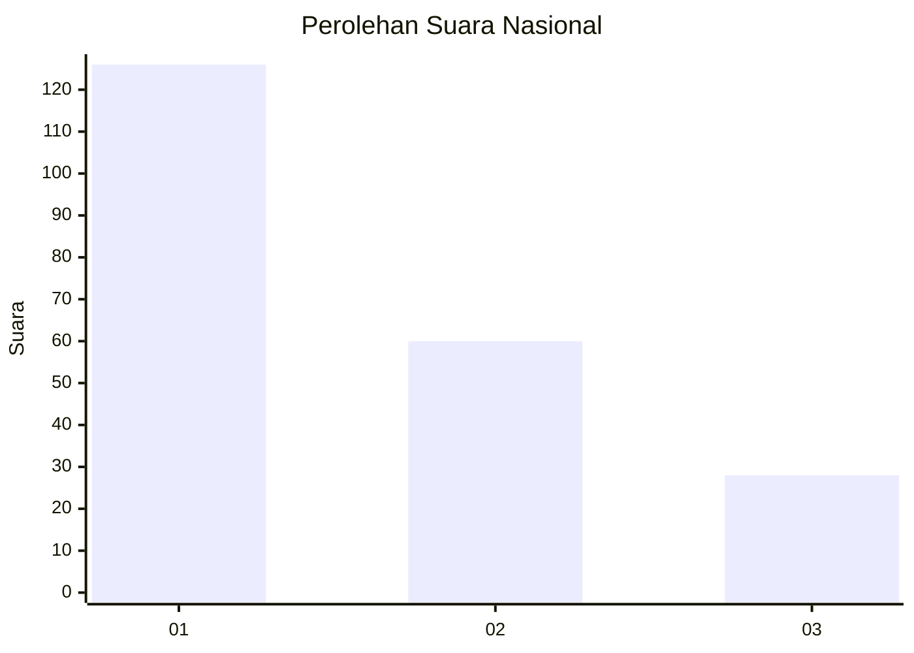
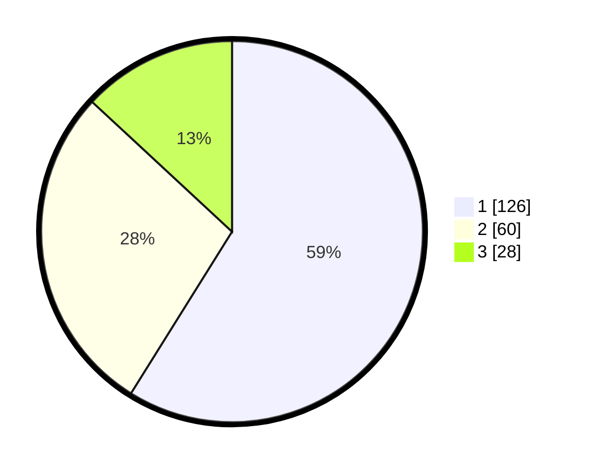

# Hasil

## Grafik

## Tabel

| No.    | Nama Paslon    | Suara | Suara (raw) | Persentase |
|:------ |:-------------- | -----:| -----------:| ----------:|
| 100025 | ANIES MUHAIMIN | 126   | [126][p-1]  | 58,88      |
| 100026 | PRABOWO GIBRAN | 60    | [60][p-2]   | 28,04      |
| 100027 | GANJAR MAHFUD  | 28    | [28][p-3]   | 13,08      |

[p-1]: https://github.com/gigit-pemilu/pemilu-2024/blob/main/pilpres/hitung-suara/sub/31-dki-jakarta/sub/73-jakarta-barat/sub/05-kebon-jeruk/sub/1001-kebon-jeruk/sub/032-tps/sub/paslon-1.txt
[p-2]: https://github.com/gigit-pemilu/pemilu-2024/blob/main/pilpres/hitung-suara/sub/31-dki-jakarta/sub/73-jakarta-barat/sub/05-kebon-jeruk/sub/1001-kebon-jeruk/sub/032-tps/sub/paslon-2.txt
[p-3]: https://github.com/gigit-pemilu/pemilu-2024/blob/main/pilpres/hitung-suara/sub/31-dki-jakarta/sub/73-jakarta-barat/sub/05-kebon-jeruk/sub/1001-kebon-jeruk/sub/032-tps/sub/paslon-3.txt

## Foto C Plano

https://sirekap-obj-formc.kpu.go.id/6254/pemilu/ppwp/31/73/05/10/01/3173051001032-20240214-211334--1414154d-6076-48e0-9fff-d585b0955e84.jpg

https://sirekap-obj-formc.kpu.go.id/6254/pemilu/ppwp/31/73/05/10/01/3173051001032-20240214-221942--df90fc06-14d0-48bb-8862-621ceb0c85c0.jpg

https://sirekap-obj-formc.kpu.go.id/6254/pemilu/ppwp/31/73/05/10/01/3173051001032-20240214-211415--e2fee9b8-6aa3-45ac-8344-6d8d36a9198f.jpg

## Metadata

| Key        | Value               |
| ---------- | ------------------- |
| Time Stamp | 2024-02-16 16:25:10 |

