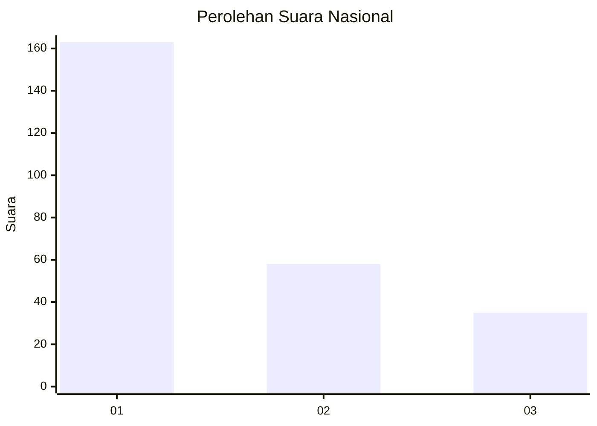
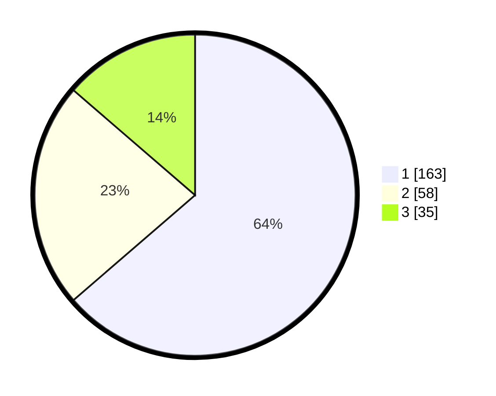

# Hasil

## Grafik

## Tabel

| No.    | Nama Paslon    | Suara | Suara (raw) | Persentase |
|:------ |:-------------- | -----:| -----------:| ----------:|
| 100025 | ANIES MUHAIMIN | 163   | [163][p-1]  | 63,67      |
| 100026 | PRABOWO GIBRAN | 58    | [58][p-2]   | 22,66      |
| 100027 | GANJAR MAHFUD  | 35    | [35][p-3]   | 13,67      |

[p-1]: https://github.com/gigit-pemilu/pemilu-2024/blob/main/pilpres/hitung-suara/sub/31-dki-jakarta/sub/73-jakarta-barat/sub/05-kebon-jeruk/sub/1001-kebon-jeruk/sub/033-tps/sub/paslon-1.txt
[p-2]: https://github.com/gigit-pemilu/pemilu-2024/blob/main/pilpres/hitung-suara/sub/31-dki-jakarta/sub/73-jakarta-barat/sub/05-kebon-jeruk/sub/1001-kebon-jeruk/sub/033-tps/sub/paslon-2.txt
[p-3]: https://github.com/gigit-pemilu/pemilu-2024/blob/main/pilpres/hitung-suara/sub/31-dki-jakarta/sub/73-jakarta-barat/sub/05-kebon-jeruk/sub/1001-kebon-jeruk/sub/033-tps/sub/paslon-3.txt

## Foto C Plano

https://sirekap-obj-formc.kpu.go.id/ffb4/pemilu/ppwp/31/73/05/10/01/3173051001033-20240215-032315--0858a7af-7ac3-4005-be02-f01cfea479b1.jpg

https://sirekap-obj-formc.kpu.go.id/ffb4/pemilu/ppwp/31/73/05/10/01/3173051001033-20240215-032616--364f80db-7742-4c92-a6d5-a26981ca0f07.jpg

https://sirekap-obj-formc.kpu.go.id/ffb4/pemilu/ppwp/31/73/05/10/01/3173051001033-20240215-032903--f405b321-bbec-498a-a5b7-bee888a7d7c4.jpg

## Metadata

| Key        | Value               |
| ---------- | ------------------- |
| Time Stamp | 2024-02-15 15:00:29 |

