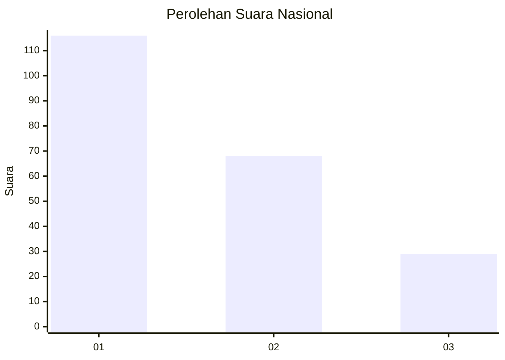
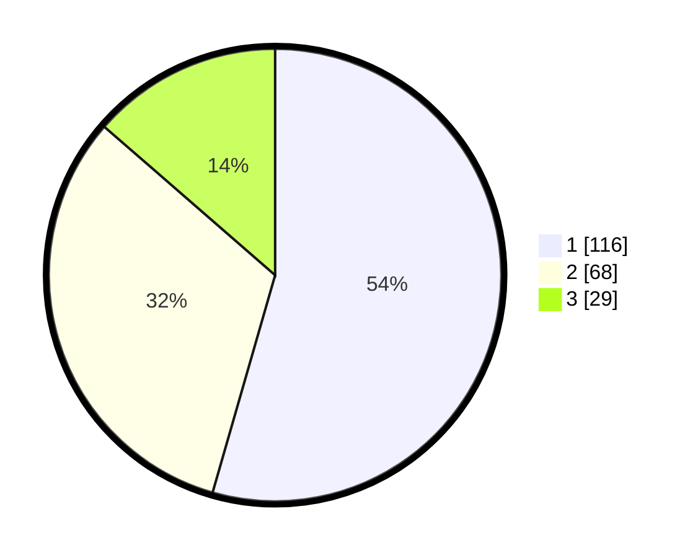

# Hasil

## Grafik

## Tabel

| No.    | Nama Paslon    | Suara | Suara (raw) | Persentase |
|:------ |:-------------- | -----:| -----------:| ----------:|
| 100025 | ANIES MUHAIMIN | 116   | [116][p-1]  | 54,46      |
| 100026 | PRABOWO GIBRAN | 68    | [68][p-2]   | 31,92      |
| 100027 | GANJAR MAHFUD  | 29    | [29][p-3]   | 13,62      |

[p-1]: https://github.com/gigit-pemilu/pemilu-2024/blob/main/pilpres/hitung-suara/sub/31-dki-jakarta/sub/73-jakarta-barat/sub/05-kebon-jeruk/sub/1001-kebon-jeruk/sub/047-tps/sub/paslon-1.txt
[p-2]: https://github.com/gigit-pemilu/pemilu-2024/blob/main/pilpres/hitung-suara/sub/31-dki-jakarta/sub/73-jakarta-barat/sub/05-kebon-jeruk/sub/1001-kebon-jeruk/sub/047-tps/sub/paslon-2.txt
[p-3]: https://github.com/gigit-pemilu/pemilu-2024/blob/main/pilpres/hitung-suara/sub/31-dki-jakarta/sub/73-jakarta-barat/sub/05-kebon-jeruk/sub/1001-kebon-jeruk/sub/047-tps/sub/paslon-3.txt

## Foto C Plano

https://sirekap-obj-formc.kpu.go.id/dd75/pemilu/ppwp/31/73/05/10/01/3173051001047-20240215-000105--52d77b9b-2d18-4059-a12a-9fa9f2bf56ab.jpg

https://sirekap-obj-formc.kpu.go.id/dd75/pemilu/ppwp/31/73/05/10/01/3173051001047-20240214-233833--60a83ab1-b355-4669-a1b4-089e7a0eb053.jpg

https://sirekap-obj-formc.kpu.go.id/dd75/pemilu/ppwp/31/73/05/10/01/3173051001047-20240214-233906--d2766b8b-21f6-4d82-9872-6d80c95116ae.jpg

## Metadata

| Key        | Value               |
| ---------- | ------------------- |
| Time Stamp | 2024-02-19 13:00:00 |

