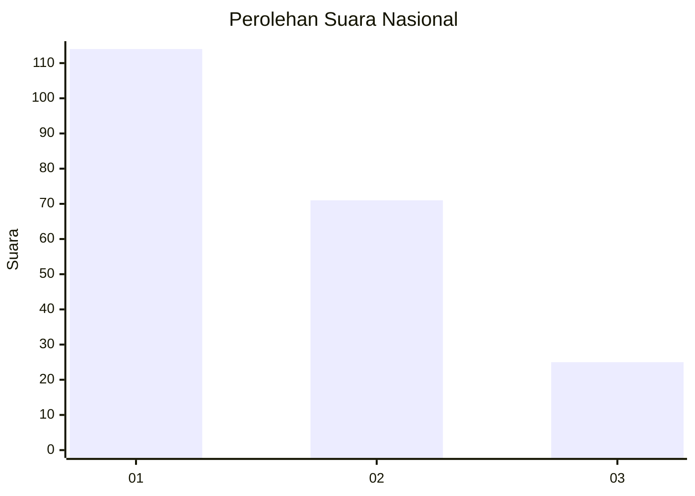
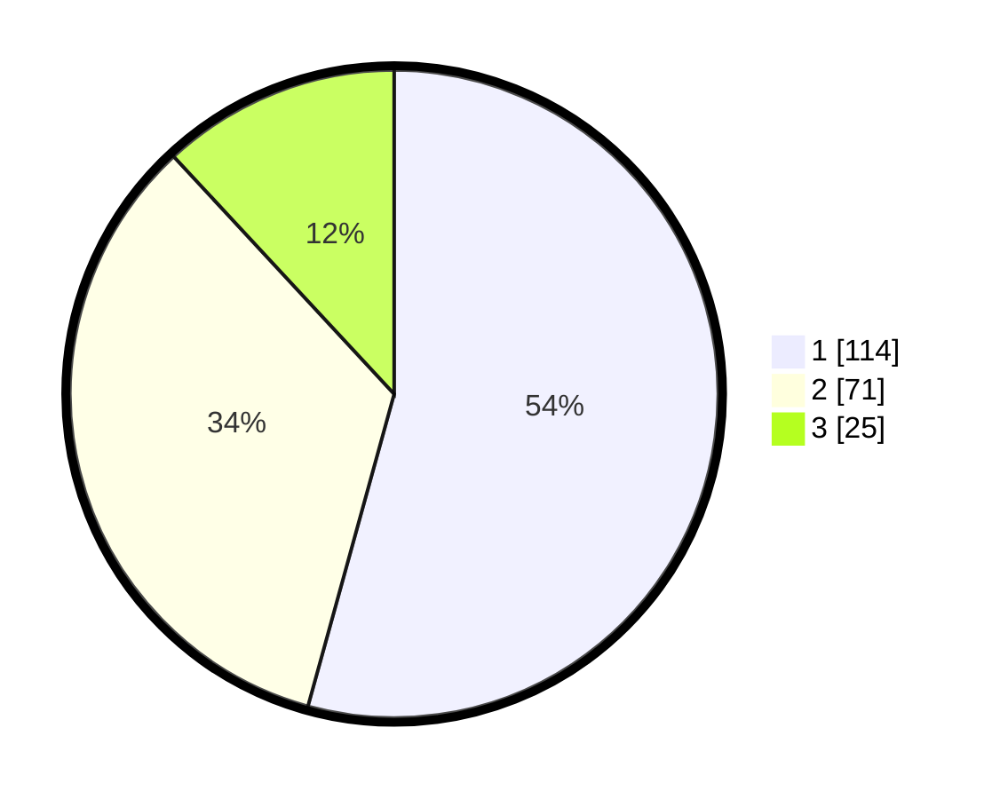

# Hasil

## Grafik

## Tabel

| No.    | Nama Paslon    | Suara | Suara (raw) | Persentase |
|:------ |:-------------- | -----:| -----------:| ----------:|
| 100025 | ANIES MUHAIMIN | 114   | [114][p-1]  | 54,29      |
| 100026 | PRABOWO GIBRAN | 71    | [71][p-2]   | 33,81      |
| 100027 | GANJAR MAHFUD  | 25    | [25][p-3]   | 11,90      |

[p-1]: https://github.com/gigit-pemilu/pemilu-2024/blob/main/pilpres/hitung-suara/sub/31-dki-jakarta/sub/73-jakarta-barat/sub/05-kebon-jeruk/sub/1001-kebon-jeruk/sub/050-tps/sub/paslon-1.txt
[p-2]: https://github.com/gigit-pemilu/pemilu-2024/blob/main/pilpres/hitung-suara/sub/31-dki-jakarta/sub/73-jakarta-barat/sub/05-kebon-jeruk/sub/1001-kebon-jeruk/sub/050-tps/sub/paslon-2.txt
[p-3]: https://github.com/gigit-pemilu/pemilu-2024/blob/main/pilpres/hitung-suara/sub/31-dki-jakarta/sub/73-jakarta-barat/sub/05-kebon-jeruk/sub/1001-kebon-jeruk/sub/050-tps/sub/paslon-3.txt

## Foto C Plano

https://sirekap-obj-formc.kpu.go.id/8b25/pemilu/ppwp/31/73/05/10/01/3173051001050-20240214-224759--e950f63b-693b-4d81-bc11-1c9137deba46.jpg

https://sirekap-obj-formc.kpu.go.id/8b25/pemilu/ppwp/31/73/05/10/01/3173051001050-20240214-224903--da024c25-4763-4e65-b8c9-1ebb6b5aed1c.jpg

https://sirekap-obj-formc.kpu.go.id/8b25/pemilu/ppwp/31/73/05/10/01/3173051001050-20240214-224918--4a3bd6e4-2cec-4a90-a81f-725ec2bf4610.jpg

## Metadata

| Key        | Value               |
| ---------- | ------------------- |
| Time Stamp | 2024-02-19 13:00:00 |

