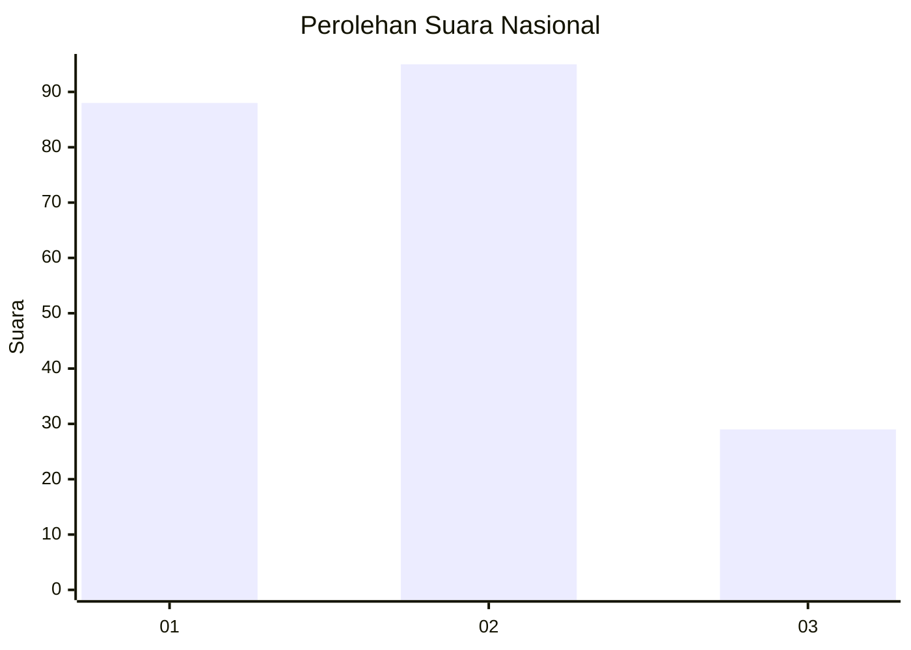
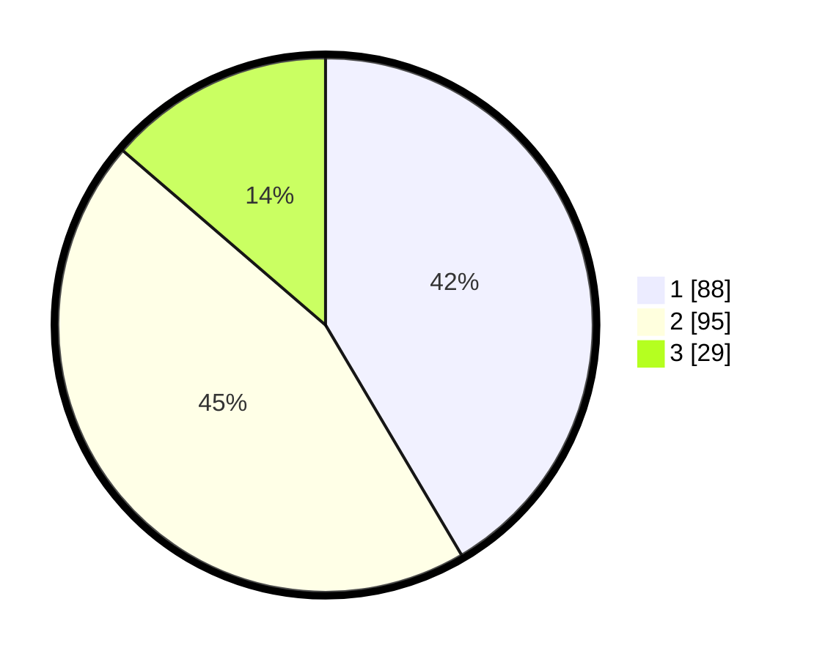

# Hasil

## Grafik

## Tabel

| No.    | Nama Paslon    | Suara | Suara (raw) | Persentase |
|:------ |:-------------- | -----:| -----------:| ----------:|
| 100025 | ANIES MUHAIMIN | 88    | [88][p-1]   | 41,51      |
| 100026 | PRABOWO GIBRAN | 95    | [95][p-2]   | 44,81      |
| 100027 | GANJAR MAHFUD  | 29    | [29][p-3]   | 13,68      |

[p-1]: https://github.com/gigit-pemilu/pemilu-2024/blob/main/pilpres/hitung-suara/sub/31-dki-jakarta/sub/73-jakarta-barat/sub/05-kebon-jeruk/sub/1001-kebon-jeruk/sub/060-tps/sub/paslon-1.txt
[p-2]: https://github.com/gigit-pemilu/pemilu-2024/blob/main/pilpres/hitung-suara/sub/31-dki-jakarta/sub/73-jakarta-barat/sub/05-kebon-jeruk/sub/1001-kebon-jeruk/sub/060-tps/sub/paslon-2.txt
[p-3]: https://github.com/gigit-pemilu/pemilu-2024/blob/main/pilpres/hitung-suara/sub/31-dki-jakarta/sub/73-jakarta-barat/sub/05-kebon-jeruk/sub/1001-kebon-jeruk/sub/060-tps/sub/paslon-3.txt

## Foto C Plano

https://sirekap-obj-formc.kpu.go.id/8bb4/pemilu/ppwp/31/73/05/10/01/3173051001060-20240215-025314--917cb76b-d8a1-4ce2-a7f9-44f749a8eac1.jpg

https://sirekap-obj-formc.kpu.go.id/8bb4/pemilu/ppwp/31/73/05/10/01/3173051001060-20240215-025908--ba01a968-00e0-49cf-bfd3-29578cbb1868.jpg

https://sirekap-obj-formc.kpu.go.id/8bb4/pemilu/ppwp/31/73/05/10/01/3173051001060-20240215-030244--d98d9c6e-de0d-4bcf-b47c-8e3730fca2ea.jpg

## Metadata

| Key        | Value               |
| ---------- | ------------------- |
| Time Stamp | 2024-02-19 13:00:00 |

