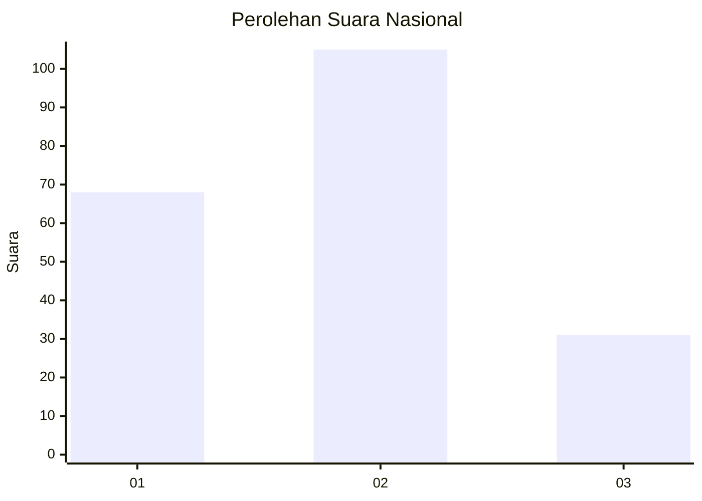
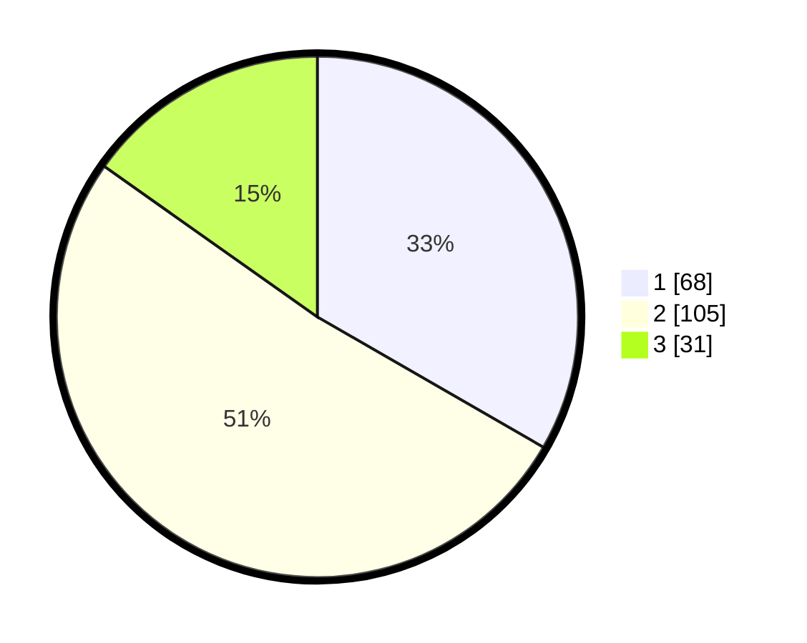

# Hasil

## Grafik

## Tabel

| No.    | Nama Paslon    | Suara | Suara (raw) | Persentase |
|:------ |:-------------- | -----:| -----------:| ----------:|
| 100025 | ANIES MUHAIMIN | 68    | [68][p-1]   | 33,33      |
| 100026 | PRABOWO GIBRAN | 105   | [105][p-2]  | 51,47      |
| 100027 | GANJAR MAHFUD  | 31    | [31][p-3]   | 15,20      |

[p-1]: https://github.com/gigit-pemilu/pemilu-2024/blob/main/pilpres/hitung-suara/sub/31-dki-jakarta/sub/73-jakarta-barat/sub/05-kebon-jeruk/sub/1001-kebon-jeruk/sub/067-tps/sub/paslon-1.txt
[p-2]: https://github.com/gigit-pemilu/pemilu-2024/blob/main/pilpres/hitung-suara/sub/31-dki-jakarta/sub/73-jakarta-barat/sub/05-kebon-jeruk/sub/1001-kebon-jeruk/sub/067-tps/sub/paslon-2.txt
[p-3]: https://github.com/gigit-pemilu/pemilu-2024/blob/main/pilpres/hitung-suara/sub/31-dki-jakarta/sub/73-jakarta-barat/sub/05-kebon-jeruk/sub/1001-kebon-jeruk/sub/067-tps/sub/paslon-3.txt

## Foto C Plano

https://sirekap-obj-formc.kpu.go.id/834b/pemilu/ppwp/31/73/05/10/01/3173051001067-20240214-222043--391a3436-7b9a-4ab6-9899-b9d02e99356e.jpg

https://sirekap-obj-formc.kpu.go.id/834b/pemilu/ppwp/31/73/05/10/01/3173051001067-20240214-223616--a830b796-7424-41e6-87aa-aa34a9ecb744.jpg

https://sirekap-obj-formc.kpu.go.id/834b/pemilu/ppwp/31/73/05/10/01/3173051001067-20240214-223152--d197ae09-4714-4a7a-b828-d5f3c23a314e.jpg

## Metadata

| Key        | Value               |
| ---------- | ------------------- |
| Time Stamp | 2024-02-19 13:00:00 |

