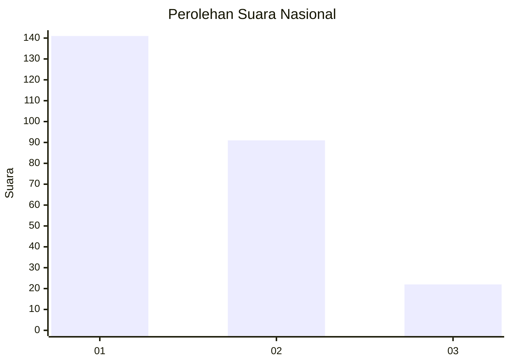
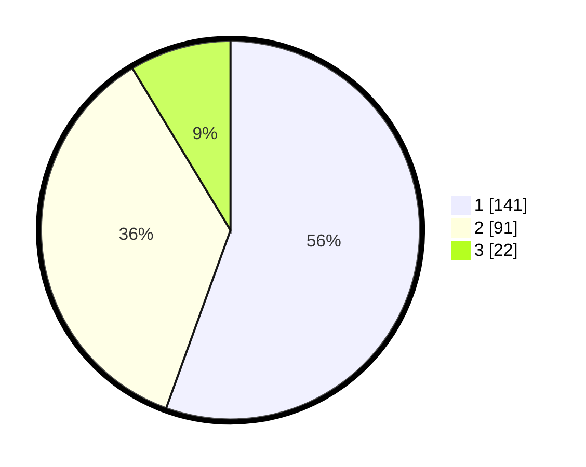

# Hasil

## Grafik

## Tabel

| No.    | Nama Paslon    | Suara | Suara (raw) | Persentase |
|:------ |:-------------- | -----:| -----------:| ----------:|
| 100025 | ANIES MUHAIMIN | 141   | [141][p-1]  | 55,51      |
| 100026 | PRABOWO GIBRAN | 91    | [91][p-2]   | 35,83      |
| 100027 | GANJAR MAHFUD  | 22    | [22][p-3]   | 8,66       |

[p-1]: https://github.com/gigit-pemilu/pemilu-2024/blob/main/pilpres/hitung-suara/sub/31-dki-jakarta/sub/73-jakarta-barat/sub/05-kebon-jeruk/sub/1001-kebon-jeruk/sub/071-tps/sub/paslon-1.txt
[p-2]: https://github.com/gigit-pemilu/pemilu-2024/blob/main/pilpres/hitung-suara/sub/31-dki-jakarta/sub/73-jakarta-barat/sub/05-kebon-jeruk/sub/1001-kebon-jeruk/sub/071-tps/sub/paslon-2.txt
[p-3]: https://github.com/gigit-pemilu/pemilu-2024/blob/main/pilpres/hitung-suara/sub/31-dki-jakarta/sub/73-jakarta-barat/sub/05-kebon-jeruk/sub/1001-kebon-jeruk/sub/071-tps/sub/paslon-3.txt

## Foto C Plano

https://sirekap-obj-formc.kpu.go.id/ac05/pemilu/ppwp/31/73/05/10/01/3173051001071-20240214-155114--6d244c6a-fe06-4e52-8460-4187b2c2e4c9.jpg

https://sirekap-obj-formc.kpu.go.id/ac05/pemilu/ppwp/31/73/05/10/01/3173051001071-20240214-222712--71e1ad2a-2bf5-49e0-a607-e242f2a78840.jpg

https://sirekap-obj-formc.kpu.go.id/ac05/pemilu/ppwp/31/73/05/10/01/3173051001071-20240214-155539--178e0d57-04d3-4046-bafe-b1652cd66003.jpg

## Metadata

| Key        | Value               |
| ---------- | ------------------- |
| Time Stamp | 2024-02-19 13:00:00 |

