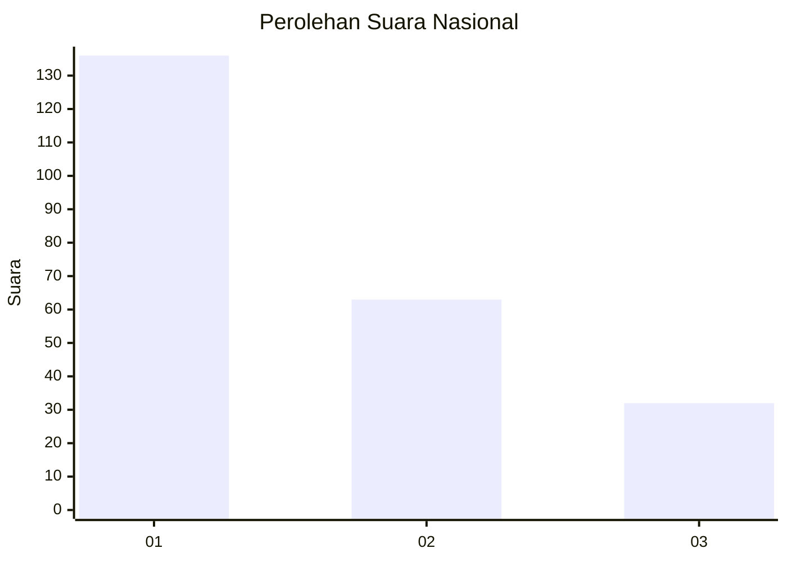
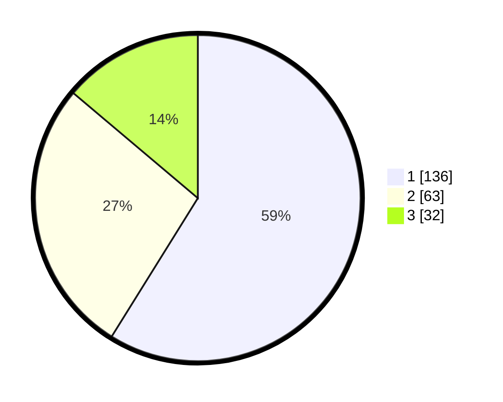

# Hasil

## Grafik

## Tabel

| No.    | Nama Paslon    | Suara | Suara (raw) | Persentase |
|:------ |:-------------- | -----:| -----------:| ----------:|
| 100025 | ANIES MUHAIMIN | 136   | [136][p-1]  | 58,87      |
| 100026 | PRABOWO GIBRAN | 63    | [63][p-2]   | 27,27      |
| 100027 | GANJAR MAHFUD  | 32    | [32][p-3]   | 13,85      |

[p-1]: https://github.com/gigit-pemilu/pemilu-2024/blob/main/pilpres/hitung-suara/sub/31-dki-jakarta/sub/73-jakarta-barat/sub/05-kebon-jeruk/sub/1001-kebon-jeruk/sub/072-tps/sub/paslon-1.txt
[p-2]: https://github.com/gigit-pemilu/pemilu-2024/blob/main/pilpres/hitung-suara/sub/31-dki-jakarta/sub/73-jakarta-barat/sub/05-kebon-jeruk/sub/1001-kebon-jeruk/sub/072-tps/sub/paslon-2.txt
[p-3]: https://github.com/gigit-pemilu/pemilu-2024/blob/main/pilpres/hitung-suara/sub/31-dki-jakarta/sub/73-jakarta-barat/sub/05-kebon-jeruk/sub/1001-kebon-jeruk/sub/072-tps/sub/paslon-3.txt

## Foto C Plano

https://sirekap-obj-formc.kpu.go.id/a52e/pemilu/ppwp/31/73/05/10/01/3173051001072-20240215-001726--b8eedf9e-5eba-4c93-ae73-49cb62fc28f0.jpg

https://sirekap-obj-formc.kpu.go.id/a52e/pemilu/ppwp/31/73/05/10/01/3173051001072-20240215-001856--be493eb8-296e-44f9-9f78-d7e90cc702bb.jpg

https://sirekap-obj-formc.kpu.go.id/a52e/pemilu/ppwp/31/73/05/10/01/3173051001072-20240215-002656--c38e9ff6-aaea-4bf6-84c3-fa16227c1469.jpg

## Metadata

| Key        | Value               |
| ---------- | ------------------- |
| Time Stamp | 2024-02-19 13:00:00 |

