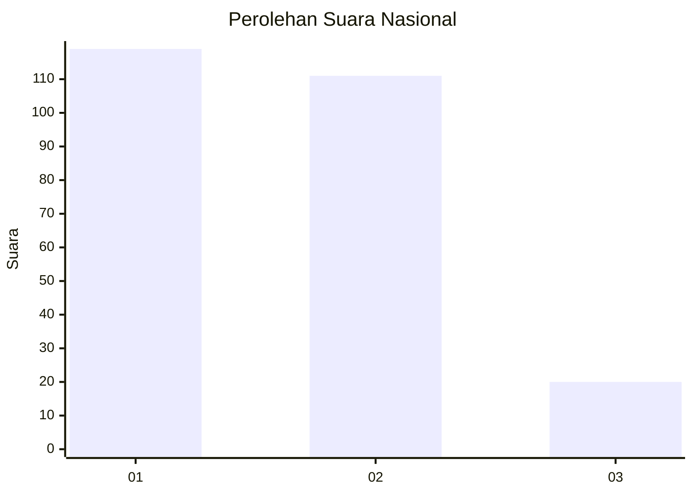
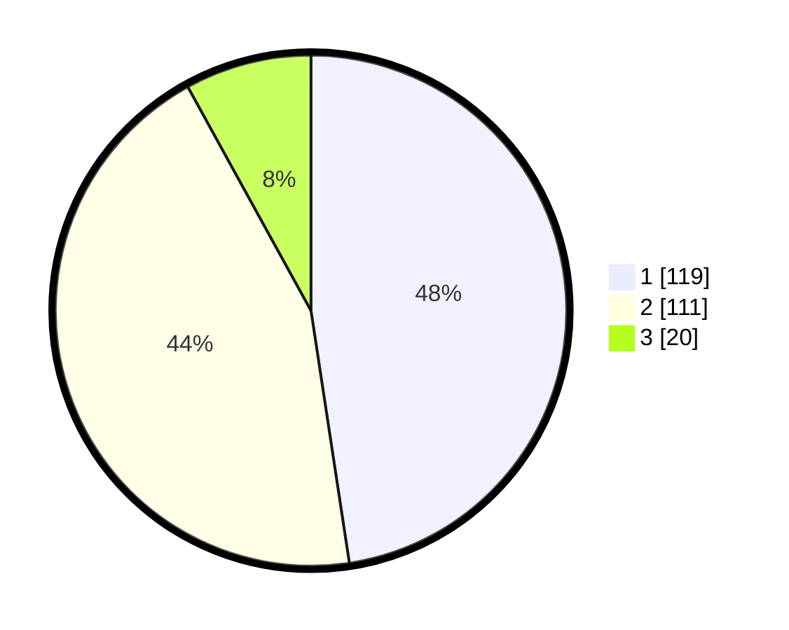

# Hasil

## Grafik

## Tabel

| No.    | Nama Paslon    | Suara | Suara (raw) | Persentase |
|:------ |:-------------- | -----:| -----------:| ----------:|
| 100025 | ANIES MUHAIMIN | 119   | [119][p-1]  | 47,60      |
| 100026 | PRABOWO GIBRAN | 111   | [111][p-2]  | 44,40      |
| 100027 | GANJAR MAHFUD  | 20    | [20][p-3]   | 8,00       |

[p-1]: https://github.com/gigit-pemilu/pemilu-2024/blob/main/pilpres/hitung-suara/sub/31-dki-jakarta/sub/73-jakarta-barat/sub/05-kebon-jeruk/sub/1001-kebon-jeruk/sub/079-tps/sub/paslon-1.txt
[p-2]: https://github.com/gigit-pemilu/pemilu-2024/blob/main/pilpres/hitung-suara/sub/31-dki-jakarta/sub/73-jakarta-barat/sub/05-kebon-jeruk/sub/1001-kebon-jeruk/sub/079-tps/sub/paslon-2.txt
[p-3]: https://github.com/gigit-pemilu/pemilu-2024/blob/main/pilpres/hitung-suara/sub/31-dki-jakarta/sub/73-jakarta-barat/sub/05-kebon-jeruk/sub/1001-kebon-jeruk/sub/079-tps/sub/paslon-3.txt

## Foto C Plano

https://sirekap-obj-formc.kpu.go.id/a3f3/pemilu/ppwp/31/73/05/10/01/3173051001079-20240214-203128--4e70d517-6b94-4b35-8fd9-30c27b4f3a58.jpg

https://sirekap-obj-formc.kpu.go.id/a3f3/pemilu/ppwp/31/73/05/10/01/3173051001079-20240214-203401--f983f35c-0ba4-4773-a8e6-da88ee34a24f.jpg

https://sirekap-obj-formc.kpu.go.id/a3f3/pemilu/ppwp/31/73/05/10/01/3173051001079-20240214-200831--8e9d0455-9e00-4ddd-9865-9aec1da4d0fe.jpg

## Metadata

| Key        | Value               |
| ---------- | ------------------- |
| Time Stamp | 2024-02-15 03:06:03 |

