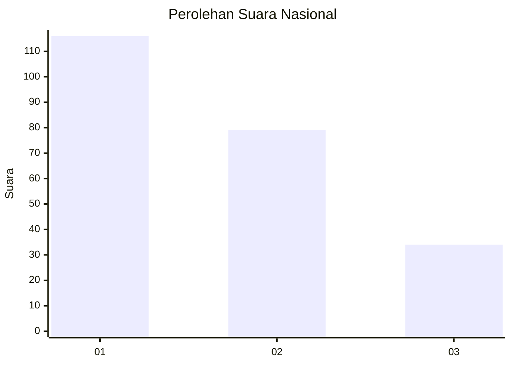
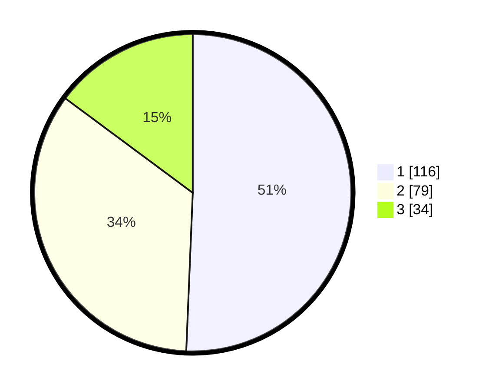

# Hasil

## Grafik

## Tabel

| No.    | Nama Paslon    | Suara | Suara (raw) | Persentase |
|:------ |:-------------- | -----:| -----------:| ----------:|
| 100025 | ANIES MUHAIMIN | 116   | [116][p-1]  | 50,66      |
| 100026 | PRABOWO GIBRAN | 79    | [79][p-2]   | 34,50      |
| 100027 | GANJAR MAHFUD  | 34    | [34][p-3]   | 14,85      |

[p-1]: https://github.com/gigit-pemilu/pemilu-2024/blob/main/pilpres/hitung-suara/sub/31-dki-jakarta/sub/73-jakarta-barat/sub/05-kebon-jeruk/sub/1001-kebon-jeruk/sub/101-tps/sub/paslon-1.txt
[p-2]: https://github.com/gigit-pemilu/pemilu-2024/blob/main/pilpres/hitung-suara/sub/31-dki-jakarta/sub/73-jakarta-barat/sub/05-kebon-jeruk/sub/1001-kebon-jeruk/sub/101-tps/sub/paslon-2.txt
[p-3]: https://github.com/gigit-pemilu/pemilu-2024/blob/main/pilpres/hitung-suara/sub/31-dki-jakarta/sub/73-jakarta-barat/sub/05-kebon-jeruk/sub/1001-kebon-jeruk/sub/101-tps/sub/paslon-3.txt

## Foto C Plano

https://sirekap-obj-formc.kpu.go.id/ec5d/pemilu/ppwp/31/73/05/10/01/3173051001101-20240215-010213--281958a1-81bf-4814-8b2a-0e1fe046cc68.jpg

https://sirekap-obj-formc.kpu.go.id/ec5d/pemilu/ppwp/31/73/05/10/01/3173051001101-20240215-010419--2da7231b-16b4-4dff-809f-ac47f17ac9af.jpg

https://sirekap-obj-formc.kpu.go.id/ec5d/pemilu/ppwp/31/73/05/10/01/3173051001101-20240215-010608--440041ac-8969-487c-98cf-2b4646294640.jpg

## Metadata

| Key        | Value               |
| ---------- | ------------------- |
| Time Stamp | 2024-02-19 13:00:00 |

