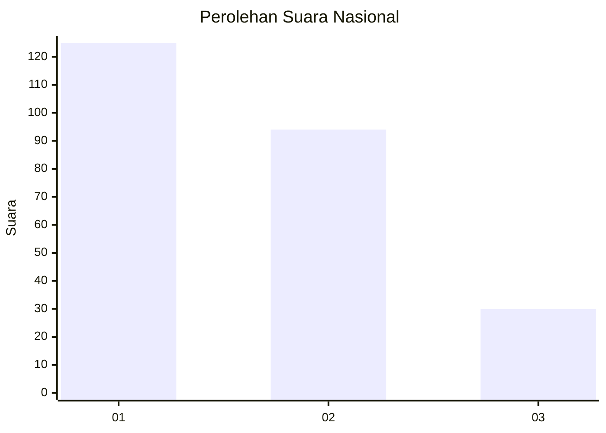
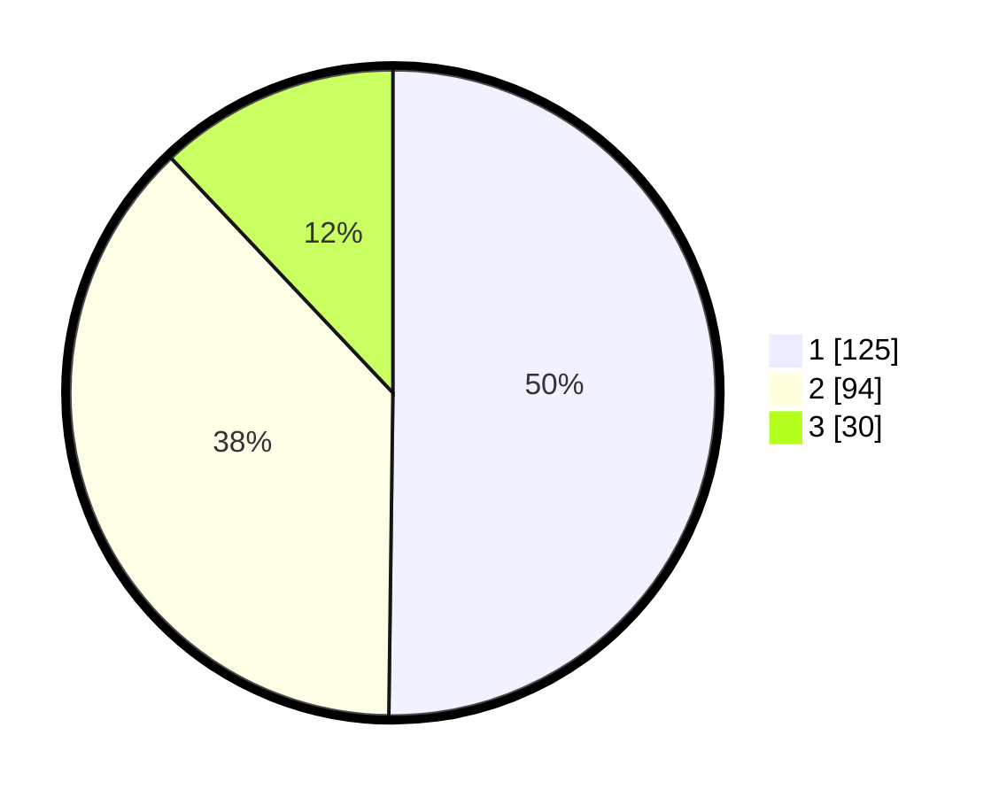

# Hasil

## Grafik

## Tabel

| No.    | Nama Paslon    | Suara | Suara (raw) | Persentase |
|:------ |:-------------- | -----:| -----------:| ----------:|
| 100025 | ANIES MUHAIMIN | 125   | [125][p-1]  | 50,20      |
| 100026 | PRABOWO GIBRAN | 94    | [94][p-2]   | 37,75      |
| 100027 | GANJAR MAHFUD  | 30    | [30][p-3]   | 12,05      |

[p-1]: https://github.com/gigit-pemilu/pemilu-2024/blob/main/pilpres/hitung-suara/sub/31-dki-jakarta/sub/73-jakarta-barat/sub/05-kebon-jeruk/sub/1001-kebon-jeruk/sub/120-tps/sub/paslon-1.txt
[p-2]: https://github.com/gigit-pemilu/pemilu-2024/blob/main/pilpres/hitung-suara/sub/31-dki-jakarta/sub/73-jakarta-barat/sub/05-kebon-jeruk/sub/1001-kebon-jeruk/sub/120-tps/sub/paslon-2.txt
[p-3]: https://github.com/gigit-pemilu/pemilu-2024/blob/main/pilpres/hitung-suara/sub/31-dki-jakarta/sub/73-jakarta-barat/sub/05-kebon-jeruk/sub/1001-kebon-jeruk/sub/120-tps/sub/paslon-3.txt

## Foto C Plano

https://sirekap-obj-formc.kpu.go.id/34a8/pemilu/ppwp/31/73/05/10/01/3173051001120-20240214-230206--86ae69d5-3b60-4dfa-8553-eb8b28cd1f9b.jpg

https://sirekap-obj-formc.kpu.go.id/34a8/pemilu/ppwp/31/73/05/10/01/3173051001120-20240214-230358--1053c51d-a7f4-43f9-bf94-c657a97a7a57.jpg

https://sirekap-obj-formc.kpu.go.id/34a8/pemilu/ppwp/31/73/05/10/01/3173051001120-20240214-230605--ddf1711f-05ae-4130-a39f-7fa5a66429fd.jpg

## Metadata

| Key        | Value               |
| ---------- | ------------------- |
| Time Stamp | 2024-02-16 16:25:10 |

