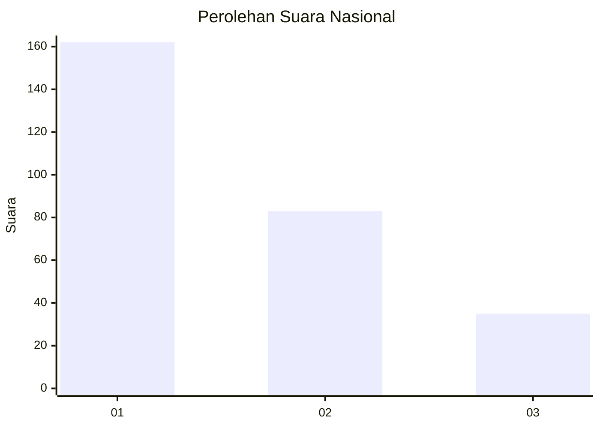
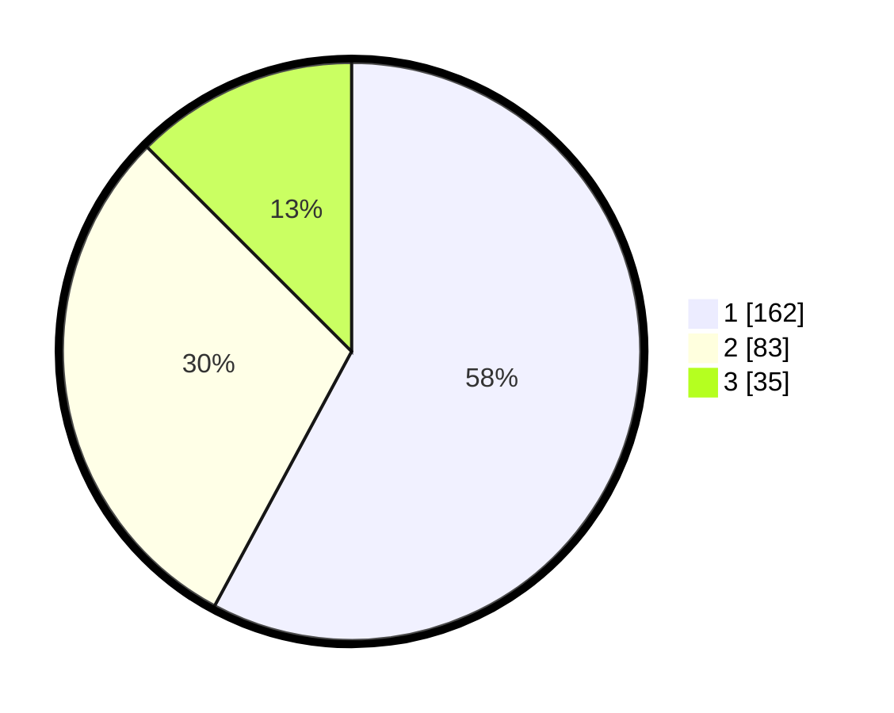

# Hasil

## Grafik

## Tabel

| No. | Nama Paslon    | Suara | Suara (raw) | Persentase |
|:--- |:-------------- | -----:| -----------:| ----------:|
| 1   | ANIES MUHAIMIN | 162   | [162][p-1]  | 57,86      |
| 2   | PRABOWO GIBRAN | 83    | [83][p-2]   | 29,64      |
| 3   | GANJAR MAHFUD  | 35    | [35][p-3]   | 12,50      |

[p-1]: https://github.com/gigit-pemilu/pemilu-2024/blob/main/pilpres/hitung-suara/sub/31-dki-jakarta/sub/73-jakarta-barat/sub/05-kebon-jeruk/sub/1001-kebon-jeruk/sub/142-tps/sub/paslon-1.txt
[p-2]: https://github.com/gigit-pemilu/pemilu-2024/blob/main/pilpres/hitung-suara/sub/31-dki-jakarta/sub/73-jakarta-barat/sub/05-kebon-jeruk/sub/1001-kebon-jeruk/sub/142-tps/sub/paslon-2.txt
[p-3]: https://github.com/gigit-pemilu/pemilu-2024/blob/main/pilpres/hitung-suara/sub/31-dki-jakarta/sub/73-jakarta-barat/sub/05-kebon-jeruk/sub/1001-kebon-jeruk/sub/142-tps/sub/paslon-3.txt

## Foto C Plano

https://sirekap-obj-formc.kpu.go.id/f3eb/pemilu/ppwp/31/73/05/10/01/3173051001142-20240214-233427--f4ec80c2-7d73-45fb-a0ce-bac4098aba73.jpg

https://sirekap-obj-formc.kpu.go.id/f3eb/pemilu/ppwp/31/73/05/10/01/3173051001142-20240214-233601--db93d1b0-288e-491a-8d3c-403b5a1dd874.jpg

https://sirekap-obj-formc.kpu.go.id/f3eb/pemilu/ppwp/31/73/05/10/01/3173051001142-20240214-233651--43d362b4-e312-4860-8d5e-6f9196e298ff.jpg

## Metadata

| Key        | Value               |
| ---------- | ------------------- |
| Time Stamp | 2024-02-16 16:25:10 |

