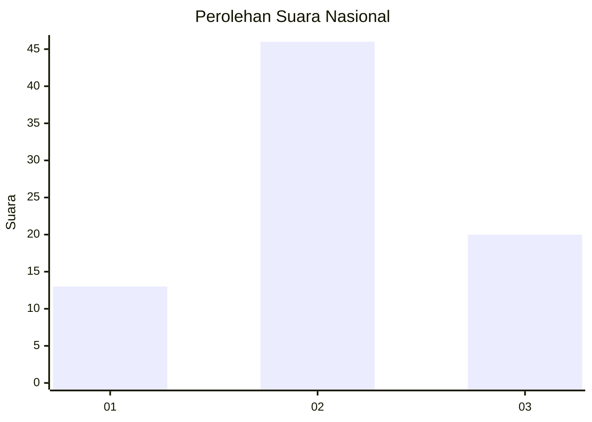
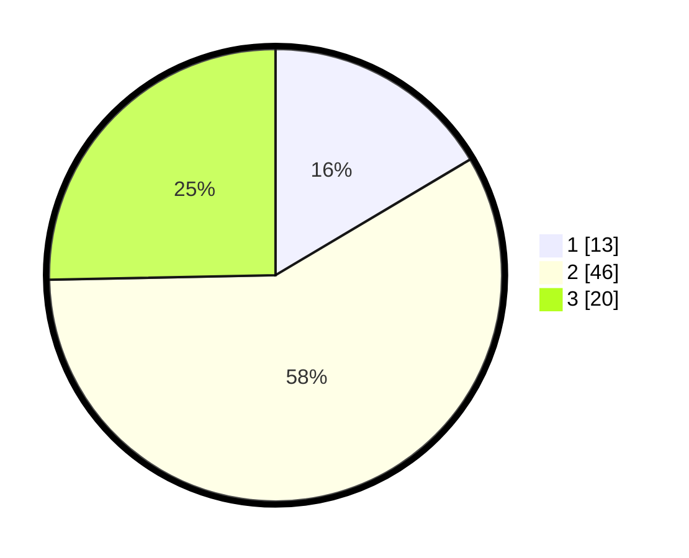

# Hasil

## Grafik

## Tabel

| No. | Nama Paslon    | Suara | Suara (raw) | Persentase |
|:--- |:-------------- | -----:| -----------:| ----------:|
| 1   | ANIES MUHAIMIN | 13    | [13][p-1]   | 16,46      |
| 2   | PRABOWO GIBRAN | 46    | [46][p-2]   | 58,23      |
| 3   | GANJAR MAHFUD  | 20    | [20][p-3]   | 25,32      |

[p-1]: https://github.com/gigit-pemilu/pemilu-2024/blob/main/pilpres/hitung-suara/sub/31-dki-jakarta/sub/73-jakarta-barat/sub/05-kebon-jeruk/sub/1001-kebon-jeruk/sub/156-tps/sub/paslon-1.txt
[p-2]: https://github.com/gigit-pemilu/pemilu-2024/blob/main/pilpres/hitung-suara/sub/31-dki-jakarta/sub/73-jakarta-barat/sub/05-kebon-jeruk/sub/1001-kebon-jeruk/sub/156-tps/sub/paslon-2.txt
[p-3]: https://github.com/gigit-pemilu/pemilu-2024/blob/main/pilpres/hitung-suara/sub/31-dki-jakarta/sub/73-jakarta-barat/sub/05-kebon-jeruk/sub/1001-kebon-jeruk/sub/156-tps/sub/paslon-3.txt

## Foto C Plano

https://sirekap-obj-formc.kpu.go.id/489d/pemilu/ppwp/31/73/05/10/01/3173051001156-20240214-231737--2b628441-3b90-4096-b840-9277cc5cdd69.jpg

https://sirekap-obj-formc.kpu.go.id/489d/pemilu/ppwp/31/73/05/10/01/3173051001156-20240214-231842--db2a76c9-dd0e-41c3-9ad5-a51ac4e9f148.jpg

https://sirekap-obj-formc.kpu.go.id/489d/pemilu/ppwp/31/73/05/10/01/3173051001156-20240214-231925--c6493d2e-12ef-42c3-a5df-2fe675c665f1.jpg

## Metadata

| Key        | Value               |
| ---------- | ------------------- |
| Time Stamp | 2024-02-16 16:25:10 |

