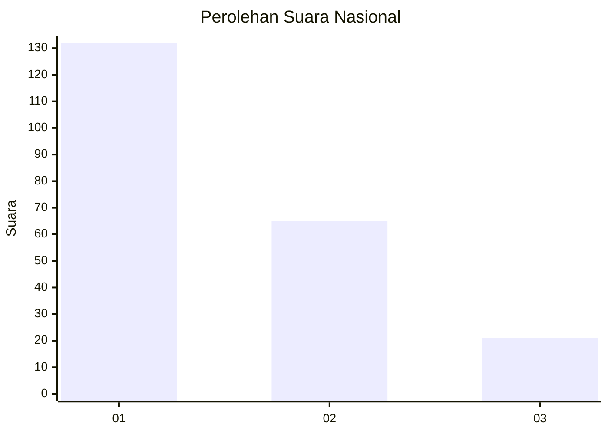
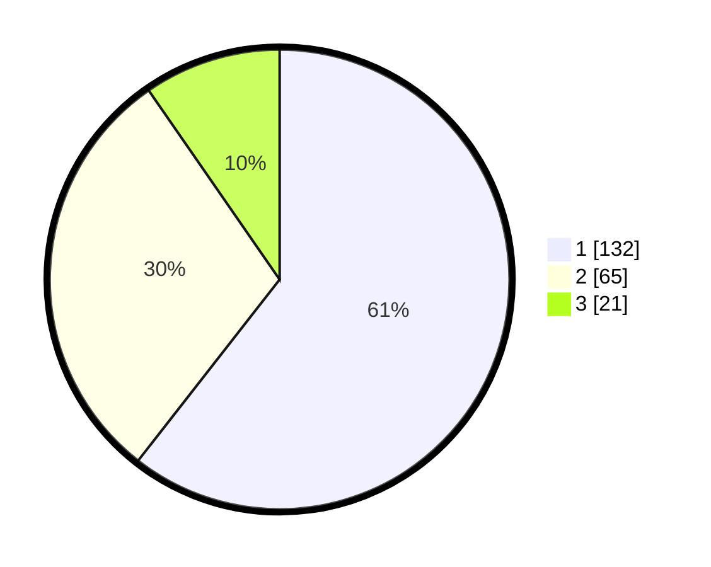

# Hasil

## Grafik

## Tabel

| No.    | Nama Paslon    | Suara | Suara (raw) | Persentase |
|:------ |:-------------- | -----:| -----------:| ----------:|
| 100025 | ANIES MUHAIMIN | 132   | [132][p-1]  | 60,55      |
| 100026 | PRABOWO GIBRAN | 65    | [65][p-2]   | 29,82      |
| 100027 | GANJAR MAHFUD  | 21    | [21][p-3]   | 9,63       |

[p-1]: https://github.com/gigit-pemilu/pemilu-2024/blob/main/pilpres/hitung-suara/sub/31-dki-jakarta/sub/73-jakarta-barat/sub/05-kebon-jeruk/sub/1001-kebon-jeruk/sub/157-tps/sub/paslon-1.txt
[p-2]: https://github.com/gigit-pemilu/pemilu-2024/blob/main/pilpres/hitung-suara/sub/31-dki-jakarta/sub/73-jakarta-barat/sub/05-kebon-jeruk/sub/1001-kebon-jeruk/sub/157-tps/sub/paslon-2.txt
[p-3]: https://github.com/gigit-pemilu/pemilu-2024/blob/main/pilpres/hitung-suara/sub/31-dki-jakarta/sub/73-jakarta-barat/sub/05-kebon-jeruk/sub/1001-kebon-jeruk/sub/157-tps/sub/paslon-3.txt

## Foto C Plano

https://sirekap-obj-formc.kpu.go.id/32a5/pemilu/ppwp/31/73/05/10/01/3173051001157-20240214-215703--a61d6f2a-4c98-46f0-b84f-c293f1fb2619.jpg

https://sirekap-obj-formc.kpu.go.id/32a5/pemilu/ppwp/31/73/05/10/01/3173051001157-20240214-215852--d85eae07-a7c5-4af7-9adf-03e508aed923.jpg

https://sirekap-obj-formc.kpu.go.id/32a5/pemilu/ppwp/31/73/05/10/01/3173051001157-20240214-215925--3ed72043-1deb-4f7c-a191-41ea840674a5.jpg

## Metadata

| Key        | Value               |
| ---------- | ------------------- |
| Time Stamp | 2024-02-19 13:00:00 |

