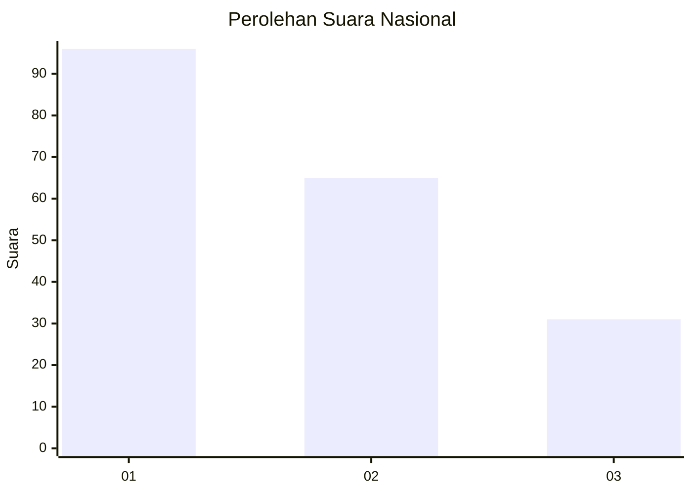
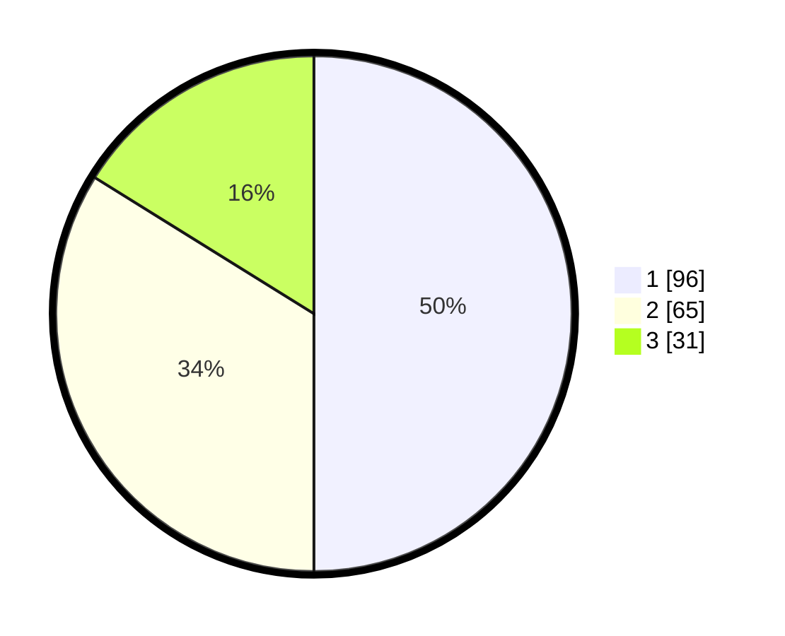

# Hasil

## Grafik

## Tabel

| No.    | Nama Paslon    | Suara | Suara (raw) | Persentase |
|:------ |:-------------- | -----:| -----------:| ----------:|
| 100025 | ANIES MUHAIMIN | 96    | [96][p-1]   | 50,00      |
| 100026 | PRABOWO GIBRAN | 65    | [65][p-2]   | 33,85      |
| 100027 | GANJAR MAHFUD  | 31    | [31][p-3]   | 16,15      |

[p-1]: https://github.com/gigit-pemilu/pemilu-2024/blob/main/pilpres/hitung-suara/sub/31-dki-jakarta/sub/73-jakarta-barat/sub/05-kebon-jeruk/sub/1001-kebon-jeruk/sub/158-tps/sub/paslon-1.txt
[p-2]: https://github.com/gigit-pemilu/pemilu-2024/blob/main/pilpres/hitung-suara/sub/31-dki-jakarta/sub/73-jakarta-barat/sub/05-kebon-jeruk/sub/1001-kebon-jeruk/sub/158-tps/sub/paslon-2.txt
[p-3]: https://github.com/gigit-pemilu/pemilu-2024/blob/main/pilpres/hitung-suara/sub/31-dki-jakarta/sub/73-jakarta-barat/sub/05-kebon-jeruk/sub/1001-kebon-jeruk/sub/158-tps/sub/paslon-3.txt

## Foto C Plano

https://sirekap-obj-formc.kpu.go.id/eb37/pemilu/ppwp/31/73/05/10/01/3173051001158-20240214-211927--2d587d40-b4b6-48ce-be56-dbd6655e1102.jpg

https://sirekap-obj-formc.kpu.go.id/eb37/pemilu/ppwp/31/73/05/10/01/3173051001158-20240214-211941--4fc4f618-dee3-48d4-810d-bfc83452b528.jpg

https://sirekap-obj-formc.kpu.go.id/eb37/pemilu/ppwp/31/73/05/10/01/3173051001158-20240214-211947--2e82a269-24ff-431a-99b8-26895790fffd.jpg

## Metadata

| Key        | Value               |
| ---------- | ------------------- |
| Time Stamp | 2024-02-16 16:25:10 |

