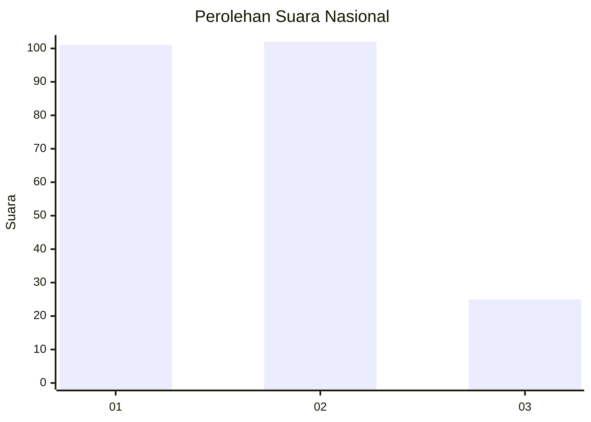
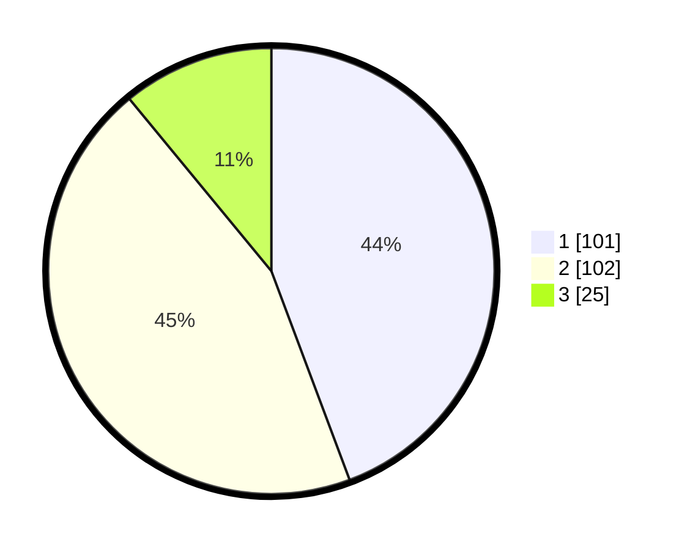

# Hasil

## Grafik

## Tabel

| No.    | Nama Paslon    | Suara | Suara (raw) | Persentase |
|:------ |:-------------- | -----:| -----------:| ----------:|
| 100025 | ANIES MUHAIMIN | 101   | [101][p-1]  | 44,30      |
| 100026 | PRABOWO GIBRAN | 102   | [102][p-2]  | 44,74      |
| 100027 | GANJAR MAHFUD  | 25    | [25][p-3]   | 10,96      |

[p-1]: https://github.com/gigit-pemilu/pemilu-2024/blob/main/pilpres/hitung-suara/sub/31-dki-jakarta/sub/73-jakarta-barat/sub/05-kebon-jeruk/sub/1001-kebon-jeruk/sub/170-tps/sub/paslon-1.txt
[p-2]: https://github.com/gigit-pemilu/pemilu-2024/blob/main/pilpres/hitung-suara/sub/31-dki-jakarta/sub/73-jakarta-barat/sub/05-kebon-jeruk/sub/1001-kebon-jeruk/sub/170-tps/sub/paslon-2.txt
[p-3]: https://github.com/gigit-pemilu/pemilu-2024/blob/main/pilpres/hitung-suara/sub/31-dki-jakarta/sub/73-jakarta-barat/sub/05-kebon-jeruk/sub/1001-kebon-jeruk/sub/170-tps/sub/paslon-3.txt

## Foto C Plano

https://sirekap-obj-formc.kpu.go.id/f5a3/pemilu/ppwp/31/73/05/10/01/3173051001170-20240214-225823--6c5b1bcf-72d3-4cbc-b87d-c3d136c44869.jpg

https://sirekap-obj-formc.kpu.go.id/f5a3/pemilu/ppwp/31/73/05/10/01/3173051001170-20240214-230215--3f151318-a21b-4c2e-9958-a90d2c1b288d.jpg

https://sirekap-obj-formc.kpu.go.id/f5a3/pemilu/ppwp/31/73/05/10/01/3173051001170-20240214-230358--faccc970-721c-4d24-99c5-1207ac3ce38b.jpg

## Metadata

| Key        | Value               |
| ---------- | ------------------- |
| Time Stamp | 2024-02-16 16:25:10 |

