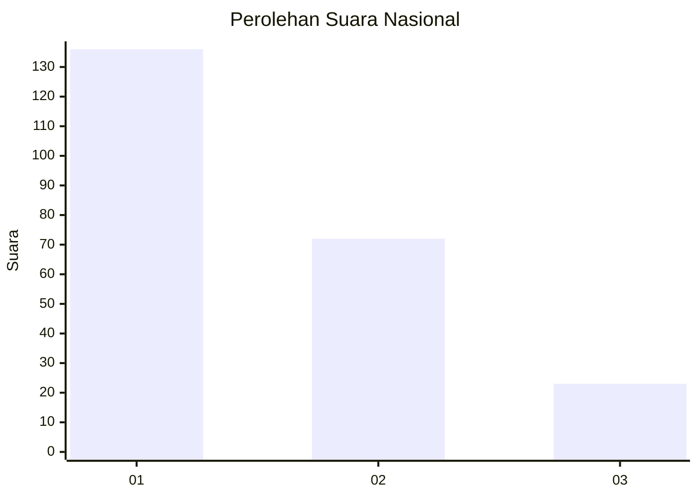
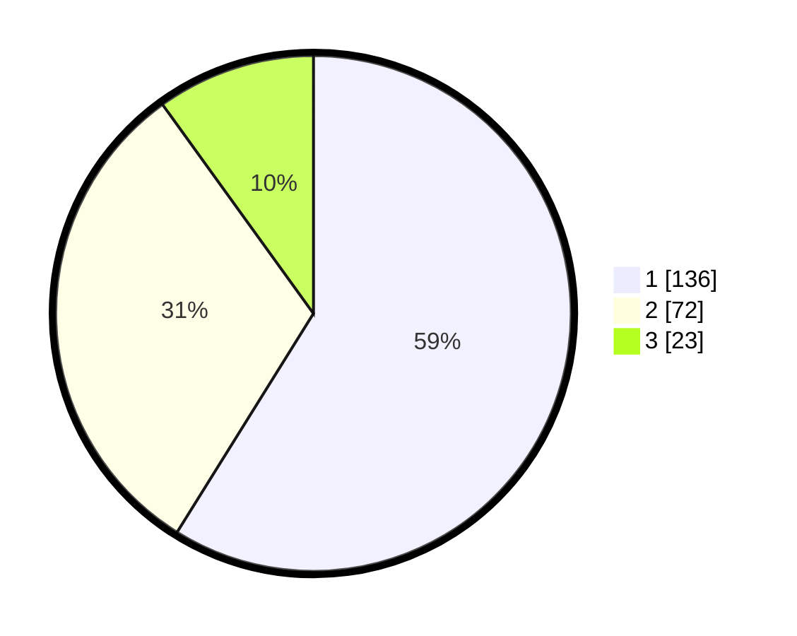

# Hasil

## Grafik

## Tabel

| No.    | Nama Paslon    | Suara | Suara (raw) | Persentase |
|:------ |:-------------- | -----:| -----------:| ----------:|
| 100025 | ANIES MUHAIMIN | 136   | [136][p-1]  | 58,87      |
| 100026 | PRABOWO GIBRAN | 72    | [72][p-2]   | 31,17      |
| 100027 | GANJAR MAHFUD  | 23    | [23][p-3]   | 9,96       |

[p-1]: https://github.com/gigit-pemilu/pemilu-2024/blob/main/pilpres/hitung-suara/sub/31-dki-jakarta/sub/73-jakarta-barat/sub/05-kebon-jeruk/sub/1001-kebon-jeruk/sub/171-tps/sub/paslon-1.txt
[p-2]: https://github.com/gigit-pemilu/pemilu-2024/blob/main/pilpres/hitung-suara/sub/31-dki-jakarta/sub/73-jakarta-barat/sub/05-kebon-jeruk/sub/1001-kebon-jeruk/sub/171-tps/sub/paslon-2.txt
[p-3]: https://github.com/gigit-pemilu/pemilu-2024/blob/main/pilpres/hitung-suara/sub/31-dki-jakarta/sub/73-jakarta-barat/sub/05-kebon-jeruk/sub/1001-kebon-jeruk/sub/171-tps/sub/paslon-3.txt

## Foto C Plano

https://sirekap-obj-formc.kpu.go.id/57e2/pemilu/ppwp/31/73/05/10/01/3173051001171-20240214-221410--678b008f-cf9e-4be7-a8fb-188fcfda53d7.jpg

https://sirekap-obj-formc.kpu.go.id/57e2/pemilu/ppwp/31/73/05/10/01/3173051001171-20240214-221534--67dedaf2-b4e6-4f0f-9446-c79761eeb5ac.jpg

https://sirekap-obj-formc.kpu.go.id/57e2/pemilu/ppwp/31/73/05/10/01/3173051001171-20240214-221733--6c396c09-aafe-4f49-8d88-63ced23cac3e.jpg

## Metadata

| Key        | Value               |
| ---------- | ------------------- |
| Time Stamp | 2024-02-19 13:00:00 |

