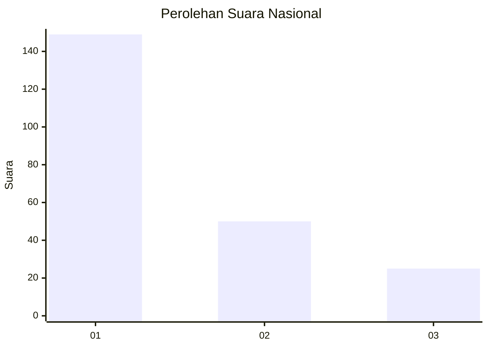
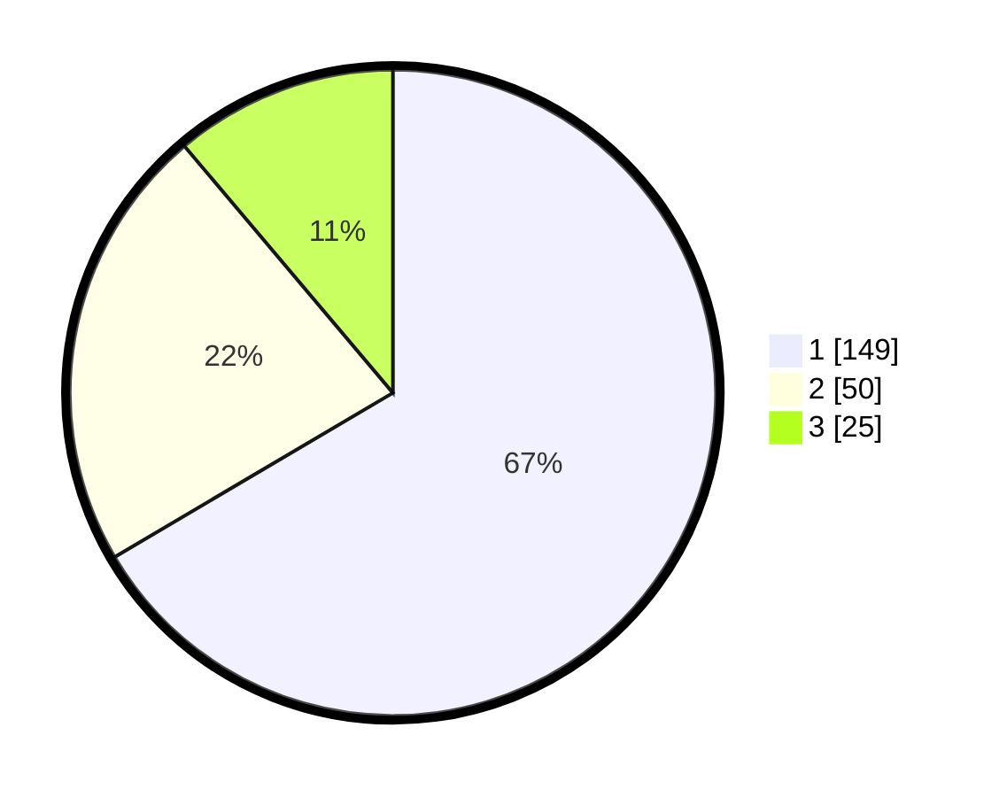

# Hasil

## Grafik

## Tabel

| No.    | Nama Paslon    | Suara | Suara (raw) | Persentase |
|:------ |:-------------- | -----:| -----------:| ----------:|
| 100025 | ANIES MUHAIMIN | 149   | [149][p-1]  | 66,52      |
| 100026 | PRABOWO GIBRAN | 50    | [50][p-2]   | 22,32      |
| 100027 | GANJAR MAHFUD  | 25    | [25][p-3]   | 11,16      |

[p-1]: https://github.com/gigit-pemilu/pemilu-2024/blob/main/pilpres/hitung-suara/sub/31-dki-jakarta/sub/73-jakarta-barat/sub/05-kebon-jeruk/sub/1001-kebon-jeruk/sub/181-tps/sub/paslon-1.txt
[p-2]: https://github.com/gigit-pemilu/pemilu-2024/blob/main/pilpres/hitung-suara/sub/31-dki-jakarta/sub/73-jakarta-barat/sub/05-kebon-jeruk/sub/1001-kebon-jeruk/sub/181-tps/sub/paslon-2.txt
[p-3]: https://github.com/gigit-pemilu/pemilu-2024/blob/main/pilpres/hitung-suara/sub/31-dki-jakarta/sub/73-jakarta-barat/sub/05-kebon-jeruk/sub/1001-kebon-jeruk/sub/181-tps/sub/paslon-3.txt

## Foto C Plano

https://sirekap-obj-formc.kpu.go.id/717f/pemilu/ppwp/31/73/05/10/01/3173051001181-20240214-225200--064f36a8-23a2-4a80-85fd-c67ff0b8cbd1.jpg

https://sirekap-obj-formc.kpu.go.id/717f/pemilu/ppwp/31/73/05/10/01/3173051001181-20240214-225241--bd409009-d093-4d2d-859f-6219436b6340.jpg

https://sirekap-obj-formc.kpu.go.id/717f/pemilu/ppwp/31/73/05/10/01/3173051001181-20240214-225352--c9249765-4693-4921-a322-c58b69a869dc.jpg

## Metadata

| Key        | Value               |
| ---------- | ------------------- |
| Time Stamp | 2024-02-16 21:01:00 |

