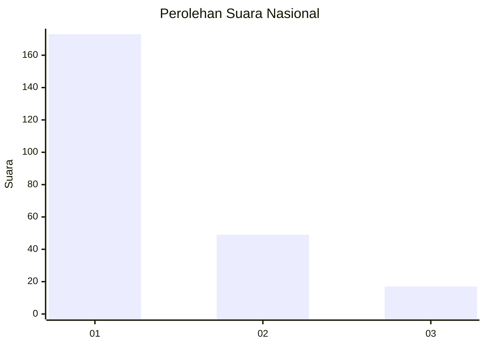
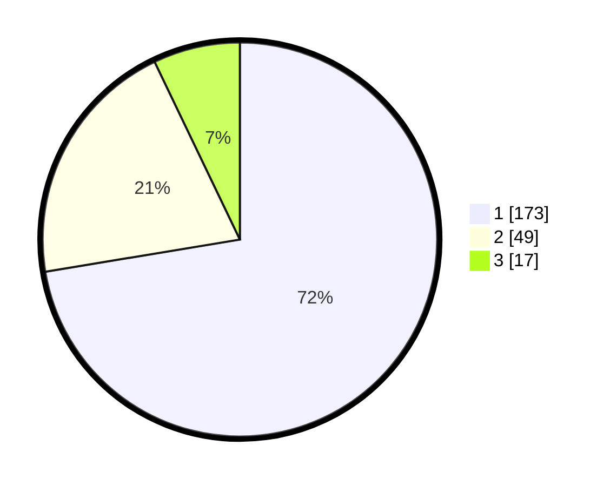

# Hasil

## Grafik

## Tabel

| No.    | Nama Paslon    | Suara | Suara (raw) | Persentase |
|:------ |:-------------- | -----:| -----------:| ----------:|
| 100025 | ANIES MUHAIMIN | 173   | [173][p-1]  | 72,38      |
| 100026 | PRABOWO GIBRAN | 49    | [49][p-2]   | 20,50      |
| 100027 | GANJAR MAHFUD  | 17    | [17][p-3]   | 7,11       |

[p-1]: https://github.com/gigit-pemilu/pemilu-2024/blob/main/pilpres/hitung-suara/sub/31-dki-jakarta/sub/73-jakarta-barat/sub/05-kebon-jeruk/sub/1001-kebon-jeruk/sub/186-tps/sub/paslon-1.txt
[p-2]: https://github.com/gigit-pemilu/pemilu-2024/blob/main/pilpres/hitung-suara/sub/31-dki-jakarta/sub/73-jakarta-barat/sub/05-kebon-jeruk/sub/1001-kebon-jeruk/sub/186-tps/sub/paslon-2.txt
[p-3]: https://github.com/gigit-pemilu/pemilu-2024/blob/main/pilpres/hitung-suara/sub/31-dki-jakarta/sub/73-jakarta-barat/sub/05-kebon-jeruk/sub/1001-kebon-jeruk/sub/186-tps/sub/paslon-3.txt

## Foto C Plano

https://sirekap-obj-formc.kpu.go.id/efcb/pemilu/ppwp/31/73/05/10/01/3173051001186-20240214-215930--9e2f0da5-91c8-4ee8-97af-69d60ebf080c.jpg

https://sirekap-obj-formc.kpu.go.id/efcb/pemilu/ppwp/31/73/05/10/01/3173051001186-20240214-220243--5dcbdf06-59be-4e92-bec1-6ebd4af66c07.jpg

https://sirekap-obj-formc.kpu.go.id/efcb/pemilu/ppwp/31/73/05/10/01/3173051001186-20240214-220428--a1e1cdb6-2581-402c-9e00-cfaa4436d663.jpg

## Metadata

| Key        | Value               |
| ---------- | ------------------- |
| Time Stamp | 2024-02-19 06:16:00 |

