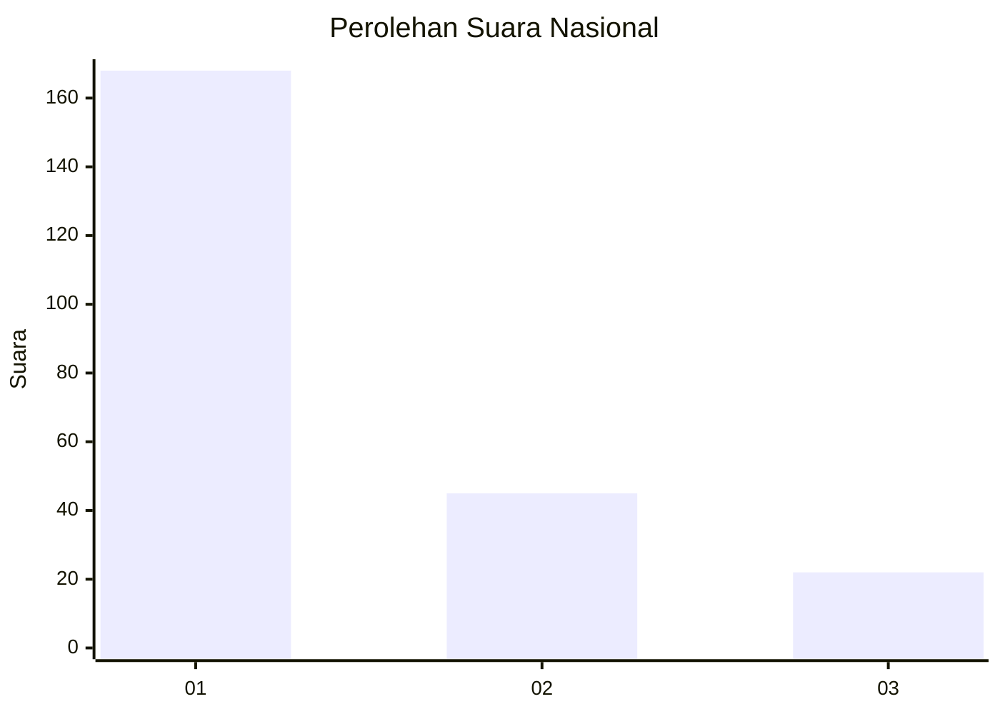
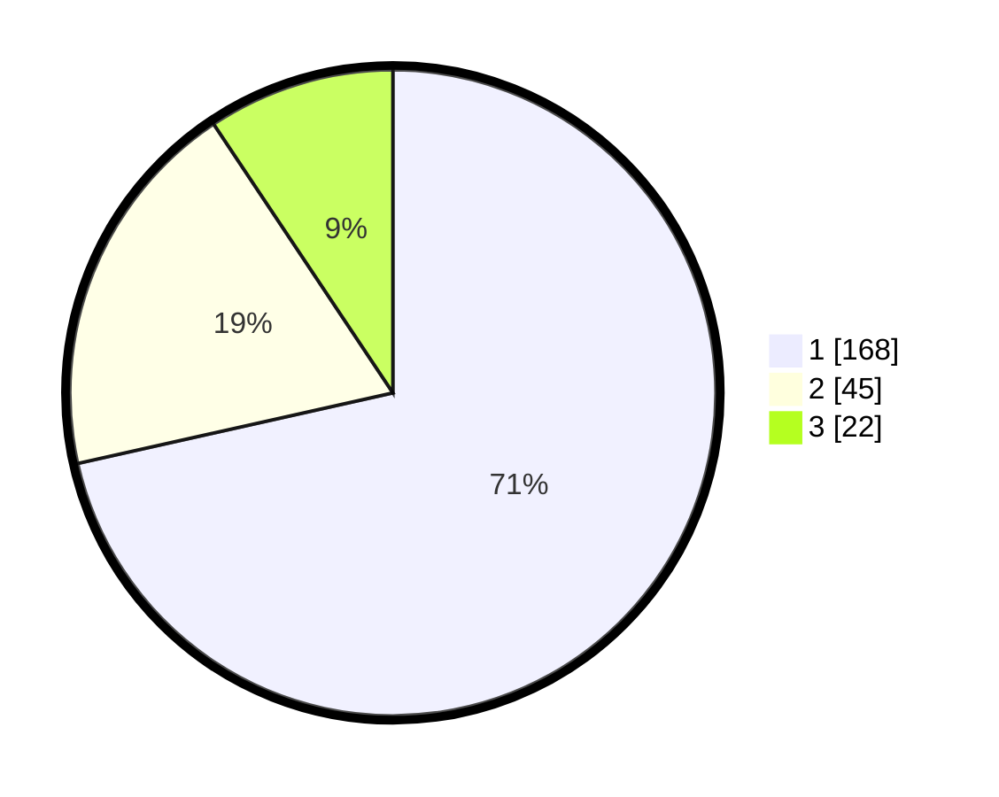

# Hasil

## Grafik

## Tabel

| No.    | Nama Paslon    | Suara | Suara (raw) | Persentase |
|:------ |:-------------- | -----:| -----------:| ----------:|
| 100025 | ANIES MUHAIMIN | 168   | [168][p-1]  | 71,49      |
| 100026 | PRABOWO GIBRAN | 45    | [45][p-2]   | 19,15      |
| 100027 | GANJAR MAHFUD  | 22    | [22][p-3]   | 9,36       |

[p-1]: https://github.com/gigit-pemilu/pemilu-2024/blob/main/pilpres/hitung-suara/sub/31-dki-jakarta/sub/73-jakarta-barat/sub/05-kebon-jeruk/sub/1002-sukabumi-utara/sub/045-tps/sub/paslon-1.txt
[p-2]: https://github.com/gigit-pemilu/pemilu-2024/blob/main/pilpres/hitung-suara/sub/31-dki-jakarta/sub/73-jakarta-barat/sub/05-kebon-jeruk/sub/1002-sukabumi-utara/sub/045-tps/sub/paslon-2.txt
[p-3]: https://github.com/gigit-pemilu/pemilu-2024/blob/main/pilpres/hitung-suara/sub/31-dki-jakarta/sub/73-jakarta-barat/sub/05-kebon-jeruk/sub/1002-sukabumi-utara/sub/045-tps/sub/paslon-3.txt

## Foto C Plano

https://sirekap-obj-formc.kpu.go.id/1b30/pemilu/ppwp/31/73/05/10/02/3173051002045-20240214-211541--e2669343-f4f0-44d3-9489-99d722edbd2f.jpg

https://sirekap-obj-formc.kpu.go.id/1b30/pemilu/ppwp/31/73/05/10/02/3173051002045-20240214-212039--a5c3cf36-923b-4581-b407-1c0f1e71d1af.jpg

https://sirekap-obj-formc.kpu.go.id/1b30/pemilu/ppwp/31/73/05/10/02/3173051002045-20240214-203421--00ee597f-92fd-485a-9a40-99c5cd556655.jpg

## Metadata

| Key        | Value               |
| ---------- | ------------------- |
| Time Stamp | 2024-02-19 13:00:00 |

