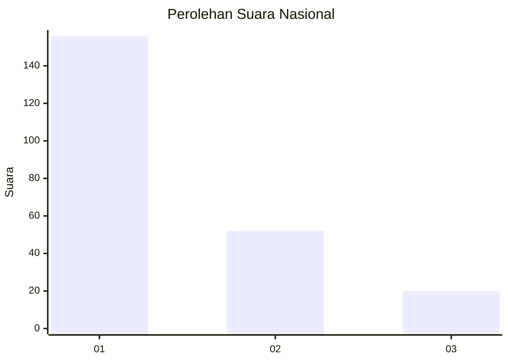
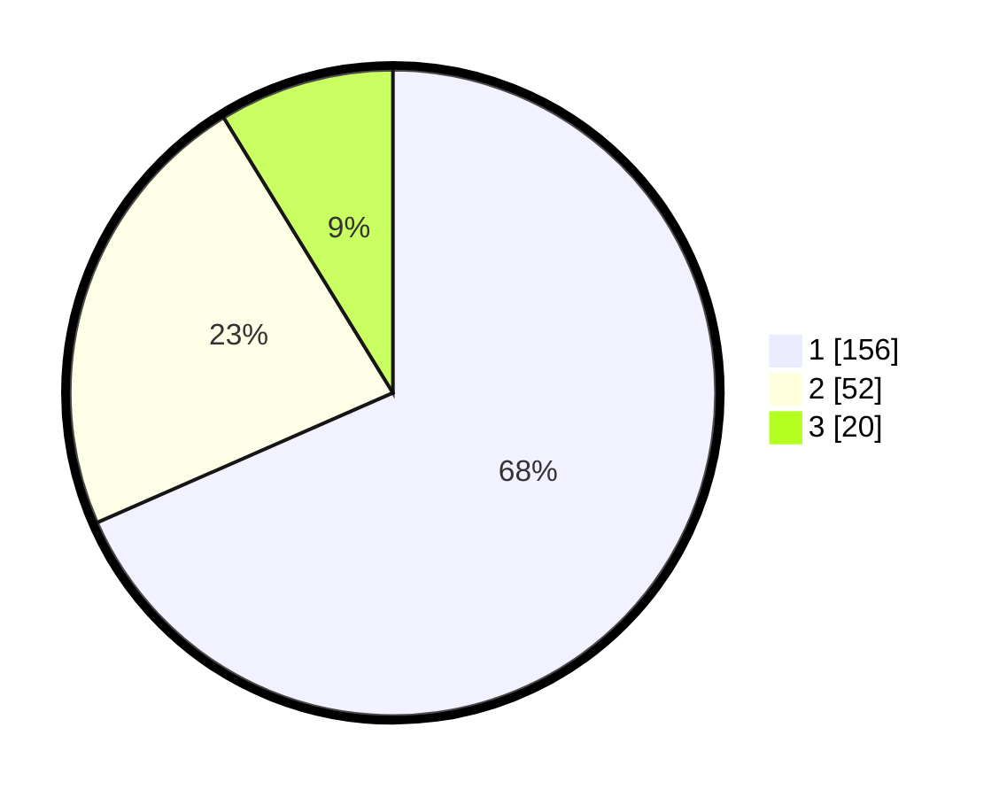

# Hasil

## Grafik

## Tabel

| No. | Nama Paslon    | Suara | Suara (raw) | Persentase |
|:--- |:-------------- | -----:| -----------:| ----------:|
| 1   | ANIES MUHAIMIN | 156   | [156][p-1]  | 68,42      |
| 2   | PRABOWO GIBRAN | 52    | [52][p-2]   | 22,81      |
| 3   | GANJAR MAHFUD  | 20    | [20][p-3]   | 8,77       |

[p-1]: https://github.com/gigit-pemilu/pemilu-2024/blob/main/pilpres/hitung-suara/sub/31-dki-jakarta/sub/73-jakarta-barat/sub/05-kebon-jeruk/sub/1002-sukabumi-utara/sub/048-tps/sub/paslon-1.txt
[p-2]: https://github.com/gigit-pemilu/pemilu-2024/blob/main/pilpres/hitung-suara/sub/31-dki-jakarta/sub/73-jakarta-barat/sub/05-kebon-jeruk/sub/1002-sukabumi-utara/sub/048-tps/sub/paslon-2.txt
[p-3]: https://github.com/gigit-pemilu/pemilu-2024/blob/main/pilpres/hitung-suara/sub/31-dki-jakarta/sub/73-jakarta-barat/sub/05-kebon-jeruk/sub/1002-sukabumi-utara/sub/048-tps/sub/paslon-3.txt

## Foto C Plano

https://sirekap-obj-formc.kpu.go.id/1cac/pemilu/ppwp/31/73/05/10/02/3173051002048-20240214-211028--52c527d6-3bb0-422f-b76e-46b97ac0d5f1.jpg

https://sirekap-obj-formc.kpu.go.id/1cac/pemilu/ppwp/31/73/05/10/02/3173051002048-20240214-211146--9edb6d59-7db5-4ffe-8b1a-f9f3f5813630.jpg

https://sirekap-obj-formc.kpu.go.id/1cac/pemilu/ppwp/31/73/05/10/02/3173051002048-20240214-211323--b46ba04c-1637-4877-ba9b-0f738aea87a2.jpg

## Metadata

| Key        | Value               |
| ---------- | ------------------- |
| Time Stamp | 2024-02-19 13:00:00 |

