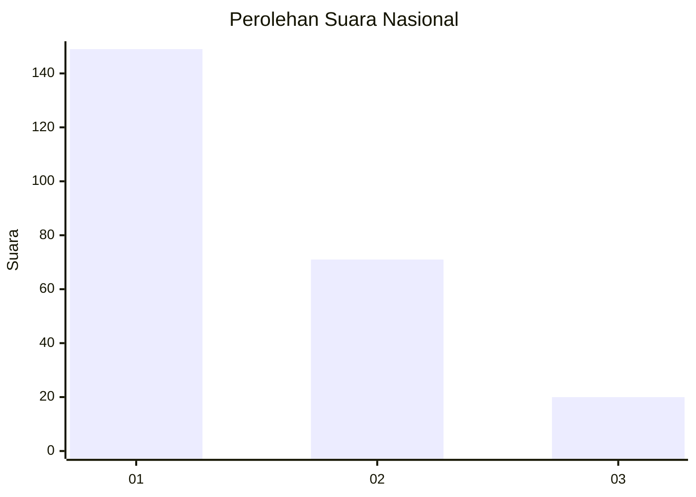
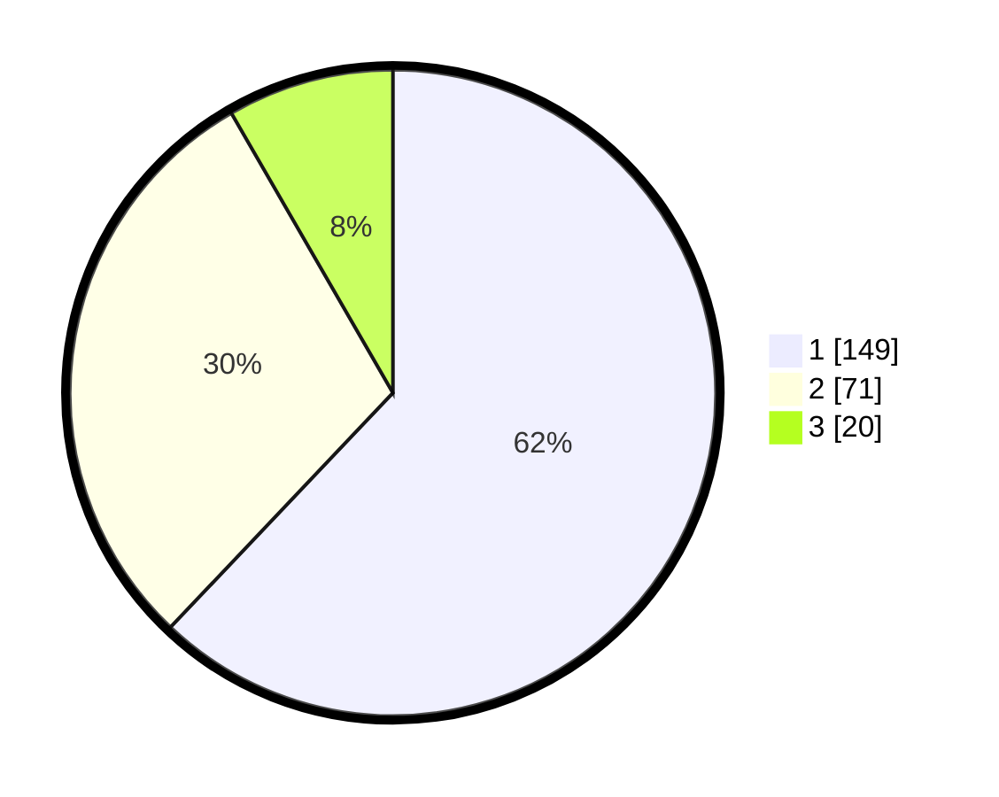

# Hasil

## Grafik

## Tabel

| No.    | Nama Paslon    | Suara | Suara (raw) | Persentase |
|:------ |:-------------- | -----:| -----------:| ----------:|
| 100025 | ANIES MUHAIMIN | 149   | [149][p-1]  | 62,08      |
| 100026 | PRABOWO GIBRAN | 71    | [71][p-2]   | 29,58      |
| 100027 | GANJAR MAHFUD  | 20    | [20][p-3]   | 8,33       |

[p-1]: https://github.com/gigit-pemilu/pemilu-2024/blob/main/pilpres/hitung-suara/sub/31-dki-jakarta/sub/73-jakarta-barat/sub/05-kebon-jeruk/sub/1002-sukabumi-utara/sub/090-tps/sub/paslon-1.txt
[p-2]: https://github.com/gigit-pemilu/pemilu-2024/blob/main/pilpres/hitung-suara/sub/31-dki-jakarta/sub/73-jakarta-barat/sub/05-kebon-jeruk/sub/1002-sukabumi-utara/sub/090-tps/sub/paslon-2.txt
[p-3]: https://github.com/gigit-pemilu/pemilu-2024/blob/main/pilpres/hitung-suara/sub/31-dki-jakarta/sub/73-jakarta-barat/sub/05-kebon-jeruk/sub/1002-sukabumi-utara/sub/090-tps/sub/paslon-3.txt

## Foto C Plano

https://sirekap-obj-formc.kpu.go.id/ec60/pemilu/ppwp/31/73/05/10/02/3173051002090-20240217-232004--fca79a75-5750-4474-ba6e-20c2787db397.jpg

https://sirekap-obj-formc.kpu.go.id/ec60/pemilu/ppwp/31/73/05/10/02/3173051002090-20240217-231911--bcfa5db6-0a1f-4c90-a95f-e86b6f386a81.jpg

https://sirekap-obj-formc.kpu.go.id/ec60/pemilu/ppwp/31/73/05/10/02/3173051002090-20240217-232054--ada337f0-3b11-4bb5-8098-d572654e1cc6.jpg

## Metadata

| Key        | Value               |
| ---------- | ------------------- |
| Time Stamp | 2024-02-19 18:00:00 |

