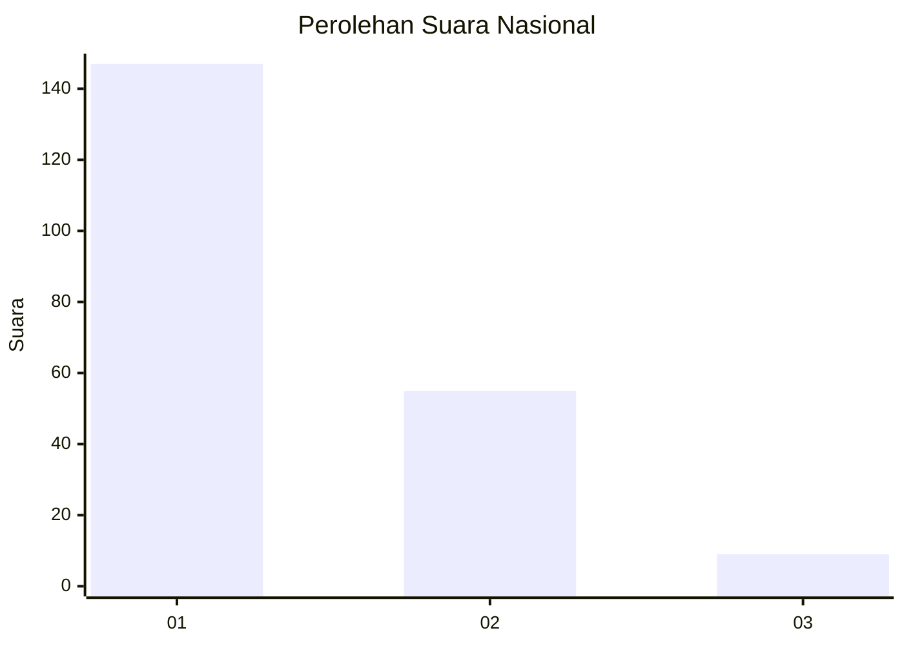
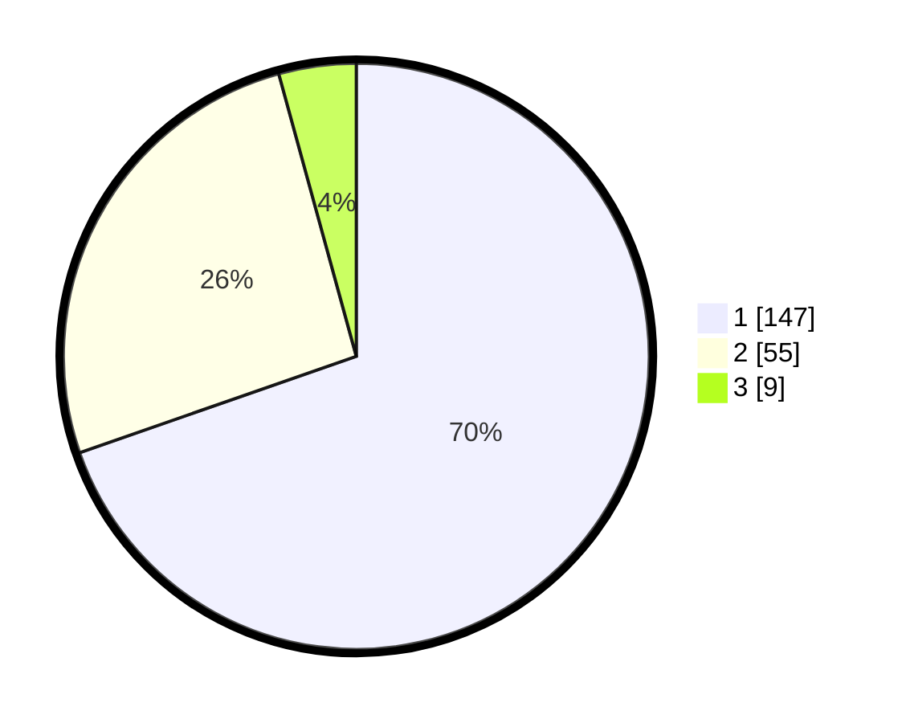

# Hasil

## Grafik

## Tabel

| No.    | Nama Paslon    | Suara | Suara (raw) | Persentase |
|:------ |:-------------- | -----:| -----------:| ----------:|
| 100025 | ANIES MUHAIMIN | 147   | [147][p-1]  | 69,67      |
| 100026 | PRABOWO GIBRAN | 55    | [55][p-2]   | 26,07      |
| 100027 | GANJAR MAHFUD  | 9     | [9][p-3]    | 4,27       |

[p-1]: https://github.com/gigit-pemilu/pemilu-2024/blob/main/pilpres/hitung-suara/sub/31-dki-jakarta/sub/73-jakarta-barat/sub/05-kebon-jeruk/sub/1002-sukabumi-utara/sub/098-tps/sub/paslon-1.txt
[p-2]: https://github.com/gigit-pemilu/pemilu-2024/blob/main/pilpres/hitung-suara/sub/31-dki-jakarta/sub/73-jakarta-barat/sub/05-kebon-jeruk/sub/1002-sukabumi-utara/sub/098-tps/sub/paslon-2.txt
[p-3]: https://github.com/gigit-pemilu/pemilu-2024/blob/main/pilpres/hitung-suara/sub/31-dki-jakarta/sub/73-jakarta-barat/sub/05-kebon-jeruk/sub/1002-sukabumi-utara/sub/098-tps/sub/paslon-3.txt

## Foto C Plano

https://sirekap-obj-formc.kpu.go.id/3eda/pemilu/ppwp/31/73/05/10/02/3173051002098-20240214-223600--a4caf034-49b5-484f-b2cd-a4d64fb67793.jpg

https://sirekap-obj-formc.kpu.go.id/3eda/pemilu/ppwp/31/73/05/10/02/3173051002098-20240214-223608--829bab0f-e551-4b57-9f74-11148b40596e.jpg

https://sirekap-obj-formc.kpu.go.id/3eda/pemilu/ppwp/31/73/05/10/02/3173051002098-20240214-223612--9d9a805c-7d4c-403f-8b94-4bc4a9e8a1a2.jpg

## Metadata

| Key        | Value               |
| ---------- | ------------------- |
| Time Stamp | 2024-02-19 13:00:00 |

