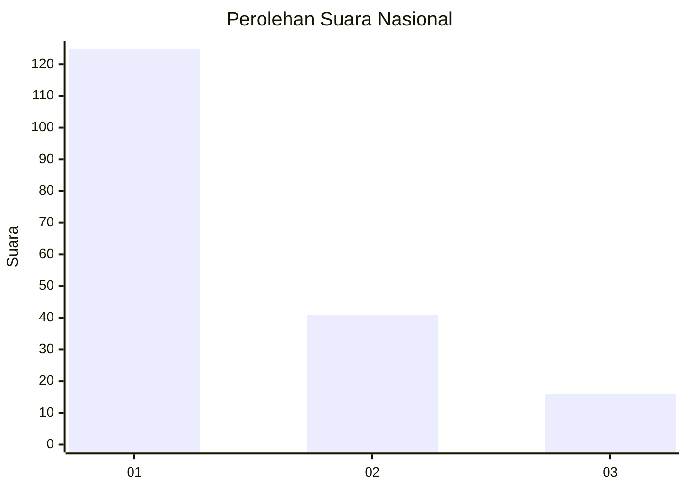
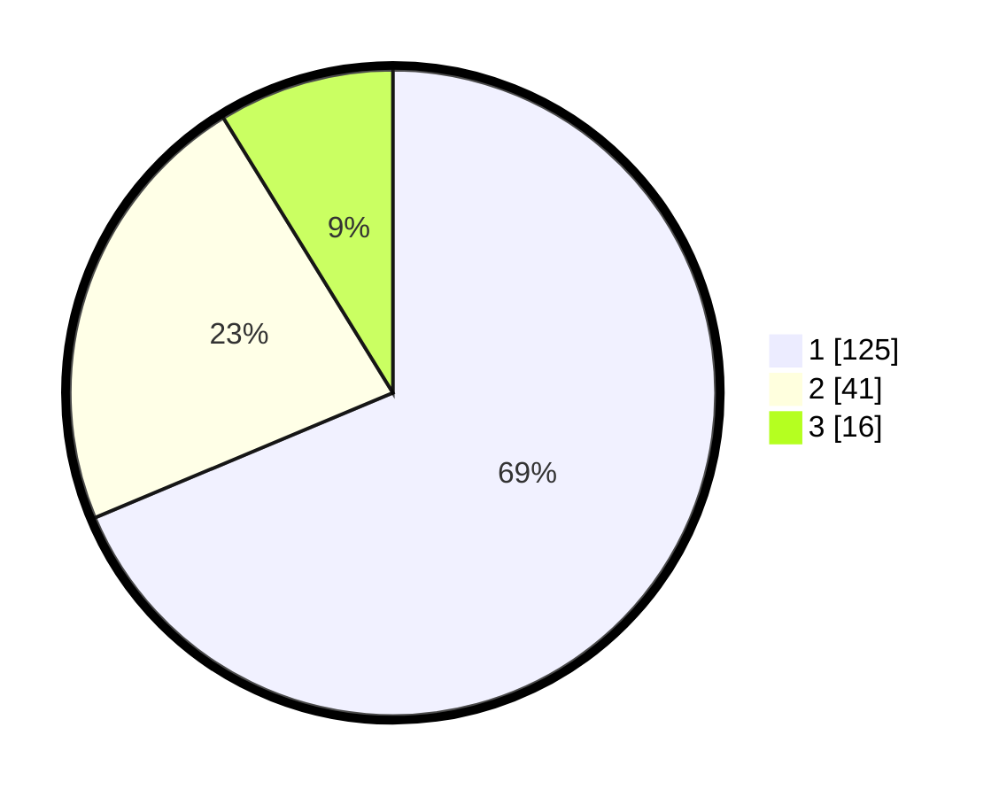

# Hasil

## Grafik

## Tabel

| No.    | Nama Paslon    | Suara | Suara (raw) | Persentase |
|:------ |:-------------- | -----:| -----------:| ----------:|
| 100025 | ANIES MUHAIMIN | 125   | [125][p-1]  | 68,68      |
| 100026 | PRABOWO GIBRAN | 41    | [41][p-2]   | 22,53      |
| 100027 | GANJAR MAHFUD  | 16    | [16][p-3]   | 8,79       |

[p-1]: https://github.com/gigit-pemilu/pemilu-2024/blob/main/pilpres/hitung-suara/sub/31-dki-jakarta/sub/73-jakarta-barat/sub/05-kebon-jeruk/sub/1002-sukabumi-utara/sub/111-tps/sub/paslon-1.txt
[p-2]: https://github.com/gigit-pemilu/pemilu-2024/blob/main/pilpres/hitung-suara/sub/31-dki-jakarta/sub/73-jakarta-barat/sub/05-kebon-jeruk/sub/1002-sukabumi-utara/sub/111-tps/sub/paslon-2.txt
[p-3]: https://github.com/gigit-pemilu/pemilu-2024/blob/main/pilpres/hitung-suara/sub/31-dki-jakarta/sub/73-jakarta-barat/sub/05-kebon-jeruk/sub/1002-sukabumi-utara/sub/111-tps/sub/paslon-3.txt

## Foto C Plano

https://sirekap-obj-formc.kpu.go.id/0aed/pemilu/ppwp/31/73/05/10/02/3173051002111-20240214-215432--7616f9ab-cf6b-4a22-ac72-d9d677160283.jpg

https://sirekap-obj-formc.kpu.go.id/0aed/pemilu/ppwp/31/73/05/10/02/3173051002111-20240214-215724--6a63b5be-2672-4d8c-a4c0-06c39de02c02.jpg

https://sirekap-obj-formc.kpu.go.id/0aed/pemilu/ppwp/31/73/05/10/02/3173051002111-20240214-215754--e3b609ba-6ddb-4082-affa-3c97f3af8a98.jpg

## Metadata

| Key        | Value               |
| ---------- | ------------------- |
| Time Stamp | 2024-02-19 13:00:00 |

