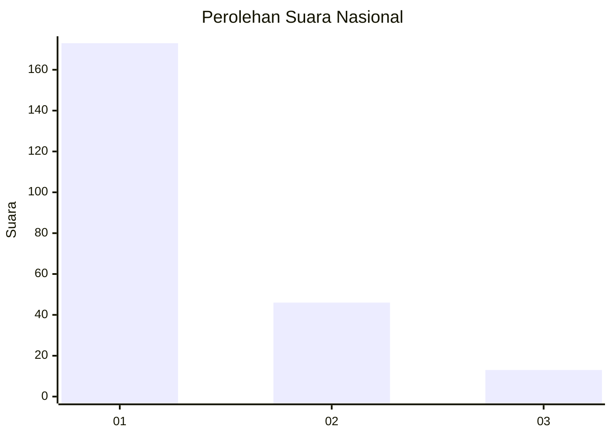
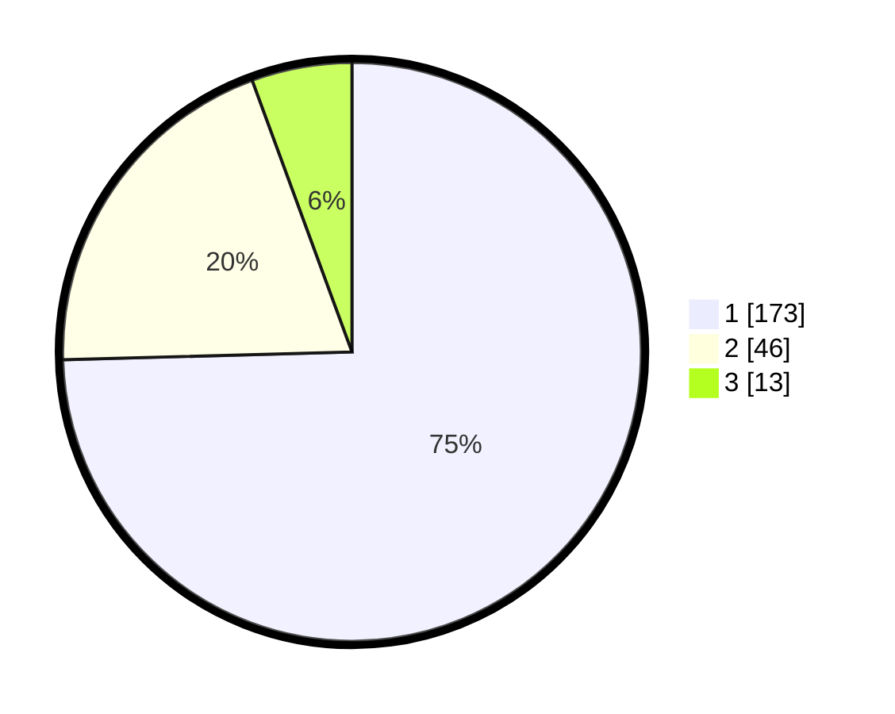

# Hasil

## Grafik

## Tabel

| No. | Nama Paslon    | Suara | Suara (raw) | Persentase |
|:--- |:-------------- | -----:| -----------:| ----------:|
| 1   | ANIES MUHAIMIN | 173   | [173][p-1]  | 74,57      |
| 2   | PRABOWO GIBRAN | 46    | [46][p-2]   | 19,83      |
| 3   | GANJAR MAHFUD  | 13    | [13][p-3]   | 5,60       |

[p-1]: https://github.com/gigit-pemilu/pemilu-2024/blob/main/pilpres/hitung-suara/sub/31-dki-jakarta/sub/73-jakarta-barat/sub/05-kebon-jeruk/sub/1002-sukabumi-utara/sub/120-tps/sub/paslon-1.txt
[p-2]: https://github.com/gigit-pemilu/pemilu-2024/blob/main/pilpres/hitung-suara/sub/31-dki-jakarta/sub/73-jakarta-barat/sub/05-kebon-jeruk/sub/1002-sukabumi-utara/sub/120-tps/sub/paslon-2.txt
[p-3]: https://github.com/gigit-pemilu/pemilu-2024/blob/main/pilpres/hitung-suara/sub/31-dki-jakarta/sub/73-jakarta-barat/sub/05-kebon-jeruk/sub/1002-sukabumi-utara/sub/120-tps/sub/paslon-3.txt

## Foto C Plano

https://sirekap-obj-formc.kpu.go.id/6658/pemilu/ppwp/31/73/05/10/02/3173051002120-20240215-014219--56445a36-92b7-4730-af94-a8c88d1b48cf.jpg

https://sirekap-obj-formc.kpu.go.id/6658/pemilu/ppwp/31/73/05/10/02/3173051002120-20240215-014329--75116d03-322c-49a7-86e2-20c51bb6a53f.jpg

https://sirekap-obj-formc.kpu.go.id/6658/pemilu/ppwp/31/73/05/10/02/3173051002120-20240215-014414--51320fa4-c836-4c04-ac57-9b1d8866c7bd.jpg

## Metadata

| Key        | Value               |
| ---------- | ------------------- |
| Time Stamp | 2024-02-19 13:00:00 |

