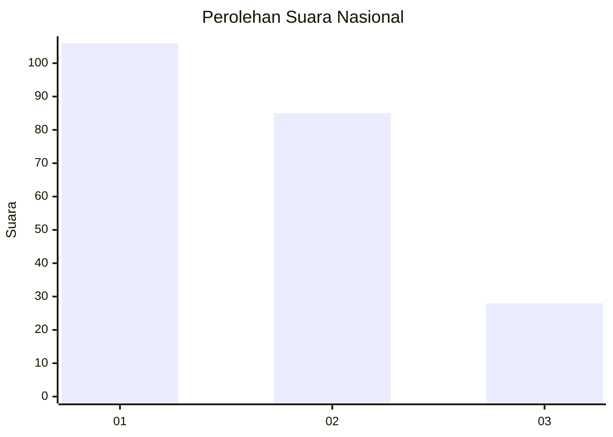
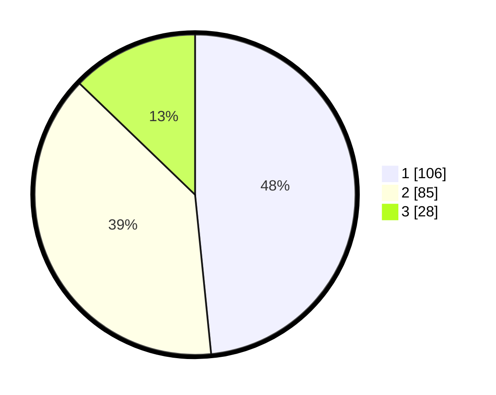

# Hasil

## Grafik

## Tabel

| No.    | Nama Paslon    | Suara | Suara (raw) | Persentase |
|:------ |:-------------- | -----:| -----------:| ----------:|
| 100025 | ANIES MUHAIMIN | 106   | [106][p-1]  | 48,40      |
| 100026 | PRABOWO GIBRAN | 85    | [85][p-2]   | 38,81      |
| 100027 | GANJAR MAHFUD  | 28    | [28][p-3]   | 12,79      |

[p-1]: https://github.com/gigit-pemilu/pemilu-2024/blob/main/pilpres/hitung-suara/sub/31-dki-jakarta/sub/73-jakarta-barat/sub/05-kebon-jeruk/sub/1003-sukabumi-selatan/sub/006-tps/sub/paslon-1.txt
[p-2]: https://github.com/gigit-pemilu/pemilu-2024/blob/main/pilpres/hitung-suara/sub/31-dki-jakarta/sub/73-jakarta-barat/sub/05-kebon-jeruk/sub/1003-sukabumi-selatan/sub/006-tps/sub/paslon-2.txt
[p-3]: https://github.com/gigit-pemilu/pemilu-2024/blob/main/pilpres/hitung-suara/sub/31-dki-jakarta/sub/73-jakarta-barat/sub/05-kebon-jeruk/sub/1003-sukabumi-selatan/sub/006-tps/sub/paslon-3.txt

## Foto C Plano

https://sirekap-obj-formc.kpu.go.id/18d0/pemilu/ppwp/31/73/05/10/03/3173051003006-20240216-150706--e4ef4724-3a89-42e8-9002-871333d00cf8.jpg

https://sirekap-obj-formc.kpu.go.id/18d0/pemilu/ppwp/31/73/05/10/03/3173051003006-20240216-151959--52ddf6fd-b4ad-46d4-a922-7f1f07e7b4b0.jpg

https://sirekap-obj-formc.kpu.go.id/18d0/pemilu/ppwp/31/73/05/10/03/3173051003006-20240216-151254--2c427f31-f757-4d2f-ba63-3cf97cab913b.jpg

## Metadata

| Key        | Value               |
| ---------- | ------------------- |
| Time Stamp | 2024-02-16 16:25:10 |

