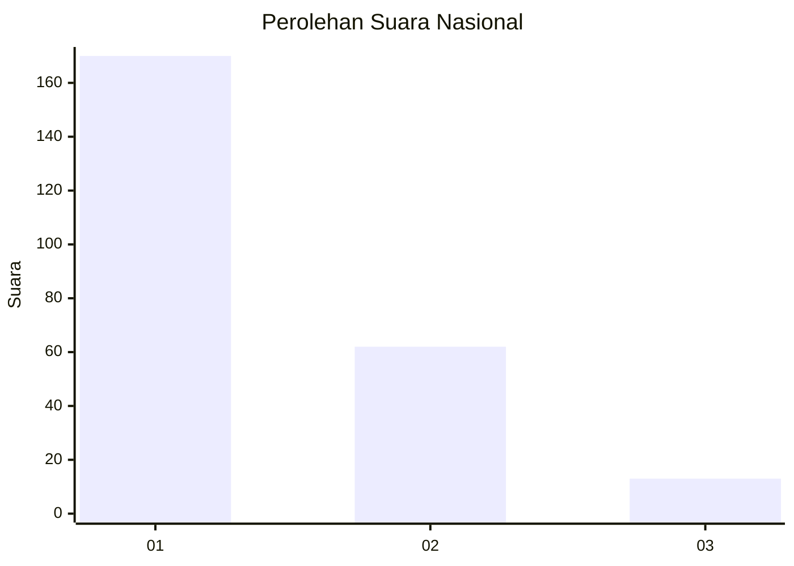
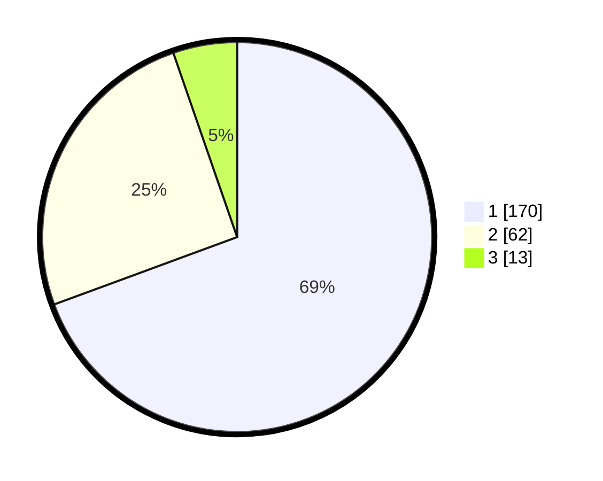

# Hasil

## Grafik

## Tabel

| No.    | Nama Paslon    | Suara | Suara (raw) | Persentase |
|:------ |:-------------- | -----:| -----------:| ----------:|
| 100025 | ANIES MUHAIMIN | 170   | [170][p-1]  | 69,39      |
| 100026 | PRABOWO GIBRAN | 62    | [62][p-2]   | 25,31      |
| 100027 | GANJAR MAHFUD  | 13    | [13][p-3]   | 5,31       |

[p-1]: https://github.com/gigit-pemilu/pemilu-2024/blob/main/pilpres/hitung-suara/sub/31-dki-jakarta/sub/73-jakarta-barat/sub/05-kebon-jeruk/sub/1003-sukabumi-selatan/sub/010-tps/sub/paslon-1.txt
[p-2]: https://github.com/gigit-pemilu/pemilu-2024/blob/main/pilpres/hitung-suara/sub/31-dki-jakarta/sub/73-jakarta-barat/sub/05-kebon-jeruk/sub/1003-sukabumi-selatan/sub/010-tps/sub/paslon-2.txt
[p-3]: https://github.com/gigit-pemilu/pemilu-2024/blob/main/pilpres/hitung-suara/sub/31-dki-jakarta/sub/73-jakarta-barat/sub/05-kebon-jeruk/sub/1003-sukabumi-selatan/sub/010-tps/sub/paslon-3.txt

## Foto C Plano

https://sirekap-obj-formc.kpu.go.id/31ea/pemilu/ppwp/31/73/05/10/03/3173051003010-20240214-204616--711d1809-a1a3-4346-ad99-92f863fba874.jpg

https://sirekap-obj-formc.kpu.go.id/31ea/pemilu/ppwp/31/73/05/10/03/3173051003010-20240214-204715--4b10106d-ecb3-49b1-919c-c2e8d3ef1f93.jpg

https://sirekap-obj-formc.kpu.go.id/31ea/pemilu/ppwp/31/73/05/10/03/3173051003010-20240214-234855--b4976af1-1384-42e1-9a54-bb25c1a3c825.jpg

## Metadata

| Key        | Value               |
| ---------- | ------------------- |
| Time Stamp | 2024-02-17 19:30:00 |

