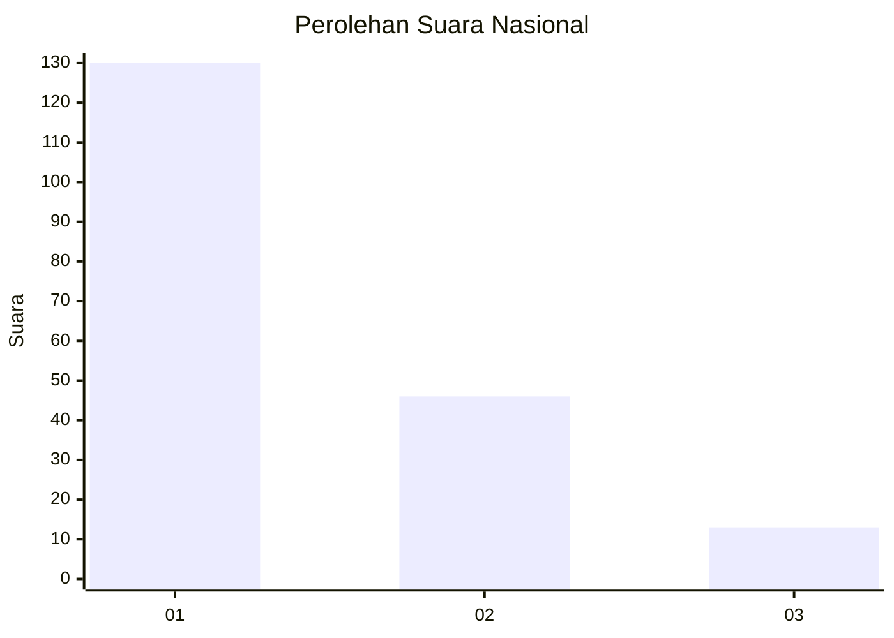
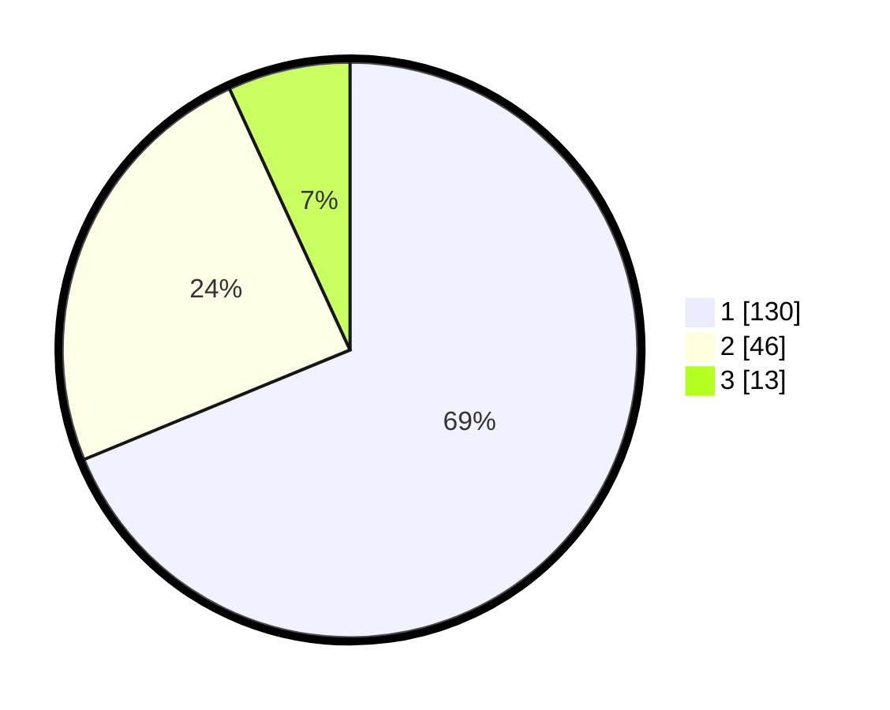

# Hasil

## Grafik

## Tabel

| No.    | Nama Paslon    | Suara | Suara (raw) | Persentase |
|:------ |:-------------- | -----:| -----------:| ----------:|
| 100025 | ANIES MUHAIMIN | 130   | [130][p-1]  | 68,78      |
| 100026 | PRABOWO GIBRAN | 46    | [46][p-2]   | 24,34      |
| 100027 | GANJAR MAHFUD  | 13    | [13][p-3]   | 6,88       |

[p-1]: https://github.com/gigit-pemilu/pemilu-2024/blob/main/pilpres/hitung-suara/sub/31-dki-jakarta/sub/73-jakarta-barat/sub/05-kebon-jeruk/sub/1003-sukabumi-selatan/sub/013-tps/sub/paslon-1.txt
[p-2]: https://github.com/gigit-pemilu/pemilu-2024/blob/main/pilpres/hitung-suara/sub/31-dki-jakarta/sub/73-jakarta-barat/sub/05-kebon-jeruk/sub/1003-sukabumi-selatan/sub/013-tps/sub/paslon-2.txt
[p-3]: https://github.com/gigit-pemilu/pemilu-2024/blob/main/pilpres/hitung-suara/sub/31-dki-jakarta/sub/73-jakarta-barat/sub/05-kebon-jeruk/sub/1003-sukabumi-selatan/sub/013-tps/sub/paslon-3.txt

## Foto C Plano

https://sirekap-obj-formc.kpu.go.id/5db2/pemilu/ppwp/31/73/05/10/03/3173051003013-20240216-201136--eac4220e-e6e3-4382-b51d-33de9bb60a1d.jpg

https://sirekap-obj-formc.kpu.go.id/5db2/pemilu/ppwp/31/73/05/10/03/3173051003013-20240215-003707--08cdbf4c-611e-4517-8e3f-9235c3178d77.jpg

https://sirekap-obj-formc.kpu.go.id/5db2/pemilu/ppwp/31/73/05/10/03/3173051003013-20240215-003759--ea44920d-5f5f-4495-a7c4-887ec20872a1.jpg

## Metadata

| Key        | Value               |
| ---------- | ------------------- |
| Time Stamp | 2024-02-16 21:01:00 |

