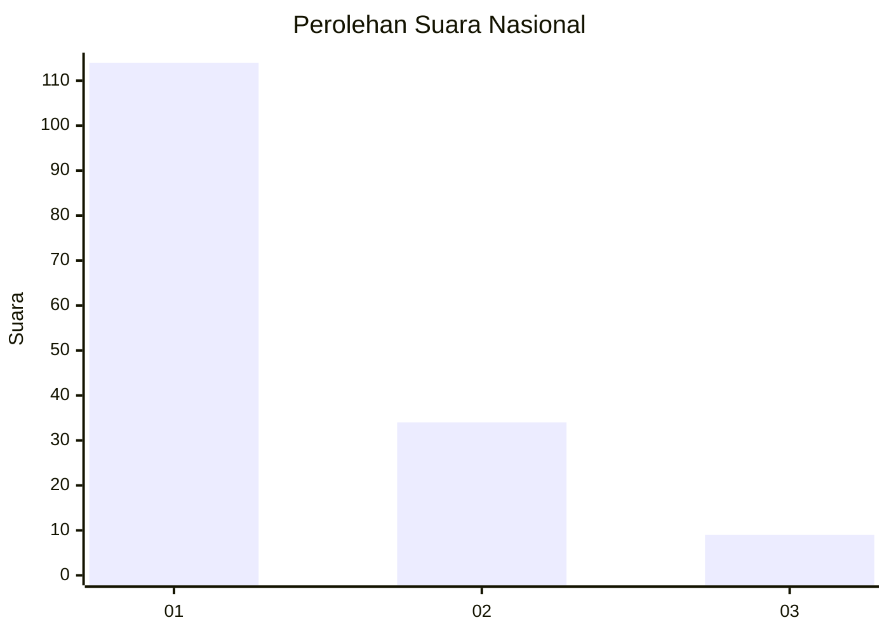
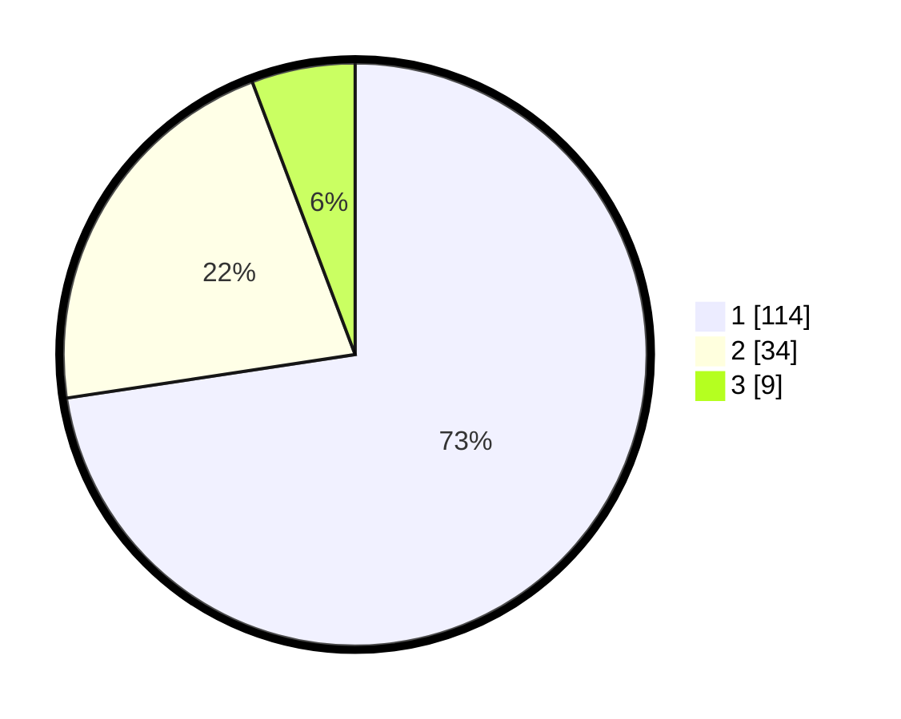

# Hasil

## Grafik

## Tabel

| No.    | Nama Paslon    | Suara | Suara (raw) | Persentase |
|:------ |:-------------- | -----:| -----------:| ----------:|
| 100025 | ANIES MUHAIMIN | 114   | [114][p-1]  | 72,61      |
| 100026 | PRABOWO GIBRAN | 34    | [34][p-2]   | 21,66      |
| 100027 | GANJAR MAHFUD  | 9     | [9][p-3]    | 5,73       |

[p-1]: https://github.com/gigit-pemilu/pemilu-2024/blob/main/pilpres/hitung-suara/sub/31-dki-jakarta/sub/73-jakarta-barat/sub/05-kebon-jeruk/sub/1003-sukabumi-selatan/sub/016-tps/sub/paslon-1.txt
[p-2]: https://github.com/gigit-pemilu/pemilu-2024/blob/main/pilpres/hitung-suara/sub/31-dki-jakarta/sub/73-jakarta-barat/sub/05-kebon-jeruk/sub/1003-sukabumi-selatan/sub/016-tps/sub/paslon-2.txt
[p-3]: https://github.com/gigit-pemilu/pemilu-2024/blob/main/pilpres/hitung-suara/sub/31-dki-jakarta/sub/73-jakarta-barat/sub/05-kebon-jeruk/sub/1003-sukabumi-selatan/sub/016-tps/sub/paslon-3.txt

## Foto C Plano

https://sirekap-obj-formc.kpu.go.id/12e1/pemilu/ppwp/31/73/05/10/03/3173051003016-20240214-231829--03cc0c75-36cb-4978-bdc9-7e61b0771095.jpg

https://sirekap-obj-formc.kpu.go.id/12e1/pemilu/ppwp/31/73/05/10/03/3173051003016-20240214-231900--cc3c3044-1aba-41d4-94df-120465f98b90.jpg

https://sirekap-obj-formc.kpu.go.id/12e1/pemilu/ppwp/31/73/05/10/03/3173051003016-20240214-231933--3e902e93-e8c9-4842-abef-1df3f12d0217.jpg

## Metadata

| Key        | Value               |
| ---------- | ------------------- |
| Time Stamp | 2024-02-16 21:01:00 |

