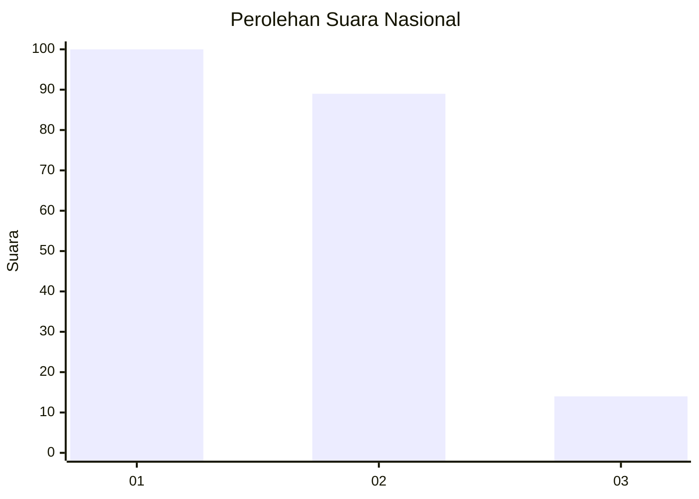
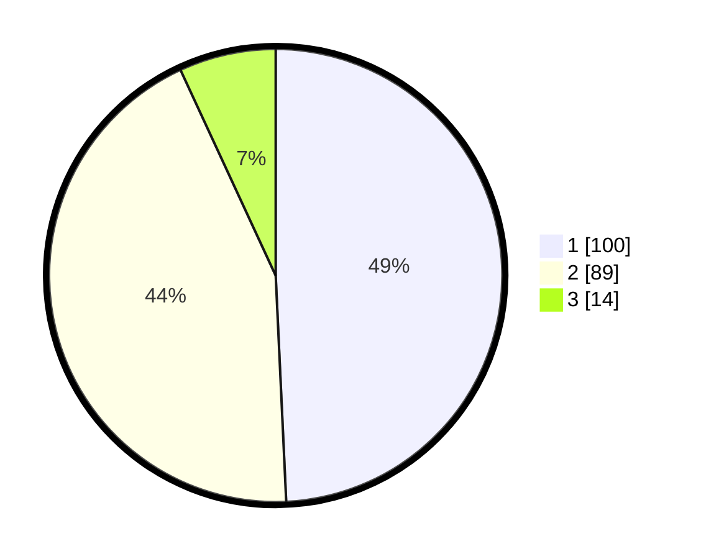

# Hasil

## Grafik

## Tabel

| No.    | Nama Paslon    | Suara | Suara (raw) | Persentase |
|:------ |:-------------- | -----:| -----------:| ----------:|
| 100025 | ANIES MUHAIMIN | 100   | [100][p-1]  | 49,26      |
| 100026 | PRABOWO GIBRAN | 89    | [89][p-2]   | 43,84      |
| 100027 | GANJAR MAHFUD  | 14    | [14][p-3]   | 6,90       |

[p-1]: https://github.com/gigit-pemilu/pemilu-2024/blob/main/pilpres/hitung-suara/sub/31-dki-jakarta/sub/73-jakarta-barat/sub/05-kebon-jeruk/sub/1003-sukabumi-selatan/sub/019-tps/sub/paslon-1.txt
[p-2]: https://github.com/gigit-pemilu/pemilu-2024/blob/main/pilpres/hitung-suara/sub/31-dki-jakarta/sub/73-jakarta-barat/sub/05-kebon-jeruk/sub/1003-sukabumi-selatan/sub/019-tps/sub/paslon-2.txt
[p-3]: https://github.com/gigit-pemilu/pemilu-2024/blob/main/pilpres/hitung-suara/sub/31-dki-jakarta/sub/73-jakarta-barat/sub/05-kebon-jeruk/sub/1003-sukabumi-selatan/sub/019-tps/sub/paslon-3.txt

## Foto C Plano

https://sirekap-obj-formc.kpu.go.id/16bb/pemilu/ppwp/31/73/05/10/03/3173051003019-20240214-234621--a35439e5-cf7a-43d9-81c8-36b841b87844.jpg

https://sirekap-obj-formc.kpu.go.id/16bb/pemilu/ppwp/31/73/05/10/03/3173051003019-20240214-232712--aa14ce77-bab8-4539-9650-5589633761a5.jpg

https://sirekap-obj-formc.kpu.go.id/16bb/pemilu/ppwp/31/73/05/10/03/3173051003019-20240214-232828--97fae380-675c-4620-8a7a-729b9c21fc45.jpg

## Metadata

| Key        | Value               |
| ---------- | ------------------- |
| Time Stamp | 2024-02-16 21:01:00 |

