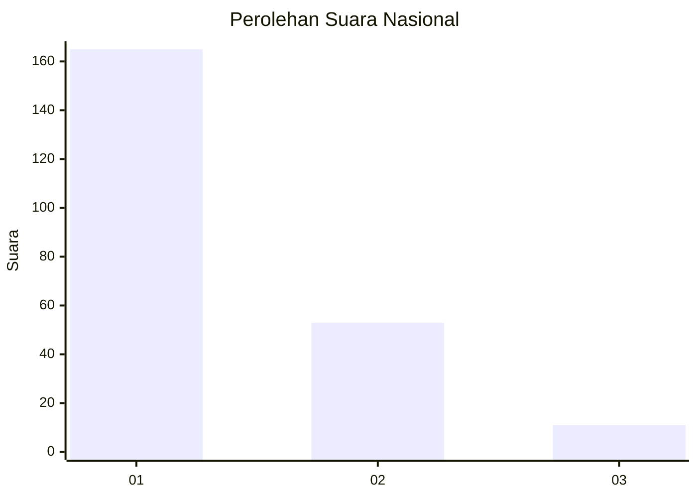
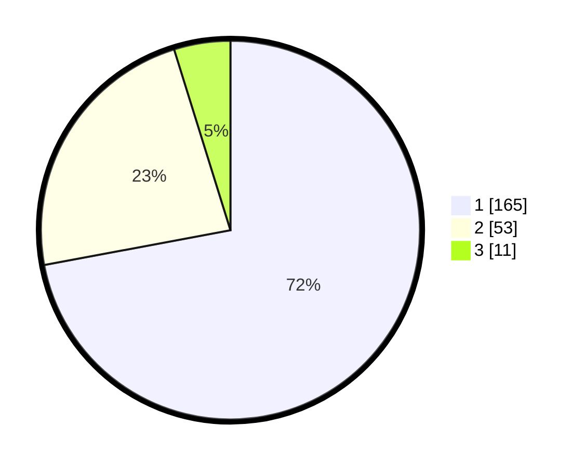

# Hasil

## Grafik

## Tabel

| No. | Nama Paslon    | Suara | Suara (raw) | Persentase |
|:--- |:-------------- | -----:| -----------:| ----------:|
| 1   | ANIES MUHAIMIN | 165   | [165][p-1]  | 72,05      |
| 2   | PRABOWO GIBRAN | 53    | [53][p-2]   | 23,14      |
| 3   | GANJAR MAHFUD  | 11    | [11][p-3]   | 4,80       |

[p-1]: https://github.com/gigit-pemilu/pemilu-2024/blob/main/pilpres/hitung-suara/sub/31-dki-jakarta/sub/73-jakarta-barat/sub/05-kebon-jeruk/sub/1003-sukabumi-selatan/sub/040-tps/sub/paslon-1.txt
[p-2]: https://github.com/gigit-pemilu/pemilu-2024/blob/main/pilpres/hitung-suara/sub/31-dki-jakarta/sub/73-jakarta-barat/sub/05-kebon-jeruk/sub/1003-sukabumi-selatan/sub/040-tps/sub/paslon-2.txt
[p-3]: https://github.com/gigit-pemilu/pemilu-2024/blob/main/pilpres/hitung-suara/sub/31-dki-jakarta/sub/73-jakarta-barat/sub/05-kebon-jeruk/sub/1003-sukabumi-selatan/sub/040-tps/sub/paslon-3.txt

## Foto C Plano

https://sirekap-obj-formc.kpu.go.id/ce70/pemilu/ppwp/31/73/05/10/03/3173051003040-20240215-025635--e61b9d36-14b6-4a3a-8a1b-86f72d7b7c42.jpg

https://sirekap-obj-formc.kpu.go.id/ce70/pemilu/ppwp/31/73/05/10/03/3173051003040-20240215-011108--c8c6ad87-f637-400b-a40f-480317fbd8a4.jpg

https://sirekap-obj-formc.kpu.go.id/ce70/pemilu/ppwp/31/73/05/10/03/3173051003040-20240215-021458--cdfe1c62-5288-4d8b-9bf0-2b670ec62ebc.jpg

## Metadata

| Key        | Value               |
| ---------- | ------------------- |
| Time Stamp | 2024-02-19 13:00:00 |

