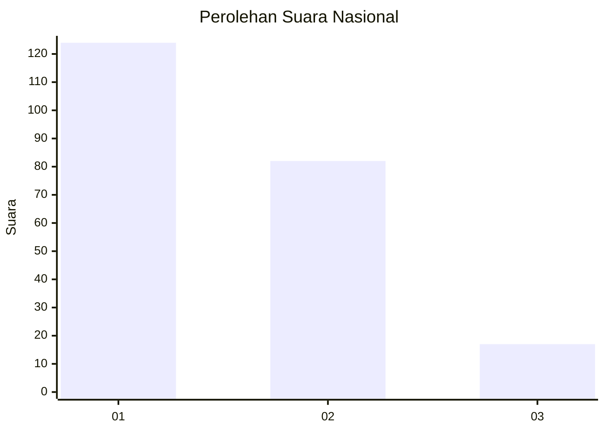
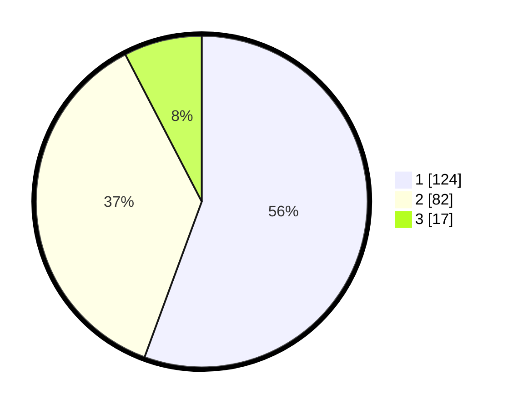

# Hasil

## Grafik

## Tabel

| No.    | Nama Paslon    | Suara | Suara (raw) | Persentase |
|:------ |:-------------- | -----:| -----------:| ----------:|
| 100025 | ANIES MUHAIMIN | 124   | [124][p-1]  | 55,61      |
| 100026 | PRABOWO GIBRAN | 82    | [82][p-2]   | 36,77      |
| 100027 | GANJAR MAHFUD  | 17    | [17][p-3]   | 7,62       |

[p-1]: https://github.com/gigit-pemilu/pemilu-2024/blob/main/pilpres/hitung-suara/sub/31-dki-jakarta/sub/73-jakarta-barat/sub/05-kebon-jeruk/sub/1003-sukabumi-selatan/sub/045-tps/sub/paslon-1.txt
[p-2]: https://github.com/gigit-pemilu/pemilu-2024/blob/main/pilpres/hitung-suara/sub/31-dki-jakarta/sub/73-jakarta-barat/sub/05-kebon-jeruk/sub/1003-sukabumi-selatan/sub/045-tps/sub/paslon-2.txt
[p-3]: https://github.com/gigit-pemilu/pemilu-2024/blob/main/pilpres/hitung-suara/sub/31-dki-jakarta/sub/73-jakarta-barat/sub/05-kebon-jeruk/sub/1003-sukabumi-selatan/sub/045-tps/sub/paslon-3.txt

## Foto C Plano

https://sirekap-obj-formc.kpu.go.id/facf/pemilu/ppwp/31/73/05/10/03/3173051003045-20240215-002940--845b72c0-5a23-4af6-9f91-fb8783650af8.jpg

https://sirekap-obj-formc.kpu.go.id/facf/pemilu/ppwp/31/73/05/10/03/3173051003045-20240215-003052--744178c9-f1b9-4ab4-9952-ac264515e759.jpg

https://sirekap-obj-formc.kpu.go.id/facf/pemilu/ppwp/31/73/05/10/03/3173051003045-20240215-003158--1ed3d68f-ce24-4406-bd70-550eeaf62724.jpg

## Metadata

| Key        | Value               |
| ---------- | ------------------- |
| Time Stamp | 2024-02-16 21:01:00 |

